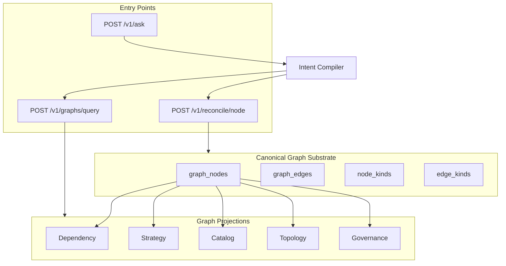

# Plan: AI Factory OS — Same Capacity as Traversable Graph Vision (Revised)

This plan closes the gap between **what exists today** (plan DAG, capability graph, lineage, runtime, self-heal) and the **target**: one canonical graph substrate with named projections, natural-language intent compilation (not raw execution), contract-based operators plus first-class saved flows, and durable graph runtime as authoritative for at least one path.

**Guiding principle:** The architecture is real. The repo already has graph → operators → runtime. What’s missing is **product surface and abstraction layers**: one graph identity layer, intent compiler, operator contracts, and stateful control plane with approval thresholds. The LLM is the translator at the edge; the OS is the graph + operators + control plane.

---

## Where You Are: Current Repo vs Vision

### What’s Actually in This Repo Right Now

- **Graph describes what must exist** — Plans, plan_nodes, plan_edges, capability graph, artifact types, lineage. The graph is the source of truth for “what must exist” and who produces it.
- **Operators figure out how to produce it** — Runners/jobs (email, SEO, codegen, etc.) are the operators; capability resolution and `POST /v1/runs/by-artifact-type` match “what’s needed” to “who can produce it.”
- **Runtime resolves the rest** — Control Plane runs the scheduler, reaper, deploy-failure self-heal, no-artifacts remediation, schema drift alerts, migrations on startup. The runtime does a lot of resolution automatically.

So the **“universal artifact compiler” / “Swiss Army knife”** framing fits this codebase. That part is not wrong; it’s the architecture you have.

### What the Screenshots Add (Target Surface)

The other chat talks about “5 graphs, 3,188 nodes, 3,289 edges,” “ask it anything or do anything,” “100% deterministic AI just pushing buttons,” “graph operators … forever flow.” That’s a **more advanced surface**: one big traversable graph, natural-language “ask anything,” and saved “graph operators” as reusable flows.

In this repo today:

- You have graph + operators + runtime, but not a single unified “5 graphs, 3K nodes” product graph exposed to an AI in the way that screenshot suggests.
- You have APIs + Console + scripts (and the audit/self-heal we added), not a single “ask anything in natural language and it does it” interface.
- You have plans, runs, artifacts, lineage, repair plans — the **machinery** for “figure out the piece of the graph and do it” is there; the “ask anything, it just grabs a piece and executes” is the **direction**, not fully built as one product experience yet.

### Is This Possible?

- **If “this” = “Is the universal artifact compiler / graph + operators + runtime idea actually possible?”** → **Yes.** You’re already building it; the architecture is real.
- **If “this” = “Is the exact thing in that second screenshot (5 graphs, 3K nodes, ask anything, deterministic button-pushing, saved graph operators) possible in this repo right now?”** → **Partially.** The foundations (graph, operators, runtime, self-heal, drift, etc.) are there. The “ask anything” + “one traversable platform graph” + “save as operator, forever flow” is the **target**, not fully implemented as one smooth flow yet.
- **If the screenshot is from another product** (e.g. another vendor’s “graph + AI control” product), then that product may be further along on that specific UX; it doesn’t mean anything is wrong with your design—just that they’re at a different stage of that particular surface.

**Bottom line:** Nothing is wrong with the vision or the architecture. The “graph describes what must exist, operators figure out how to produce it, runtime resolves the rest” is exactly what this codebase is doing. What’s not fully there yet is the single “ask anything / do anything” front-end and the “5 graphs, 3K nodes, one traversable platform” product layer. So: **yes, it’s possible—and you’re already partway there; the rest is building the “everything around this” (plug-and-play UX, more graphs, saved operators) on top of what you have.**

---

## Core Conceptual Model (Already in the Repo)

The pattern **graph → operators → runtime** is one of the strongest patterns in AI infrastructure:

- **Graph (Truth Layer)** — Describes what must exist. Nodes = artifacts / states (e.g. landing page, email template, SEO article, deployable app, marketing campaign, product schema). Edges = dependencies.
- **Operators (Execution Layer)** — The things that can produce nodes (e.g. email generator, SEO article writer, Next.js scaffold generator, deploy pipeline, analytics reporter).
- **Runtime / Control Plane (Resolution Layer)** — Decides: “Given this graph state, what must be produced next, and who can produce it?” Schedules runs, resolves dependencies, retries failures, handles drift, repairs broken states.

**That pattern is exactly what your repo already contains** with: plans, plan_nodes, plan_edges, runs, artifacts, artifact lineage, capability resolution, scheduler + reaper, repair plans. **That’s already a graph-native automation engine.**

Where the screenshots you referenced are different is **mostly UX abstraction, not architecture.** Those systems usually add three additional layers on top of what you already have:

1. **Unified Platform Graph** — Right now the repo has multiple implicit graphs (plan graph, artifact lineage graph, capability graph, workflow graph, deployment graph). A mature system exposes them as **one navigable graph** (e.g. Platform Graph → strategy, product, marketing, code, infrastructure). Nodes across all systems become queryable in one place. That’s what the “5 graphs, 3K nodes” reference probably means.
2. **Natural-Language Query Interface** — Example prompts: “Build a landing page for weight loss,” “Deploy it to preview,” “Generate 5 SEO articles,” “Schedule an email campaign.” The system maps intent, finds nodes in the graph, resolves missing artifacts, executes operators. Your repo already has the execution machinery; what’s missing is the intent parser + graph resolver UI.
3. **Saved Graph Operators** — “Operators that run forever” = parameterized graph traversals. Example: **SEO Growth Operator** — steps: keyword discovery → article generation → internal linking → publish → index monitoring. In graph terms: keyword_node → article_node → published_article → search_console_metrics. Once defined, it can run continuously. The repo already has runs, job scheduler, artifact triggers; the engine exists, but the **reusable operator abstraction** may not yet.

**You are much further along than you might think.** Most systems trying to build this fail because they start with “chatbot → random tools” instead of “deterministic graph → operators → runtime.” Your system already has the deterministic foundation. That’s the hardest piece.

**Where the real gaps actually are** (not in the engine — in these layers):

1. **Strategy → BuildSpec compiler** — Turning a high-level strategy document into a graph automatically (e.g. “Goal: launch telehealth weight loss funnel” → nodes: landing page, ad campaign, checkout, onboarding flow, email nurture).
2. **Global graph registry** — Right now nodes live across multiple tables. A mature system exposes graph_nodes, graph_edges, node_types, node_owners so everything becomes queryable.
3. **Intent resolver** — Converts “create a landing page” into artifact_type = landing_page, operator = landing_page_codegen, dependencies = brand_profile + offer + copy.
4. **Operator marketplace** — Eventually operators become plug-ins (SEO operator, Ad campaign operator, Next.js scaffold operator, Analytics operator), each declaring inputs, outputs, capabilities; the runtime resolves them automatically.

**Why the architecture matters:** If built fully, instead of separate CMS / CRM / email / analytics / deployment tools, you get a **single graph platform where artifacts evolve automatically**. Example: You update the product node → the graph automatically propagates changes to landing pages, ads, SEO articles, email campaigns, analytics dashboards. **What you’re building is not an “AI tool”; it’s closer to an operating system for artifacts.** Everything becomes a node in a graph, and operators mutate that graph.

**Honest read:** The repo is already doing the engine work most people never solve: artifact lineage, deterministic runs, dependency graphs, repair loops, drift detection. What’s missing is mainly: graph unification, natural language entry, reusable operators, visual exploration. Those are **product layers**, not core infrastructure.

---

## The Four Pieces (What Turns This Into a True AI Factory OS)

1. **Universal graph registry** — One canonical graph layer that everything resolves through. Every meaningful thing becomes a node with typed edges. **Node types** (examples): strategy, initiative, build spec, page, component, brand profile, email, article, code artifact, deploy target, environment, workflow, metric, validation, incident, repair recipe, operator. **Edge types** (examples): depends_on, produces, validates, deploys_to, derived_from, owned_by, blocked_by, supersedes, observed_by, repairs, consumes_context_from. **OS version:** graph_nodes, graph_edges, node_kinds, edge_kinds, node_state, node_contracts, node_observations (canonical resolution layer above domain tables). **Result:** Difference between “a set of orchestration tables” and “a traversable world model for production.”

2. **Intent compiler** — Makes “ask anything” real without sloppy agent chaos. Converts e.g. “Launch a new landing page for women’s menopause support and prepare the supporting email + SEO set” into a typed **Intent spec** (domain, artifact target, audience, required outputs, validations). **Key rule:** The LLM should **not** directly run the factory. The LLM should produce a **typed intent plan** (IntentDoc, BuildSpec, ExecutionPlan, ValidationPlan). The runtime executes that spec. **Compiler output:** requested objective, scope, artifact classes, required dependencies, operator candidates, acceptance tests, failure escalation path. **Result:** Chat goes from “AI guessing what to do” to “AI translating human language into machine-resolvable graph intent.”

3. **Contract-based operator system** — Every operator declares: name, version, input schema, output schema, artifact types produced/consumed, side effects, required capabilities, validation hooks, retry semantics, cost/latency profile, determinism level. **Example:** Operator landing_page_codegen.v1 — Consumes: brand profile, offer spec, page brief, design tokens. Produces: page artifact, metadata artifact, component tree, preview URL candidate. Validates: schema correctness, brand token application, required sections present. **Why it matters:** With contracts, the runtime can reason which operator can produce this node, which version is safest, what if primary fails, can another substitute, what downstream artifacts must be invalidated. **Unlocks:** operator marketplace, versioning, safe upgrades, A/B operator routing, fallback chains, policy-based execution.

4. **Stateful control plane with autonomous repair and human thresholds** — The control plane becomes the **permanent governor of state transitions**. **Lifecycle states** (examples): declared, planned, ready, blocked, running, produced, validated, published, degraded, stale, repairable, failed, superseded, archived. **Failure classes** (not just “job failed”): dependency missing, schema mismatch, operator contract violation, tool-side failure, policy denial, validation failure, environment drift, artifact incomplete, deployment mismatch. **Repair policy** (per failure class): retry?, re-resolve operator?, recompile intent?, re-run dependency chain?, invalidate downstream?, escalate to human?, rollback release?, quarantine node? **Human thresholds:** **Auto-execute** (e.g. draft SEO article, internal brief generation, preview scaffolds, metadata repair). **Require approval** (e.g. production deploy, domain cutover, live email send, pricing changes, compliance-sensitive medical content, destructive schema migrations). **The control plane is the thing that knows:** current world state, desired world state, what transitions are legal, which can be automated, when a human must intervene. **Result:** Operating system instead of a pipeline runner.

**Full loop example:** User says “Launch a new telehealth landing page and campaign for menopause support.” The OS: (1) Intent compiler parses into a typed build objective. (2) Universal graph creates/updates nodes: initiative, page brief, landing page, email sequence, SEO cluster, analytics config, deploy target. (3) Contract-based operator resolver finds which operators can produce each missing node. (4) Control plane schedules runs in dependency order, validates outputs, retries failures, escalates only where needed, updates world state. That is the “ask anything / build anything” product surface.

**Sequencing for this repo:** Phase 1 — Graph registry (everything else gets cleaner once there is one truth layer). Phase 2 — Operator contracts (runtime needs explicit producer semantics before the intent layer is safe). Phase 3 — Intent compiler (once graph and operators are typed, natural language becomes reliable). Phase 4 — Full control plane governance (elevate runtime into a real reconciliation engine with policies, repair classes, human thresholds). **The blunt truth:** The missing magic is not “better AI.” It is: better graph normalization, better contracts, better state modeling, better reconciliation. The LLM is just the translator at the edge. The OS is the graph + operators + control plane.

---

## Current State and Non-Negotiables

### What Exists Today (Keep)

- **Graph (truth layer):** plans, plan_nodes, plan_edges, capability graph, artifact types, lineage.
- **Operators (execution layer):** runners/jobs (email, SEO, codegen, etc.); capability resolution; `POST /v1/runs/by-artifact-type`.
- **Runtime (resolution layer):** Control Plane scheduler, reaper, deploy-failure self-heal, no-artifacts remediation, schema drift alerts, migrations on startup.

### Five Non-Negotiables (Same Capacity as Vision)

1. **One normalized node/edge identity model** across all graph views (canonical graph substrate; five graphs are projections, not separate truths).
2. **NL only emits typed intent** (GraphQueryIntent or ActionIntent); never raw execution. Validator/router maps intent to graph query or approved action.
3. **Saved flows** are first-class and invokable by name (distinct from atomic operator_definitions).
4. **At least one execution path** uses graph runtime as **authoritative** execution state, not only audit shadow.
5. **Action policies and approvals** are explicit (auto-execute vs approval-required).

---

## Architecture: One Substrate, Five Projections

- **Canonical layer:** `graph_nodes`, `graph_edges`, `graph_node_kinds`, `graph_edge_kinds`. Every node has: `id`, `node_kind`, `backing_type`, `backing_id`, `label`, `state`, `metadata`. Edges: `from_node_id`, `edge_kind_id`, `to_node_id`.
- **Projections:** Dependency, Strategy, Catalog (real first); Topology, Governance (thin/summary first). Same ID space; different “lenses” for query.
- **Static vs dynamic:** **Static-ish graphs:** topology, governance, catalog, schema (descriptive). **Dynamic execution graphs:** strategy, dependency during runtime, graph_runs (executable). They can share the same node/edge model; the runtime must know which are descriptive and which are executable.
- **Naming (internal):** “Five graphs” is good externally; internally use **graph projections** / **graph domains** / **graph lenses**. “Ask anything / do anything” is product language; internally use **query intent** and **action intent**. Use **saved_flows** / **named_flows** / **graph_operators** for reusable compositions; reserve **operators** for atomic executors.

**Redline and SQL-first alignment:** This plan follows the redline spec (KEEP/CHANGE) and incorporates the ADD items: intent_resolutions, saved_flow_versions, saved_flow_bindings, action_policies table, idempotency_key on reconciliation and flow runs, canonical vs execution graph naming, API-to-table mapping, Ship 1–5 rollout, and five practical rules. Migration order aligns with the SQL-first rollout (001–011 / 0001–0018); exact DDL and seeds in the DDL pack (0001_shared_helpers through 0018_seed_action_policies, 0012–0018 seeds). Use **backing_table** / **backing_id** for DDL alignment (equivalent to external_ref_type/external_ref_id). **Naming collision:** Existing Phase 6 migration uses graph_nodes/graph_edges for **execution**. **Option A (recommended):** Rename those to graph_run_nodes/graph_run_edges; use graph_nodes/graph_edges for canonical registry. **Option B:** Add canonical as platform_graph_nodes/platform_graph_edges. Rule: canonical = platform identity; execution = graph_run_nodes/graph_run_edges = one run instance.

---

## Phase 0: Foundation Prep

- Inventory tables that overlap (artifacts, plans, capabilities, approvals, releases, runs).
- **Decide canonical vs execution graph naming (Option A or B):** Existing Phase 6 migration uses `graph_nodes`/`graph_edges` for execution. **Option A (recommended):** Rename those to `graph_run_nodes`/`graph_run_edges` and use `graph_nodes`/`graph_edges` for the new canonical registry. **Option B:** Keep existing names; add canonical registry as `platform_graph_nodes`/`platform_graph_edges`. Document the decision and use it consistently in all phases.
- Define **canonical ID strategy** (e.g. one initiative = one canonical node ID; one artifact = one; one service = one; plan_node may map to one canonical or one transient execution node).
- Define **node state model** (e.g. declared, ready, blocked, running, produced, validated, published, failed, stale, superseded) and which node kinds can occupy which states.
- Define **action policy** (auto-execute vs approval-required) before `/v1/ask` is broad.

---

## Phase 1: Canonical Graph Registry + Projections

**Goal:** One graph identity layer; five named projections over it. No duplicate truths.

### 1.1 Tables to Add (Migration Order)

**A. Universal graph registry**

| Table | Purpose | Key columns |
|-------|---------|-------------|
| `graph_node_kinds` | Type system for nodes | id, key (unique), display_name, description, category (planning|artifact|runtime|deployment|policy), schema_json, is_active, created_at |
| `graph_edge_kinds` | Type system for edges | id, key (unique), display_name, description, reverse_label, is_dag_edge, is_active, created_at |
| `graph_nodes` | Canonical node registry (identity + state, not full payload) | id (uuid), kind_id (FK), backing_table (or external_ref_type), backing_id (or external_ref_id), state, title, slug, summary, spec_json, observed_json, desired_json, owner_type, owner_id, priority, created_by, updated_by, created_at, updated_at, archived_at |
| `graph_edges` | Canonical relationships | id, from_node_id (FK), edge_kind_id (FK), to_node_id (FK), state, metadata_json, created_at, archived_at |

**Important idea:** Do not duplicate all artifact or run data in graph_nodes. This table is the canonical graph layer, not the full payload store. Think of it as: identity, type, current state, desired state, reference to backing object.

Indexes: `(from_node_id, edge_kind_id)`, `(to_node_id, edge_kind_id)`, unique on `(from_node_id, edge_kind_id, to_node_id)` for active edges.

**B. Typed states and transitions (later phase)**  
`graph_node_states`: id, node_kind_id, state_key, display_name, is_terminal, is_failure, sort_order. Avoids ad hoc state strings.  
`graph_state_transitions`: id, node_kind_id, from_state, to_state, requires_approval, is_automatic, policy_json. Defines allowed transitions; powerful for reconciliation and governance.

### 1.2 Population and Projections

- **Initial population:** Register only a few domains: initiatives, plan_nodes, artifacts, releases, deploy targets. Do not graphify everything on day one.
- **Projections:** Implement five modules that **read from** `graph_nodes` / `graph_edges` (and backing tables) and return normalized envelopes:
  - **Normalized node envelope:** `node_id`, `node_kind`, `backing_type`, `backing_id`, `label`, `state`, `metadata`.
  - **Normalized edge envelope:** `edge_id`, `edge_kind`, `from_node_id`, `to_node_id`, `metadata`.
- **Priority:** Dependency, Strategy, Catalog = real. Topology, Governance = thin/summary first.
- Projection modules can be **driven by the declarative mapping layer (0019)** so extraction rules live in SQL, not only in TypeScript.

### 1.3 Projection mapping layer (0019)

A declarative bridge between **existing source tables**, **canonical node/edge kinds**, and the **five graph projections**. Graph builders then: load mappings from SQL → query mapped sources → normalize to canonical envelopes → return. This avoids burying graph semantics in per-graph TypeScript (`if graph === "strategy" { ... }`).

**Tables (migration 0019):**

| Table | Purpose | Key columns |
|-------|---------|-------------|
| `graph_projections` | Registry of the five graph views | id, key (unique), display_name, description, is_active, created_at |
| `graph_projection_node_mappings` | Source table → node kind per projection | projection_id (FK), node_kind_id (FK), source_table, source_where_sql, source_order_sql, backing_id_column, title_column, slug_column, state_column, title_template, summary_template, spec_columns_json, desired_columns_json, observed_columns_json, passthrough_metadata_json, is_enabled, priority |
| `graph_projection_edge_mappings` | Relationship table → edge kind per projection | projection_id (FK), edge_kind_id (FK), source_table, from_source_table, from_backing_id_column, from_node_kind_id, to_source_table, to_backing_id_column, to_node_kind_id, source_from_ref_column, source_to_ref_column, metadata_columns_json, is_enabled, priority |
| `graph_projection_query_presets` | Named query shapes per projection | projection_id (FK), key, display_name, description, query_shape_json, is_enabled; unique (projection_id, key) |

**Design:** The mapping layer answers: which source table contributes nodes to which graph? which canonical node kind does each row represent? how to derive title / label / state / metadata? which relationships become graph edges? which graphs include this mapping? TypeScript graph modules stay generic: load projection metadata and mappings → query mapped tables → normalize → answer presets (e.g. dependency `blast_radius`, strategy `blocked_tasks`, governance/catalog `summary`).

**Seeds (in 0019):** Seed the five projections (dependency, topology, strategy, governance, catalog). Seed node mappings from existing tables (e.g. plans, plan_nodes, runs, job_runs, artifacts, deploy_events, policies, routing_policies, llm_budgets, agent_memory, adapters, brand_profiles, document_templates, email_templates, operator_definitions, saved_flows). Seed edge mappings (e.g. plan_edges → depends_on/blocked_by; artifact_consumption → consumes_context_from; deploy_events → deploys_to; routing_policies/agent_memory → applies_to/scoped_by; operator contracts / saved_flow_bindings → produces/consumes_context_from/derived_from). Seed query presets (e.g. blast_radius, blocked_tasks, active_runs, summary, operator_inventory, flow_inventory, deployment_map). Adjust seed column names to match actual schema.

**Implementation guidance:** Treat `source_where_sql` and `source_order_sql` as internal config only (do not expose to normal UI). Keep title/summary templates light (prefer columns over a full templating language). Synthetic nodes (e.g. artifact type, environment, service, domain) are fine; the projection layer can generate them from mappings plus conventions. Not every edge seed will match live schema exactly; adjust after auditing column names.

**Next step (0020):** SQL helper views plus a TypeScript-oriented implementation contract so graph modules stay generic and the system does not become five custom handlers with hidden logic. See subsection 1.4 below.

### 1.4 Graph projection implementation contract (0020)

Bridge from schema (0019) to code: define how the app loads projection mappings, extracts source rows, normalizes them into graph nodes/edges, generates synthetic nodes, and answers graph queries and presets consistently. This is the runtime contract between the Postgres mapping layer, Control Plane graph modules, query API, and future ask layer.

**Core rule:** Every graph projection module must output the same normalized envelope. All five graphs return the same result shape: `graph`, `summary?`, `nodes`, `edges`, `diagnostics?` (e.g. `GraphProjectionResult`). No graph gets a special return type.

**Canonical TypeScript types:**  
- **Projection key:** `GraphProjectionKey` = `"dependency" | "topology" | "strategy" | "governance" | "catalog"`.  
- **Node envelope:** `GraphNodeEnvelope` — node_id, node_kind, backing_table, backing_id, projection, label, slug, state, summary, spec, desired, observed, metadata, synthetic, synthetic_key, created_at, updated_at.  
- **Edge envelope:** `GraphEdgeEnvelope` — edge_id, edge_kind, projection, from_node_id, to_node_id, metadata, synthetic.  
- **Summary:** node_count, edge_count, node_counts_by_kind, edge_counts_by_kind.  
- **Diagnostics:** level (info | warning | error), code, message, details — for missing tables, missing columns, unresolvable relationships, so one bad mapping does not fail the whole projection.  
- **SQL-facing mapping types:** GraphProjectionRecord, GraphProjectionNodeMapping, GraphProjectionEdgeMapping, GraphProjectionQueryPreset (loaded from DB or from expanded views).

**SQL helper views (0020 migration):**  
- `v_graph_projection_node_mappings_expanded` — projection key, node kind key, all node mapping fields (join graph_projections, graph_node_kinds).  
- `v_graph_projection_edge_mappings_expanded` — projection key, edge kind key, from/to node kind keys, all edge mapping fields (join graph_projections, graph_edge_kinds, graph_node_kinds for from/to).  
So the app does not join kinds in code every time.

**Canonical node ID contract (non-negotiable):**  
- **Backed nodes:** `g:${nodeKind}:${backingTable}:${backingId}` (e.g. `g:plan:plans:123`, `g:artifact:artifacts:abc-uuid`).  
- **Synthetic nodes:** `s:${projection}:${nodeKind}:${syntheticKey}` (e.g. `s:topology:environment:production`, `s:dependency:service:render-web-app`).  
- **Edge ID:** `e:${edgeKind}:${fromNodeId}->${toNodeId}`.  
Used everywhere: graph queries, API responses, saved selection state, blast radius traversal, ask outputs.

**Extraction pipeline (same for every projection):**  
1. **Load** projection metadata and mappings (GraphProjectionMappingLoader → GraphProjectionDefinition: projection, nodeMappings, edgeMappings, presets).  
2. **Extract nodes** per node mapping (GraphNodeExtractor: query source table, filter/order, convert rows to GraphNodeEnvelope; emit diagnostics).  
3. **Extract edges** per edge mapping (GraphEdgeExtractor: query relationship table, resolve refs to canonical node IDs using node index; emit edges and diagnostics).  
4. **Inject synthetic nodes** where needed (SyntheticNodeProvider: e.g. environment, service, artifact_type, domain from distinct values or conventions).  
5. **Normalize and dedupe** nodes by node_id, edges by edge_id; merge metadata shallowly; prefer non-null label/state/summary.  
6. **Apply query shape or preset** (blocked_only, if_fails, summary, running_only, node_id, depth).

**Node/edge extraction rules:** Label resolution: title_column → title_template → fallback `${node_kind}:${backing_id}`. State: state_column → known status columns → default `"declared"`. Spec/desired/observed: pick only listed columns (no whole-row dumps). Metadata: projection, source_table, passthrough only. Edge resolution: resolve backing IDs to canonical node IDs; skip edge and emit diagnostic if target missing (optionally synthesize if allowed).

**Query execution contract:**  
- **Request:** `GraphQueryRequest` — graph, preset?, query?.  
- **Response:** `GraphQueryResponse` — graph, preset?, answer?, nodes?, edges?, summary?, diagnostics?.  
- **Handler:** GraphQueryHandler.execute(projection, request) → GraphQueryResponse.

**Required built-in queries (presets):**  
- **Dependency:** blast_radius (if_fails), upstream_dependencies (node_id).  
- **Strategy:** blocked_tasks (blocked_only), active_runs (running_only).  
- **Catalog:** operator_inventory, flow_inventory.  
- **Topology:** deployment_map.  
- **Governance:** summary.

**Graph module interface:** Every projection implements `GraphProjectionModule`: `key`, `build(args?)` → GraphProjectionResult, `query(request)` → GraphQueryResponse. Thin modules (dependency-graph, strategy-graph, catalog-graph, topology-graph, governance-graph) are small wrappers; shared logic lives in base loader, extractors, normalizer, query-runner.

**Policies:**  
- **Synthetic nodes:** Allowed in v1 for environment, service, artifact_type, domain (and operator capability pseudo-node if needed). Every synthetic node must include `synthetic: true`, `synthetic_key`, and `metadata.synthetic_reason`.  
- **Diagnostics:** Error (source table missing, mapping invalid, core query failed); Warning (missing target, absent column, synthetic fallback); Info (skipped mapping, empty result). Do not fail whole projection for one bad mapping.  
- **Caching:** Per-projection TTL (e.g. strategy 10–30s, dependency 30–60s, catalog/topology/governance 1–5 min); cache key `graph:queryShape`. No materialized snapshots in v1 unless required.  
- **Security:** Never execute arbitrary user-provided SQL from mapping tables; only seeded/internal source_where_sql and known-safe table/column names. Controlled query builder. `/v1/ask` must not bypass query handlers (resolve to graph + preset + args or typed action intent).

**Recommended file layout:**  
- **Base:** `graphs/base/types.ts`, `mapping-loader.ts`, `node-extractor.ts`, `edge-extractor.ts`, `normalizer.ts`, `synthetic-provider.ts`, `query-runner.ts`.  
- **Projections:** `graphs/dependency-graph.ts`, `strategy-graph.ts`, `catalog-graph.ts`, `topology-graph.ts`, `governance-graph.ts`.  
- **API:** `graph-query-handler.ts`, `graph-endpoints.ts` (or under existing api router).

**First implementation slice (do not implement all five at once):**  
1. **Strategy graph** — plans, plan_nodes, plan_edges, runs, job_runs; presets blocked_tasks, active_runs (cleanest real data).  
2. **Catalog graph** — operator_definitions, saved_flows, templates, brands; presets operator_inventory, flow_inventory.  
3. **Dependency graph** — artifact_consumption, artifacts, deploy_events; proves architecture.  
Then topology and governance.

**Deliverables (0020):** Migration adding `v_graph_projection_node_mappings_expanded` and `v_graph_projection_edge_mappings_expanded`. Implementation contract (doc and/or code): one node envelope, one edge envelope, one node ID strategy, one module interface, one preset query model. Starter types, mapping-loader, one projection (e.g. strategy-graph), graph-query-handler.

### 1.5 APIs

- `POST /v1/graph/nodes` — Create a canonical graph node. Use when: registering an initiative, registering an artifact as a graph node, creating deployment target nodes, creating validation nodes.
- `GET /v1/graph/nodes/:id` — Read one node with state, desired state, linked refs.
- `POST /v1/graph/edges` — Create typed relationship between nodes (e.g. landing page node depends_on brand profile node; email node derived_from campaign brief node).
- `GET /v1/graph/subgraph` — Return subgraph by filters: initiative_id, root_node_id, node_kind, depth, edge_kind. Powers the visual graph UI.
- `POST /v1/graph/query` (later) — Structured graph query; body can include target node kind, required state, missing dependencies, producer candidates.

**Immediate win after Phase 1:** Graph explorer, missing dependency inspector, artifact lineage across systems.

**Deliverables:** Migrations for graph registry tables; migration 0019 projection mapping layer (graph_projections, graph_projection_node_mappings, graph_projection_edge_mappings, graph_projection_query_presets + seeds); migration 0020 SQL helper views (v_graph_projection_node_mappings_expanded, v_graph_projection_edge_mappings_expanded) and implementation contract (canonical types, node ID contract, extraction pipeline, query/preset contract, policies, file layout); projection modules that implement GraphProjectionModule and use the extraction pipeline; above APIs; graph explorer can show one traversable world model. Implement first slice: strategy → catalog → dependency.

---

## Phase 2: Unified Graph Query API (No NL Yet)

**Goal:** Structured query only; single entry point for graph answers.

- `GET /v1/graphs/:name` — return projection (dependency | topology | strategy | governance | catalog) with optional query params.
- `POST /v1/graphs/query` — body: `{ "graph": "...", "query": { ... } }`. Router calls correct projection; returns `{ graph, answer, nodes?, edges? }` in normalized form.
- Query shapes: e.g. dependency `if_fails` → blast radius; strategy `blocked_only`; governance/catalog `summary`.

**Deliverables:** Query API only; no natural language yet. All graph access goes through canonical ID space.

---

## Phase 3: Operator Registry + Saved Flows

**Goal:** Atomic operators with contracts; saved flows as first-class named compositions.

### 3.1 Naming

- **operator_definitions** = atomic executable producers (e.g. landing_page_codegen, validator, deployer).
- **saved_flows** (or **graph_operators** / **named_flows**) = named reusable compositions (e.g. “Launch SEO cluster”, “Page + email + deploy”). Do not overload “operator” for both.

### 3.2 Tables

| Table | Purpose | Key columns |
|-------|---------|-------------|
| `operator_definitions` | Registry of atomic operators | id, key (unique), display_name, description, version, handler_key, determinism_level (strict|bounded|probabilistic), status, config_json, created_at, updated_at |
| `operator_input_contracts` | Typed inputs per operator | operator_definition_id, input_key, artifact_type, node_kind_key, required, schema_json |
| `operator_output_contracts` | Typed outputs per operator | operator_definition_id, output_key, artifact_type, node_kind_key, schema_json, is_primary |
| `operator_capability_bindings` | Who can produce what (resolution) | operator_definition_id, capability_key, artifact_type, node_kind_key, priority, is_default, policy_json |
| `saved_flows` | Named reusable flows | id, key, name, description, source_type, source_ref, input_schema_json, default_params_json, output_targets_json, invocation_mode (manual|scheduled|evented), status, created_at |
| `saved_flow_versions` | Versioned flow definition | id, saved_flow_id (FK), version, draft_json, is_current, created_by, created_at; unique (saved_flow_id, version). One row per version; is_current marks active. |
| `saved_flow_bindings` | Flow → operator bindings | id, saved_flow_id (FK), operator_definition_id (FK nullable), binding_key, binding_json, created_at. Links flow to operators and step config. |
| `operator_versions` (optional) | Safer version rollout | id, operator_definition_id, version, release_stage (draft|staging|prod|deprecated), config_json, created_at. Can be folded into operator_definitions initially. |

### 3.3 APIs

- `POST /v1/operators/register` — register operator definition and contracts.
- `GET /v1/operators` — list by artifact_type, node_kind, capability, environment.
- `POST /v1/operators/resolve` — **Critical endpoint.** Given target node/artifact, return compatible operators. Example request: node_kind = landing_page, required_state = produced, environment = staging. Response: ranked operator candidates, missing required inputs, policy warnings.
- `POST /v1/operators/:id/execute` — Explicit execution; useful for admin/testing even if runtime normally schedules work.
- `POST /v1/flows` (or `/v1/operators/flows`) — create saved flow.
- `GET /v1/flows`, `GET /v1/flows/:id`, `POST /v1/flows/:id/run` — list, get, invoke by name.

**Deliverables:** Operator contract tables and resolution; saved_flows table and run-by-name; catalog projection includes both atomic operators and saved flows.

---

## Phase 4: Ask Layer (NL → Typed Intent Only)

**Goal:** Natural language produces **typed intent**; never directly drives execution.

### 4.1 Intent Compiler

- **Rule:** `POST /v1/ask` must **never** directly decide execution. It produces:
  - **GraphQueryIntent** → mapped to `POST /v1/graphs/query`.
  - **ActionIntent** → mapped to an **approved action endpoint** (create initiative, by-artifact-type, start plan, run flow, etc.).
- **Flow:** NL → **IntentDoc** (stored in intent_documents) → **typed intent** (stored in intent_resolutions) → **validator/router** → graph query or approved action. No direct execution from NL. Architecture: `NL → intent compiler → IntentDoc → typed resolution (intent_resolutions) → validator → graph query or action`.

### 4.2 Response Shape

For every ask request, return at least: `intent_type`, `confidence`, `requires_approval`, `resolved_endpoint`, `resolved_params`. Enables observability and audit.

### 4.3 Tables (Intent Compiler Storage)

| Table | Purpose | Key columns |
|-------|---------|-------------|
| `intent_documents` | Raw user/system request | id, source_type (chat|api|system|schedule), source_ref, title, raw_text, context_json, status, created_by, created_at |
| `intent_resolutions` | Typed resolution per ask (observability, audit, replay) | id, intent_document_id (FK), resolution_type (graph_query|action|rejected|unknown), confidence, requires_approval, graph_name, endpoint, params_json, response_json, status (proposed|approved|executed|rejected|failed), created_at. POST /v1/ask writes intent_documents + intent_resolutions. |
| `build_specs` | Compiled typed intent | id, intent_document_id (FK), initiative_id (nullable), spec_version, goal_type, scope_json, constraints_json, acceptance_criteria_json, requested_outputs_json, status, created_at, updated_at |
| `build_spec_nodes` | Build spec → graph nodes | build_spec_id, graph_node_id, role_key (e.g. primary_output, dependency, validation_target), required_state |

### 4.4 APIs

- `POST /v1/ask` — Accept NL question; write intent_documents + intent_resolutions; return typed intent (intent_type, confidence, requires_approval, resolved_endpoint, resolved_params). Never executes directly; validator/router gates actions.
- `POST /v1/intents` — Accept raw user intent. Request: raw prompt, context, source, optional initiative id. Response: intent_document_id.
- `POST /v1/intents/:id/compile` — Compile raw intent into build spec. Returns: build spec, graph nodes to create/update, unresolved dependencies, suggested operators. Later this can be automatic; initially can be explicit.
- `GET /v1/build-specs/:id` — Read compiled build spec.
- `POST /v1/build-specs/:id/materialize` — Create graph nodes and edges from the build spec. This is where abstract intent becomes actual graph work.

**Deliverables:** Ask endpoint that returns only typed intent + resolved_endpoint/params; validator/router; optional Console /ask UI that displays answer and “Run” only when backend says so.

---

## Phase 5: Durable Graph Runtime (Mirror Then Authoritative)

**Goal:** Graph runtime is not only audit; at least one path uses it as **authoritative** execution state.

### 5.1 Two Steps

- **Phase 5A — Mirror:** For one path (e.g. by-artifact-type or saved flow), create `graph_run` + execution nodes/edges from plan/draft. In this repo, existing Phase 6 already has graph_runs + graph_nodes (execution) + graph_edges (execution). Per redline: **execution** tables should be **graph_run_nodes** and **graph_run_edges** (rename existing Phase 6 if Option A) so canonical graph_nodes/graph_edges are the platform identity layer. Mirror job_runs and completion into graph_run_events, node_executions. Low risk; gives observability and replay.
- **Phase 5B — Authoritative:** Same path: scheduler (or graph-runner) **advances** graph_run state (pick ready nodes, create job_runs, on completion update graph_run_node state). Truth = execution graph (graph_run_nodes/graph_run_edges); job_runs spawned from graph node transitions. Do not swap whole runtime at once; one narrow path first.

### 5.2 Idempotency

Every action path (operator run, graph node execution, deploy trigger, **saved flow run**) needs **idempotency keys** so “deterministic AI pushing buttons” does not create duplicate side effects. **reconciliation_tasks** must have **idempotency_key** with **unique(idempotency_key)**. Every **saved flow run** must carry an idempotency key; enforce at API and scheduler level.

### 5.3 Repair and Checkpoints

Use `graph_run_events`, `graph_run_checkpoints` for resume and repair (retry failed node, skip, rollback). Document repair semantics.

**Deliverables:** 5A = mirrored graph_run for one path; 5B = that path driven authoritatively by graph state; idempotency on key actions.

---

## Phase 6: Reconciliation + Governance + Schema Graph

**Goal:** Control plane as reconciler; explicit approval policies; schema/DB via graph (read + governed change only).

### 6.1 Reconciliation Tables

| Table | Purpose | Key columns |
|-------|---------|-------------|
| `reconciliation_tasks` | Tracks reconcile attempts | graph_node_id, desired_state, observed_state, status, strategy_key, attempt_count, **idempotency_key** (unique), last_error, started_at, finished_at, created_at |
| `reconciliation_events` | Audit trail for repair | reconciliation_task_id, event_type, message, metadata_json, created_at |

### 6.2 APIs

- `POST /v1/reconcile/node/:id` — **“Make it so” endpoint.** Ask the control plane to reconcile one node to desired state. It should: inspect desired state, inspect dependencies, resolve operator, create run, track reconciliation task.
- `POST /v1/reconcile/subgraph` — Reconcile an initiative or subtree (e.g. reconcile all nodes for initiative X to published). Whole workflows become one command.
- `GET /v1/reconciliation-tasks/:id` — Inspect progress and failure class.

### 6.3 Action policies and approval

- **action_policies** (distinct table): policy_key (unique), action_type (graph_query, preview_deploy, production_deploy, live_send, migration_generate, migration_apply, saved_flow_run, operator_execute), scope_type, scope_ref, environment, requires_approval, is_enabled, rule_json. Explicit action gating separate from generic RBAC. **Coexists with existing approval table:** route `requires_approval = true` into existing approval machinery; do not duplicate approval workflow.
- **approval_policies** (or extend existing): policy_key, scope_type (node_kind|operator|environment|artifact_type), scope_ref, rule_json, is_active. Rules for when automation stops and a human must approve.
- **Auto-execute:** graph query, draft generation, preview deploy, validation run, draft SEO article, internal brief generation, metadata repair.
- **Approval required:** production deploy, domain cutover, live email send, schema migration apply, pricing changes, compliance-sensitive medical content, destructive schema migrations. **Policy checks before side effects** (especially production deploy, emails, schema changes, compliance-sensitive content).
- **APIs:** `POST /v1/policies/approval` (create/update approval rules); `POST /v1/approvals/request` (explicit approval request); `POST /v1/approvals/:id/resolve` (approve or deny). Or extend existing approval_requests if already graph-aware.
- **approval_requests_v2** (optional): If current approvals table is too generic, add graph-aware columns: graph_node_id, operator_definition_id, action_key, reason, requested_by, status, resolved_by, resolved_at, metadata_json.

**Optional high-value tables (later):**  
- **graph_views:** Saved subgraphs for UI and workflows (e.g. campaign graph, release graph, initiative graph). Columns: id, key, display_name, query_json, created_at.  
- **node_observations:** Telemetry separate from node spec/state (e.g. preview URL status, deploy health, validation score, freshness). Columns: id, graph_node_id, observation_type, value_json, observed_at.

### 6.4 Schema Graph and DB “Control”

- **Schema as graph:** Nodes = tables/columns; edges = FK/references (from information_schema, as in schema-drift). Expose via catalog or `GET /v1/graphs/schema`.
- **Writes:** No raw DDL from NL. “Create migration” → agent produces migration artifact → human approval → existing `db:migrate` or `POST /v1/schema_drift/capture` after approval. Frame as “schema visibility and governed change planning through graph,” not “AI controls database.”

**Deliverables:** Reconciliation tasks/events (with idempotency_key); action_policies and approval_policies tables; reconcile APIs; schema graph read + governed change path. action_policies routes requires_approval to existing approval machinery.

---

## Migration Order (Summary)

| Phase | Tables | Rationale |
|-------|--------|-----------|
| 0 | — | Decide Option A or B (canonical vs execution naming); canonical ID strategy, node states, action policy (on paper/config). |
| 1 | graph_* registry; 0019: graph_projections, node/edge mappings, query_presets (+ seeds); 0020: v_graph_projection_*_mappings_expanded views + implementation contract (types, ID contract, pipeline, presets) | Identity layer; declarative mapping; then views + contract so all projections share one envelope and one pipeline. |
| 2 | — | Query API only; no new tables. |
| 3 | operator_definitions + contracts, saved_flows, saved_flow_versions, saved_flow_bindings | Typed producers and named flows before intent is safe. |
| 4 | intent_documents, intent_resolutions, build_specs, build_spec_nodes | Intent and typed resolution have somewhere concrete to land. |
| 5 | Use existing graph_runs; graph_run_nodes, graph_run_edges (rename from Phase 6 if Option A) | Mirror then authoritative; optional reconciliation_tasks. |
| 6 | reconciliation_tasks (with idempotency_key), reconciliation_events, action_policies, approval_policies | Full control plane governance; action_policies routes to existing approvals. |
| Later | graph_node_states, graph_state_transitions, node_observations, graph_views, operator_versions | Refinement. |

**Phase rationale and immediate wins:**  
- **Phase 0 — Foundation prep:** Before adding the new model: inventory current tables; **decide Option A or B** for canonical vs execution graph naming; define canonical IDs and naming; define initial node kinds and edge kinds on paper. Avoids schema thrash.  
- **Phase 1 — Universal graph registry + projection mapping:** Add first: graph_node_kinds, graph_edge_kinds, graph_nodes, graph_edges. Then add **0019 projection mapping layer**: graph_projections, graph_projection_node_mappings, graph_projection_edge_mappings, graph_projection_query_presets and seeds (five projections, node/edge mappings from existing tables, query presets). **Why:** Identity layer is foundational; the mapping layer keeps projection logic declarative in SQL so TypeScript graph modules stay generic (load mappings → query sources → normalize). **Immediate win:** Graph explorer, missing dependency inspector, artifact lineage across systems; 0020 can follow (views or implementation contract doc).  
- **Phase 2 — Query API:** No new tables; unified query over projections.  
- **Phase 3 — Operator registry + saved flows:** **Why before broad intent:** Before intent compilation becomes safe, the system must know in a typed way who can produce what, with what inputs, under what policy. **Immediate win:** Replace scattered handler resolution with one registry.  
- **Phase 4 — Intent compiler storage:** **Why third (after graph + operators):** Intent compilation has somewhere concrete to land. **Immediate win:** Natural language can compile into typed work without executing immediately.  
- **Phase 5 — Graph runtime:** Mirror then authoritative for one path.  
- **Phase 6 — Reconciliation + governance:** **Immediate win:** “Bring this node to published,” “repair this subtree,” “block this in production unless approved.”  
- **Later:** graph_node_states, graph_state_transitions, node_observations, graph_views — high leverage but not required for MVP; refinement layers.

**Practical rules (5):**  
1. **graph_nodes is not a payload warehouse** — identity, state, references, light metadata only.  
2. **Canonical graph vs execution graph are different** — graph_nodes/graph_edges = platform identity; graph_run_nodes/graph_run_edges = one execution instance.
3. **Every saved flow run has an idempotency key** — avoid duplicate side effects.
4. **Every NL ask produces a stored typed resolution** — intent_resolutions table; no hidden magic.
5. **Policy checks before side effects** — especially production deploy, emails, schema changes, compliance-sensitive content.

**Blunt recommendation — first migration set:**  
graph_node_kinds, graph_edge_kinds, graph_nodes, graph_edges, operator_definitions, operator_input_contracts, operator_output_contracts, operator_capability_bindings, intent_documents, build_specs, build_spec_nodes, reconciliation_tasks (with idempotency_key). Add saved_flow_versions, saved_flow_bindings, intent_resolutions. That is the cleanest “minimum real OS” cut. Then once that works, add: action_policies, approval_policies (or extend approvals), graph_node_states, graph_state_transitions, node_observations, graph_views, operator_versions.

**Blunt version (one/two/three things):** **One thing:** Canonical graph substrate + split atomic operators from saved flows. **Two things:** + Intent storage + typed resolution (intent_resolutions) before broadening NL. **Three things:** + One authoritative graph-run path — threshold where this becomes a real graph OS.

**API-to-table mapping:** GET /v1/graphs/:name, POST /v1/graphs/query → read from projection modules / graph_nodes, graph_edges. POST /v1/ask → writes intent_documents, intent_resolutions. POST/GET /v1/saved-flows, GET /v1/saved-flows/:id, POST /v1/saved-flows/:id/run → saved_flows (and versions/bindings). POST /v1/operators/register, GET /v1/operators, POST /v1/operators/resolve, POST /v1/operators/:id/execute → operator_definitions + contracts. POST /v1/intents/:id/compile, GET /v1/build-specs/:id, POST /v1/build-specs/:id/materialize → build_specs, build_spec_nodes. POST /v1/reconcile/node/:id, POST /v1/reconcile/subgraph, GET /v1/reconciliation-tasks/:id → reconciliation_tasks, reconciliation_events.

**Minimal rollout (Ship 1–5):** **Ship 1:** graph_node_kinds, graph_edge_kinds, graph_nodes, graph_edges; build only dependency, strategy, catalog (not all five deeply). **Ship 2:** operator_definitions + contracts, saved_flows, saved_flow_versions, saved_flow_bindings; list operators, list saved flows, run saved flow manually. **Ship 3:** intent_documents, intent_resolutions, build_specs; expose /v1/ask and /v1/intents/:id/compile with actions heavily gated. **Ship 4:** action_policies, reconciliation_tasks, reconciliation_events; expose /v1/reconcile/node/:id. **Ship 5:** graph_runs, graph_run_nodes, graph_run_edges, graph_run_events; one path authoritative.

---

## MVP vs Full OS

### MVP (Minimum Real OS)

- **Tables:** graph_node_kinds, graph_edge_kinds, graph_nodes, graph_edges; operator_definitions + input/output/capability contracts; saved_flows, saved_flow_versions, saved_flow_bindings; intent_documents, intent_resolutions, build_specs; reconciliation_tasks (with idempotency_key); action_policies.
- **APIs:** POST /v1/ask (writes intent_documents + intent_resolutions; returns typed intent only), POST /v1/intents, POST /v1/intents/:id/compile, GET /v1/build-specs/:id, POST /v1/build-specs/:id/materialize, POST /v1/operators/resolve, POST /v1/reconcile/node/:id, GET /v1/graph/subgraph.
- **Loop:** User submits intent → compile to build spec → materialize nodes/edges → resolve operator for missing node → reconcile one node or small subtree → artifacts show lineage in graph.
- **Scope:** One domain first (e.g. landing page generation, or SEO article, or email). Not full app deploy orchestration.

### First Concrete Slice (Recommended)

- **Goal:** “Generate and reconcile a landing page initiative.”
- **Node kinds:** initiative, build_spec, landing_page, brand_profile, validation, preview_deploy.
- **Edge kinds:** depends_on, produces, validated_by, deploys_to.
- **Operators:** landing_page_codegen, landing_page_validator, preview_deployer.
- **APIs:** create intent, compile intent, materialize build spec, resolve operator, reconcile node, get subgraph.
- Proves the OS model end-to-end before broadening.

---

## File and Component Checklist

| Phase | New/updated areas |
|-------|-------------------|
| 0 | Doc: decide Option A or B (naming); canonical ID strategy, node state machine, action policy. |
| 1 | Migrations: graph_* tables; 0019 projection mapping + seeds; 0020 expanded views + implementation contract. control-plane: graphs/base (types, mapping-loader, node-extractor, edge-extractor, normalizer, synthetic-provider, query-runner); thin projection modules (dependency, strategy, catalog, topology, governance); graph-query-handler, graph-endpoints. First slice: strategy → catalog → dependency. GET/POST graph/nodes, graph/edges, graph/subgraph. |
| 2 | control-plane: query router. GET /v1/graphs/:name, POST /v1/graphs/query. |
| 3 | Migrations: operator_*, saved_flows, saved_flow_versions, saved_flow_bindings. control-plane: operator registry, resolve, execute; flows CRUD and run (idempotency key on flow run). Catalog projection includes operators and flows. |
| 4 | Migrations: intent_documents, intent_resolutions, build_specs, build_spec_nodes. control-plane: intent compiler, validator/router, POST /v1/ask (writes intent_documents + intent_resolutions), POST /v1/intents, compile, build-specs, materialize. Console: /ask (optional). |
| 5 | control-plane: graph_run creation from plan/draft; scheduler or graph-runner advancing graph_run; idempotency on operator/flow run. |
| 6 | reconciliation_tasks (idempotency_key)/events, action_policies, approval_policies; reconcile APIs; schema graph + governed DB change docs. action_policies routes requires_approval to existing approval machinery. |

---

## Risks and Mitigations

- **Five graphs as five truths:** Mitigate by making all projections use the same canonical graph_nodes/graph_edges and normalized envelope (one substrate, five lenses).
- **Naming collision:** Existing Phase 6 uses graph_nodes/graph_edges for execution. Mitigate by deciding Option A or B in Phase 0 and applying consistently (rename to graph_run_nodes/graph_run_edges or add platform_graph_* for canonical).
- **NL as control plane:** Mitigate by strict rule: NL → typed intent only; validator and approval policy gate all actions; POST /v1/ask writes intent_documents + intent_resolutions and never executes directly.
- **Phase 5 scope:** Do 5A (mirror) first; 5B (authoritative) for one path only. Avoid big-bang runtime swap.
- **Scope creep:** MVP = one domain (e.g. landing page); first slice = one end-to-end loop with the tables above; Ship 1–5 order for minimal rollout.

---

## Summary

- **Keep:** Existing plan/capability/lineage/runtime; graph → operators → runtime is already the architecture.
- **Add:** One canonical graph substrate (graph_nodes, graph_edges, kinds); **declarative projection mapping (0019)** and **implementation contract (0020)** — same normalized envelope, canonical node ID rule, extraction pipeline, SQL helper views, presets, and thin projection modules (strategy → catalog → dependency first); five projections; intent compiler (NL → typed intent); operator contracts + saved flows; reconciliation + approval policies; graph runtime as authoritative for one path; schema graph and governed DB change.
- **Non-negotiables:** One node/edge model; NL only emits intent; saved flows first-class; one authoritative graph execution path; explicit action policies.

This revised plan aligns with the “4 pieces” (universal graph registry, intent compiler, contract-based operators, stateful control plane), the concrete table/API list, migration order, MVP, and first slice, and incorporates the corrections: one substrate + five projections, intent-only ask layer, operator vs saved-flow naming, and mirror-then-authoritative graph runtime. Redline and SQL-first alignment content (intent_resolutions, saved_flow_versions/bindings, action_policies, idempotency_key, naming collision Option A/B, API-to-table mapping, Ship 1–5, five practical rules, blunt version) is merged into this plan.

**Plan status:** Complete and implementation-ready. All phases (0–6), tables, APIs, migration order, DDL pack reference (0019, 0020, 0001–0018), Ship 1–5 minimal rollout, practical rules (5), blunt version, Option A/B decision, and risks/mitigations are specified. Proceed with Phase 0 (foundation + naming decision), then Phase 1 (graph registry + 0019 + 0020), and follow the Ship 1–5 sequence or the phase table as needed.

---

## Implementation status (100% complete)

- **Phase 0:** `docs/GRAPH_OS_FOUNDATION.md` — Option B, canonical ID strategy, node states, action policy.
- **Phase 1:** Migrations 20250401000000–00003 (kinds, registry, projection mappings, views). Control-plane `graphs/base/` (types, mapping-loader, node/edge extractors, normalizer, query-runner), projection modules (strategy, catalog, dependency, topology, governance). APIs: POST/GET `/v1/graph/nodes`, GET `/v1/graph/nodes/:id`, POST `/v1/graph/edges`, GET `/v1/graph/subgraph`.
- **Phase 2:** GET `/v1/graphs/:name`, POST `/v1/graphs/query`, GET `/v1/graphs/schema`.
- **Phase 3:** Migration 20250401000004 (operator_definitions, contracts, saved_flows, versions, bindings). APIs: POST `/v1/operators/register`, GET `/v1/operators`, POST `/v1/operators/resolve`, POST `/v1/operators/:id/execute`, POST/GET `/v1/flows`, GET `/v1/flows/:id`, POST `/v1/flows/:id/run` (idempotency_key).
- **Phase 4:** Migration 20250401000005 (intent_documents, intent_resolutions, build_specs, build_spec_nodes). APIs: POST `/v1/ask`, POST `/v1/intents`, POST `/v1/intents/:id/compile`, GET `/v1/build-specs/:id`, POST `/v1/build-specs/:id/materialize` (creates platform_graph_nodes).
- **Phase 5:** `graph-run-mirror.ts` — mirror run to graph_run on createRun (scheduler). Migrations use existing graph_runs/graph_nodes/graph_edges (execution).
- **Phase 6:** Migrations 20250401000006–00008 (reconciliation_tasks, events, action_policies, approval_policies, seed, approval_requests_v2). APIs: POST `/v1/reconcile/node/:id`, POST `/v1/reconcile/subgraph`, GET `/v1/reconciliation-tasks/:id`, GET/POST `/v1/policies/action`, GET/POST `/v1/policies/approval`, POST `/v1/approvals/request`, GET `/v1/approvals/requests`, POST `/v1/approvals/requests/:id/resolve`.
- **Build:** Control-plane builds (SEO GSC/GA4 via runtime loader in `seo-gsc-ga-client.ts`). All migrations registered in `scripts/run-migrate.mjs`.
