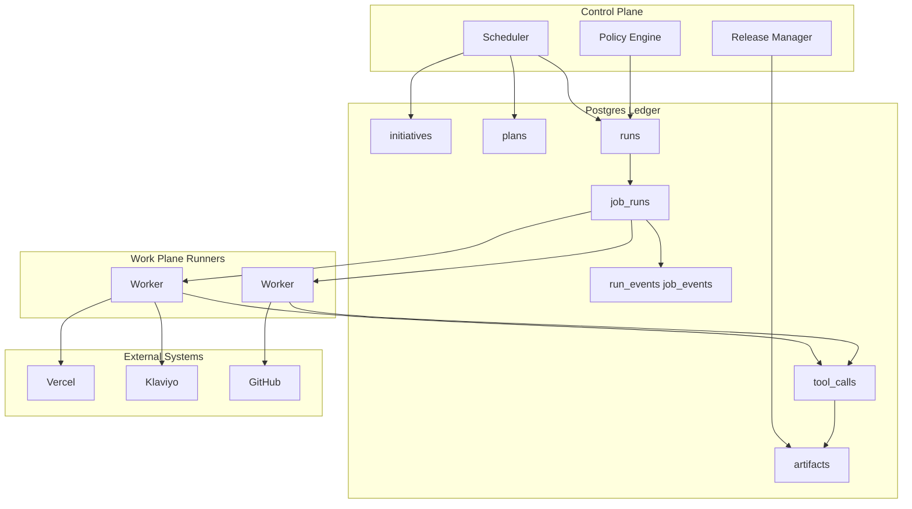
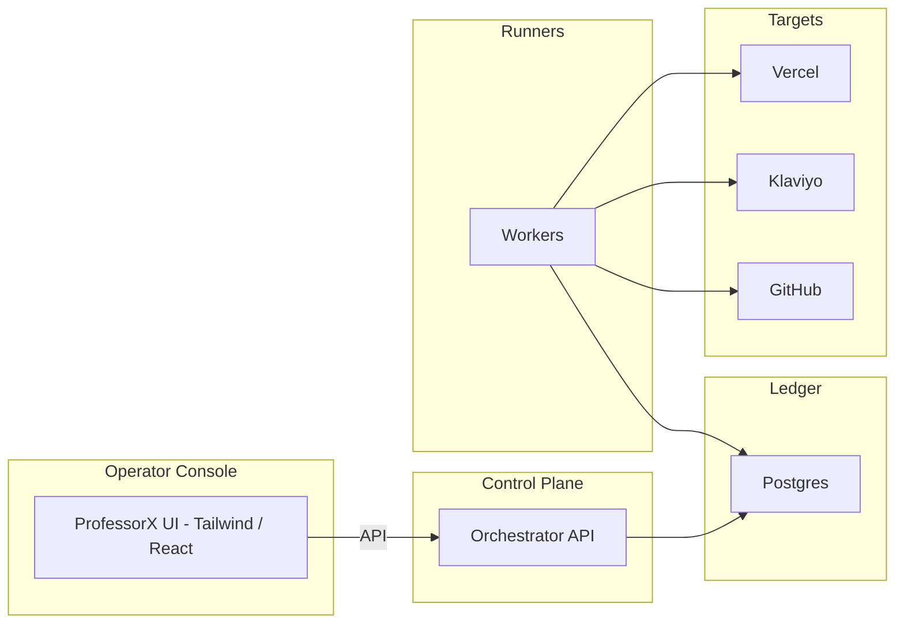

# AI Software Factory: Schema Spec and Technical Stack Plan (Detailed)

**Blueprint status (alignment with repo):** This document remains the **canonical long-form spec**. The repo implements it: core schema (sections 5.1–5.21) is in `supabase/migrations/20250303000000_ai_factory_core.sql`; scheduler lock, job_claims, node_outcomes, repair_recipes, release_routes exist; Control Plane, Runner Fleet, ProfessorX Console, self-heal (deploy-failure, no-artifacts, repair engine), and Eval Initiative (nightly failure-cluster scan + sandbox replay) are implemented. **Hosting:** The spec lists Control Plane/Runners as "K8s/ECS/Fly/VM"; in practice this repo also uses **Render** (Docker) for Control Plane and runners—see `render.yaml`, `docs/RUNNERS_DEPLOYMENT.md`. **Extensions beyond this spec:** Later migrations add `incident_memory`, `deploy_events`, `intent_documents`, `intent_resolutions`, `artifact_consumption`, graph runtime tables, `vercel_self_heal_projects`; these extend rather than replace the spec. **Section 18** (creativepropulsionlabs/.github prompts/ADR) is optional reference; adopt or adapt if using that org.

## 1. Executive Summary and Strategic Context

### 1.1 What We Are Building

This plan produces **human-ready specification artifacts** for an AI Software Factory: a schema-driven orchestration system that can autonomously execute development and marketing pipelines, self-correct via multi-hypothesis repair and multi-LLM escalation, self-document (.mdd), and—critically—**safely build itself** (self-hosting) without bricking. The product reference is ProfessorX (“When an individual acquires great power, the use or misuse of that power is everything.”): plan-execution AI that composes from design tokens and schemas rather than freehand code, with MCP integrations (Vercel, Klaviyo, DNS, GitHub, etc.), Tailwind and other libraries so it can design with them (design-with-code), and a clear split between agnostic layers (intent, plans, design system) and non-agnostic execution adapters.

The **database schema is the kernel**. Your friend’s rule holds: the most important part is not written by AI—it is designed by humans from a precise spec. This plan therefore delivers a **schema specification document** (exact fields, types, constraints, indexes, idempotency strategy, event taxonomy, canary/rollback linkage, capability model) and a **reference pipeline spec for the Upgrade Initiative** (self-hosting). No raw DDL is produced; a lead engineer implements the DDL from the spec. Two workflow-engine variants are documented: **Temporal-first** (enterprise-grade durable workflows) and **DB-first** (Postgres as workflow engine with SKIP LOCKED queues), so the architecture remains portable and you can start DB-first while staying Temporal-compatible.

### 1.2 Why This Plan Is 5,000+ Words

The spec must be strong enough that implementation “doesn’t skip a beat”: determinism, idempotency, replayability, strong invariants, and safe schema evolution. That requires spelling out every invariant, every table’s role, every critical constraint, both execution variants, and the full self-hosting pipeline—so nothing is left ambiguous when the human implements it.

### 1.3 System Context: What the Factory Orchestrates (ProfessorX Reference)

The UI and product reference (ProfessorX) expose three major layers that the schema and pipeline must support. **Foundation** (design system): Components, Typography, Colors, Spacing, Blocks, Pages, Themes, Releases—so the system composes frontends from design tokens, not raw HTML. **Content / marketing:** Brand Themes, Campaign Definitions, Flow Definitions, Segment Definitions, Template Definitions—marketing orchestration as first-class artifacts. **Orchestration:** Dashboard (Overview, Scheduler Health), AI Calls, Executions, Initiatives, Jobs, Pipeline Runs, Pipelines, Plan Decomposition Edges/Nodes/Runs, Programs, Plans, Stages, Status Events, Tasks, Typed Job Details. That implies a task scheduler, a plan graph (DAG), typed jobs with input/output schemas, event-driven progression, and visibility into what is being deployed. The schema must store initiatives, compiled plans (nodes and edges), runs, job runs, artifacts (including deploy IDs, flow IDs, PRs, .mdd docs), validations, and events so that the Control Plane and Work Plane can execute, audit, and self-build against this single source of truth. MCP integrations (Vercel, Klaviyo, GitHub, DNS, etc.) are executed as governed tool_calls with idempotency and capability_grants, not ad-hoc agent calls.

### 1.4 High-Level Architecture (Control Plane, Postgres, Work Plane)

The system is structured so that the Control Plane (orchestrator) writes intent and state to Postgres; workers (Work Plane) poll or are triggered from that state and execute jobs, calling adapters and writing back results and events. Postgres is the canonical ledger; the workflow engine (Temporal or DB-first queue) drives *when* jobs run, but *what* ran and *what* was produced is always in Postgres. Workers (Runner Plane) read job_runs (e.g. SKIP LOCKED in DB-first) or are scheduled by Temporal (Temporal-first), execute adapter calls, resolve secret_refs via vault at runtime, write tool_calls and artifacts and job_events. External systems (Vercel, Klaviyo, GitHub, DNS) are touched only through adapters with idempotency and capability checks. This keeps the factory auditable and safe for self-hosting.

Conceptual data flow (mermaid):




Control Plane writes initiatives, plans, runs; workers claim job_runs, execute via adapters, write tool_calls and artifacts; Postgres remains the single source of truth for what happened.

### 1.4.1 Four-Layer Architecture (Alignment with System Architecture)

The system can be described as four layers that match the *AI Factory System Architecture* document:


| Layer               | Role                                                                                                        | In this plan                                                                                                                        |
| ------------------- | ----------------------------------------------------------------------------------------------------------- | ----------------------------------------------------------------------------------------------------------------------------------- |
| **Control Plane**   | Planning, scheduling, policy, governance, authoritative ledger                                              | Section 1.4, 2.1; Scheduler, Policy Engine, Release Manager; owns initiatives, plans, runs, release_routes                          |
| **Work Plane**      | Adapters, validators, generators, deploy tools; evolvable                                                   | Section 2.1; deployment/repo/marketing/workflow/data adapters (Vercel, GitHub, Klaviyo, n8n, Airtable, etc.)                        |
| **Runner Fleet**    | Distributed workers that execute plan nodes; ephemeral per-job workspaces, lease-based claiming             | Section 2.6C, 12C; job_claims, heartbeat, pinned sandbox; workers are stateless with respect to durable state (all state in ledger) |
| **MCP Tool Fabric** | Standardized connectors to external systems; capabilities invoked by runners in a controlled, auditable way | Section 2.6D; adapters, tool_calls, capability_grants; modular, replaceable integrations                                            |


The **orchestration ledger** (Postgres) is the authoritative record: Initiatives → Plans → Runs → Job Runs → Tool Calls → Artifacts → Events. Full traceability, replayability, and deterministic auditing.

**Observability and Audit Layer:** All execution activity is recorded for audit and analytics. Components: (1) **Execution events** — run_events, job_events. (2) **Artifact lineage tracking** — artifacts reference run_id, job_run_id, tool_call provenance; rollback_targets and artifact_class support retention and audit. (3) **Tool call logging** — tool_calls with request/response artifacts, idempotency_key, capability_grants. (4) **Error signature clustering** — error_signature normalization (5C), Incidents views, repair_recipes keyed by error_signature. (5) **Release scorecards** — Factory Scorecard, artifact_type scorecard_report and drift_report (sections 13.3–13.4).

### 1.4.2 Alignment with Full Architecture Blueprint

The *AI Factory Full Architecture Blueprint* (Control Plane • Work Plane • Runner Fleet • MCP Tool Fabric • Self-Improvement Systems) is fully reflected in this plan as follows.

**1. System Philosophy** — The factory is designed around four principles: **Determinism** (identical inputs → identical results; all execution logged and replayable). **Idempotency** (external side effects safely repeatable; tool calls include idempotency keys and request hashes). **Observability** (every run, job, artifact, and event traceable). **Controlled Evolution** (improvements must pass measurable validation before promotion). These underpin the ten invariants (section 3) and the self-improvement specs (13.3–13.4).

**2. Control Plane** — Section 1.4, 2.1, 2.6A: initiative planning and compilation, execution scheduling, capability authorization, policy enforcement, release routing and canary management, orchestration ledger persistence. No heavy execution; delegates to Runner Fleet.

**3. Work Plane** — Section 2.1, 2.6D: deployment, marketing, data, and integration adapters (GitHub, Vercel, Airtable, n8n, email, analytics); evolvable via upgrade workflows.

**4. Runner Fleet** — Section 2.6C, 12C. Runners are stateless execution agents. **Lifecycle (per claimed job):** (1) claim job from queue (job_claims lease); (2) load execution context (pinned run, release, plan node, policy, capability_grants); (3) call required tools (tool_calls via MCP adapters); (4) generate artifacts; (5) record events (job_events, run_events); (6) finalize run status and release lease. Properties: stateless, horizontally scalable; lease-based job claims; deterministic artifact generation; retry-safe execution; failure clustering via error_signature.

**5. MCP Tool Fabric** — Section 2.6D: unified abstraction for external services; tool_calls with structured records; consistent logging, rate limiting, security. Repository, deployment, automation, data, messaging.

**6. Orchestration Ledger** — Section 5, 2.6B: Postgres; Initiatives → Plans → Runs → Job Runs → Tool Calls → Artifacts → Events. Replayability, debugging, auditing, analytics.

**7. Self-Improvement Framework** — Section 12, 13.3, 13.4: Upgrade Initiative; proposal → PR → sandbox validation → staging → canary → promotion; measurable improvement required.

**8. Failure Analysis and Repair Library** — Section 13.3, 13.4: repair_recipes keyed by error_signature; patch pattern, validations, success rate; automatic application of known fixes.

**9. Evaluation and Replay System** — Section 13.3, 13.4: nightly Eval Initiative; analyze prod failures, replay in sandbox, validate repairs, generate PRs when improved.

**10. Observability and Analytics** — Section 1.4.1, 12B: structured events; run duration distributions, retry rates, error signature clustering, canary drift, deployment success rates.

**11. Security Model** — Section 5 (policies, capability_grants, secret_refs), 12B RBAC: capability grants, secret refs (vault at runtime); RBAC; environment-scoped capability_grants; policy approval workflows.

**12. UI Console Architecture** — Section 12B, 12B.4: internal operations console. Key views map to blueprint names: **initiatives dashboard** → Overview / Initiatives list; **run explorer** → Runs list + Run detail (flight recorder); **pipeline visualizer** → Plans list/detail + DAG viewer; **release manager** → Releases (canary, promote, rollback); **artifact explorer** → Artifacts list/detail; **adapter health monitor** → Adapters & Capabilities + Health (workers, leases). Operators inspect workflows, trigger runs, manage deployments.

**13. Distributed Scalability** — Runners are stateless; the system scales horizontally by adding workers. Job queues use database-backed leasing (job_claims, SKIP LOCKED) so parallel execution does not duplicate work (section 5A, 10, 12C).

**14. Long-Term Evolution** — Section 13.3, 13.4: repair knowledge base grows; failure rates decline, retry counts shrink, deployment velocity increases; platform becomes a reliable autonomous dev/marketing infrastructure.

### 1.5 Three Apps and Deployment (No Confusion: “It Launches Vercel” vs “Built on Vercel”)

**“It launches Vercel applications”** means Vercel is a **deployment target** (what the factory produces), not necessarily where the factory or console runs. The clean mental model:

- **App 1 — Control Plane (orchestrator + ledger API):** Owns Postgres ledger, policy engine, release manager, routing, approvals. Must be boring, stable, recoverable. **Self-hosted** (K8s/ECS/Fly/VM) with a real DB. It should **not** depend on Vercel for correctness; otherwise a bad deploy or Vercel outage could brick the orchestrator (“sawing off the branch you’re sitting on”).
- **App 2 — Operator Console (ProfessorX UI):** The internal web UI humans use. **Can be hosted on Vercel** (or anywhere)—it’s just a UI calling the Control Plane API. If the console dies, the factory can still run (operate via CLI/backup admin). Typically **React + Tailwind and other libraries** (design-with-code: compose UIs using those libraries as design tools; schema-driven components); can be Next.js. Stack: React, Tailwind, optional shadcn/ui or custom component system; UI is stateless and reads/writes only via the Control Plane API.
- **App 3 — Work Plane Outputs (targets):** Vercel apps the factory generates and deploys, Klaviyo assets it creates, DNS changes, GitHub repos/PRs. These are **products** the factory produces.

**Recommended deployment split (lock in spec):**

- **Operator Console (Next.js/React)** → Vercel (or elsewhere) — fast iteration, great DX; safe because it’s not the executor.
- **Control Plane API** → self-hosted (K8s/ECS/Fly/VM) + Postgres + optional Redis/NATS.
- **Runners** → self-hosted worker fleet (same cluster or separate).
- **Targets** → Vercel, Klaviyo, DNS, GitHub, etc.

So: “built on Vercel” can mean (1) UI hosted on Vercel ✅ (2) generated apps deployed to Vercel ✅ (3) control plane on Vercel ⚠️ risky for a self-building factory. The spec assumes (1) and (2); control plane is self-hosted.

**Data flow (who talks to whom):**




Console is stateless; it reads/writes only via the Control Plane API; the Control Plane writes to Postgres; runners execute and call targets.

---

## 2. Two-Plane Architecture and Self-Building Safety

### 2.1 Control Plane vs Work Plane

The system is split into two planes so that self-building cannot corrupt the orchestrator itself.

- **Control Plane (stable, minimal)**  
Orchestration scheduler, job queue / event bus, secrets/vault bridge, pipeline runner coordinator, policy engine (approvals, constraints), release manager, rollback logic. This part must remain stable and change rarely. **Rule:** The system may update the Work Plane autonomously within gates; Control Plane updates require stricter gates (e.g. human approval for control-plane code changes).
- **Work Plane (mutable)**  
Adapters (Vercel, Klaviyo, DNS, GitHub), schema library, code templates and generators, UI components and Tailwind token packs, doc generators (.mdd), repair strategies. This plane can evolve frequently; the factory can safely self-build it via PR-based changes, sandbox → staging → production promotion, and canary rollout.

### 2.2 Self-Building Must Be Patch-Based

Every self-change must be: create branch → commit diff → open PR → run full pipeline validation → merge only after gates. Never “edit files in place on prod.” This yields diffs, auditability, rollback targets, and reproducibility.

### 2.3 Three-Environment Promotion

- **Sandbox (ephemeral):** Fresh checkout, fresh dependencies, isolated or dummy secrets; run tests and static checks; generate preview artifacts.  
- **Staging (persistent):** Real integrations in “safe mode” (e.g. no sends, no prod DNS writes); smoke tests, synthetic transactions, 30–60 minute soak.  
- **Production:** Only after staging passes; explicit approval or automated green gates; high-risk actions (DNS prod, email send, billing) require human gate.

### 2.4 Deterministic Builds and Blast-Radius Controls

Pin: runtime image digests, dependency lockfiles, tool versions, schema versions, model versions and prompt templates for critical steps. Enforce file-scope constraints per job type (e.g. schema updates only touch `/schemas/`), diff size caps, and capability constraints so dangerous operations cannot be autonomous. The schema spec must support **pinning execution context** on every run: `runner_image_digest`, `workplane_bundle_version`, `policy_version`, `model_policy_version`, `repo_commit_base`, `environment`.

### 2.5 Lifeboat

Maintain a manual fallback: last-known-good branch/tag, ability to redeploy control plane manually, backup of schemas and adapters, minimal admin UI/CLI for rollback without the full system.

### 2.6 Six Subsystems (Factory OS Pattern)

The architecture implied by “it launches Vercel apps but doesn’t run on Vercel” and “doesn’t write code” (bounded transformations) is a **factory OS** with six subsystems. The plan’s schema and deliverables support all of them:

- **A) Control Plane API:** Accepts initiatives, compiles plans (DAG), schedules nodes, enforces policy, routes canaries, triggers rollback. Owns plan compilation, approvals, run creation, persistence to Postgres. Self-hosted.
- **B) Ledger DB (Postgres):** Canonical source for plans/nodes/edges, runs/job_runs/node_progress/node_completions/node_outcomes, tool_calls, artifacts, events, policies, adapters, secret_refs, job_claims, worker_registry, release_routes, rollback_targets, secret_access_events.
- **C) Runner Fleet:** Long-running worker processes (not serverless): claim eligible jobs (node_progress + job_claims), execute node logic in pinned sandbox (image/commit/bundle), call MCP adapters, write artifacts + events, heartbeat leases. Runners are always-on.
- **D) Adapter Registry + MCP:** One interface per integration (Vercel, GitHub, Klaviyo, DNS, etc.); idempotency keys, capability gating, request schema validation, rollback handles. tool_calls + operation_key + capability_grants in schema.
- **E) Artifact Store + .mdd:** Blob store (S3/R2/GCS) for request/response bodies, logs, build outputs; doc generator turns runs into .mdd timelines. artifacts table holds refs; content out of DB.
- **F) Secrets Vault:** secret_refs only in DB; runners resolve at runtime; secret_access_events for audit. LLM never sees secrets.

**Runner internals (for implementers):** Job claim loop (poll eligible → job_claims lease → run); execution sandbox (ephemeral workspace, pinned image/commit/bundle for determinism); typed node executor (input/output schema, limited file scope, allowed tools); repair loop (error_signature → hypotheses → test in clean sandbox → escalate model → halt + .mdd). “Doesn’t write code” = templates + tokens + composition; repairs are patch-based, not full rewrites.

---

## 3. The Ten Invariants the Schema Must Enforce

The human-ready schema spec will state these as the **contract** the implementation must satisfy.

1. **Append-only ledger where it matters**
  State transitions are recorded in event tables; “current status” is derivable (materialized view or derived column). Enables replay and proof of what happened when the system self-corrects.
2. **Strict idempotency keys on every side-effect**
  Every external call that can create or modify something has an `idempotency_key` and a unique constraint (e.g. `(adapter_id, idempotency_key)` on `tool_calls`). Retries must not duplicate deployments, flows, segments, or DNS records.
3. **Runs are immutable execution contexts**
  A run pins: `runner_image_digest`, `workplane_bundle_version`, `policy_version`, `model_policy_version`, `repo_commit_base`, `environment`. Same inputs imply same outputs only if execution context is pinned.
4. **Plans are compiled artifacts**
  A plan is a compiled DAG with nodes, edges, input/output schema refs per node, deterministic seed, and hash of compilation inputs. No loose text; determinism and reproducibility.
5. **Node execution is strictly ordered, exactly-once by constraint**
  The DB and application logic prevent a node from being “succeeded” twice and from running before dependencies. Enforced via `job_run` unique constraints and dependency resolution in the scheduler.
6. **Artifacts are first-class, typed, content-addressed**
  Every meaningful output (PR URL, commit SHA, Vercel deploy ID, Klaviyo flow ID, .mdd doc, logs ref) is an artifact with `artifact_type`, `uri`, `sha256`, `created_by_job_run_id`. Enables auditability, replay, and rollback targets.
7. **Secrets never appear in DB**
  Only `secret_ref` pointers, scopes, and policies. No keys, headers, or masked values.
8. **Policies are versioned and attached to runs**
  Each run references the exact policy version used so you can explain why something happened at a given time.
9. **Canary cohorts supported**
  Fields for `release_id`, `cohort` (canary/control), `percent_rollout`, `routed_at` so safe self-updates and analysis are possible.
10. **Migrations are safe (online)**
  Additive changes first, backfills via controlled jobs, dual-write/dual-read, eventual constraint tightening. The system must migrate without skipping a beat.

---

## 4. State + Event Hybrid: Operational vs Ledger Tables

The schema pattern is two complementary layers.

- **Operational tables (current state):** Fast reads for UI and scheduler. Include: `initiatives`, `plans`, `plan_nodes`, `plan_edges`, `runs`, `job_runs`, `artifacts`, `adapters`, `policies`, `releases`, `secret_refs`. Optionally `capability_grants`.
- **Ledger tables (append-only truth):** Immutable history. Include: `run_events` (status transitions, gates), `job_events` (attempts, failure signatures, repair/escalation), `tool_calls` (typed adapter invocations with idempotency), `validations` (test/lint/policy results), `approvals` (who approved what, when). This makes the system self-healing and explainable.

---

## 5. Human-Ready Schema Spec: Table-by-Table (Exact Structure)

The following is the level of detail the schema spec document must contain. Each table is specified with exact field names, logical types, nullability, primary/foreign keys, unique constraints, and recommended indexes. Semantics (what the row represents and who writes it) are brief but unambiguous.

### 5.1 initiatives

- **id** — uuid, PK, not null.  
- **intent_type** — text, not null (e.g. `deploy_app`, `create_flow`, `connect_domain`, `self_update`).  
- **title** — text, nullable.  
- **risk_level** — text, not null (`low` | `med` | `high`).  
- **created_by** — text, nullable (user or service identifier).  
- **created_at** — timestamptz, not null.

**Semantics:** One row per user or system goal. Written by the Control Plane when an initiative is created. No unique constraint beyond PK; idempotency for the *run* is at the run level.

**Indexes:** `(created_at DESC)`, `(intent_type, created_at)`, `(risk_level)` for filtering.

---

### 5.2 plans (compiled DAG)

- **id** — uuid, PK, not null.  
- **initiative_id** — uuid, FK → initiatives(id), not null.  
- **plan_hash** — text, not null (hash of compilation inputs).  
- **deterministic_seed** — text, nullable.  
- **created_at** — timestamptz, not null.

**Unique constraint:** `(initiative_id, plan_hash)` so compiling the same inputs twice yields the same plan identity.

**Semantics:** One row per compiled execution graph. Written by the planning engine. The plan is immutable once created.

**Indexes:** `(initiative_id)`, `(created_at DESC)`.

---

### 5.3 plan_nodes

- **id** — uuid, PK, not null.  
- **plan_id** — uuid, FK → plans(id), not null.  
- **node_key** — text, not null (stable key, e.g. `deploy.webapp`).  
- **job_type** — text, not null (e.g. `DeployVercelApp`, `CreateKlaviyoFlow`).  
- **node_type** — text, not null (`job` | `gate` | `approval` | `validator`).  
- **input_schema_ref** — text, nullable.  
- **output_schema_ref** — text, nullable.  
- **retry_policy_json** — jsonb, nullable.  
- **risk_level** — text, nullable (node-level override).  
- **created_at** — timestamptz, not null.

**Unique constraint:** `(plan_id, node_key)`.

**Semantics:** One row per node in the plan DAG. Written when the plan is compiled.

**Indexes:** `(plan_id)` (for resolving edges and scheduling).

---

### 5.4 plan_edges

- **id** — uuid, PK, not null.  
- **plan_id** — uuid, FK → plans(id), not null.  
- **from_node_id** — uuid, FK → plan_nodes(id), not null.  
- **to_node_id** — uuid, FK → plan_nodes(id), not null.  
- **condition** — text, not null (`success` | `failure` | `approval` | etc.).  
- **created_at** — timestamptz, not null.

**Unique constraint:** `(plan_id, from_node_id, to_node_id, condition)`.

**Semantics:** Dependencies between nodes. Written at plan compile time.

**Indexes:** `(plan_id)`, `(to_node_id)` (for dependency resolution: “which nodes are ready when this one completes?”).

---

### 5.5 releases (rollout objects)

- **id** — uuid, PK, not null.  
- **control_plane_version** — text, nullable.  
- **workplane_bundle_version** — text, nullable.  
- **runner_image_digest** — text, nullable.  
- **policy_version** — text, nullable (or FK to policies).  
- **created_at** — timestamptz, not null.  
- **status** — text, not null (`draft` | `canary` | `promoted` | `rolled_back`).  
- **percent_rollout** — int, nullable (0–100; only meaningful when status = canary; config for what fraction of runs go to this release).

**Semantics:** One row per versioned bundle (control + work plane + runner + policy). percent_rollout is release config; runs do not store percent_rollout. Used for canary and rollback. Written by release manager.

**Indexes:** `(status)`, `(created_at DESC)`.

---

### 5.5b release_routes (routing config — canary by config, not code)

- **id** — uuid, PK, not null.  
- **environment** — text, not null.  
- **rule_id** — text, not null.  
- **release_id** — uuid, FK → releases(id), not null.  
- **cohort** — text, not null (`canary` | `control`).  
- **percent** — int, not null (0–100).  
- **constraints** — jsonb, nullable (e.g. only certain initiative types, or null = all).  
- **active_from** — timestamptz, nullable.  
- **active_to** — timestamptz, nullable.

**Semantics:** Routing logic lives in data, not only in code. Scheduler consults release_routes to decide which release and cohort a new run gets. Makes canary reversible by config (adjust percent or active_to). Prevents “routing logic in code only” so production can tune rollout without deploys.

**Indexes:** `(environment)`, `(release_id)`, `(active_from, active_to)`.

---

### 5.6 runs (execution contexts)

- **id** — uuid, PK, not null.  
- **plan_id** — uuid, FK → plans(id), not null.  
- **release_id** — uuid, FK → releases(id), not null (beyond MVP; self-hosting without pinning a release is nondeterminism).  
- **policy_version** — text, nullable (explicit policy version used for this run; may also be implied by release, but “release bundle policy” and “runtime policy pointer” differ operationally—store explicitly).  
- **environment** — text, not null (`sandbox` | `staging` | `prod`).  
- **cohort** — text, nullable (`canary` | `control`).  
- **status** — text, not null (`queued` | `running` | `succeeded` | `failed` | `rolled_back`).  
- **started_at** — timestamptz, nullable.  
- **ended_at** — timestamptz, nullable.  
- **root_idempotency_key** — text, not null.  
- **routed_at** — timestamptz, nullable (when this run was routed to a release).  
- **routing_reason** — text, nullable (e.g. “canary_sample”, “manual”).  
- **routing_rule_id** — text, nullable (id of the rule that chose this release/cohort).  
- **prompt_template_version** — text, nullable (pin which prompt templates this run uses; enables attribution of improvements/regressions).  
- **adapter_contract_version** — text, nullable (pin adapter contract version; enables attribution).  
- **scheduler_lock_token** — uuid, nullable (soft lock: which scheduler owns advancement of this run).  
- **scheduler_lock_expires_at** — timestamptz, nullable.

**Invariant:** Only one active “run coordinator” at a time per run. Scheduler (or run_claims table, same pattern as job_claims) acquires the lock before advancing the run (e.g. updating node_progress, transitioning run status). Prevents duplicate schedulers from double-incrementing deps_satisfied or marking nodes eligible twice during leader failover. Optional: **run_claims** table (run_id, worker_id, claim_token, claimed_at, lease_expires_at, heartbeat_at, released_at) if soft lock on runs is insufficient.

**Unique constraint:** `(environment, root_idempotency_key)`.

**Semantics:** One row per concrete execution of a plan. Pins execution context via release_id and policy_version. Written by Control Plane / workers.

**Indexes:** `(plan_id)`, `(release_id)`, `(status)`, `(environment, started_at DESC)`, `(cohort)`, `(scheduler_lock_expires_at)` for lock expiry sweep.

---

### 5.7 job_runs (node execution attempts — Pattern A)

**Design decision (locked):** Job run model is **Pattern A: attempt rows + derived current state.** Each attempt is one row (immutable once terminal). “Current attempt” for a node is derived as max(attempt) for (run_id, plan_node_id). Terminal outcome for the node is the status of that latest attempt. Do not mix with Pattern B (one row per node + attempts in events); this spec commits to Pattern A for append-only consistency and clear lease binding (one job_claims row per job_run_id = one attempt).

- **id** — uuid, PK, not null.  
- **run_id** — uuid, FK → runs(id), not null.  
- **plan_node_id** — uuid, FK → plan_nodes(id), not null.  
- **attempt** — int, not null (1-based).  
- **status** — text, not null (`queued` | `running` | `succeeded` | `failed`). Retry is implemented by inserting a new job_run row (attempt+1, status `queued`); there is no `retrying` status.  
- **started_at** — timestamptz, nullable.  
- **ended_at** — timestamptz, nullable.  
- **error_signature** — text, nullable (normalized failure fingerprint).  
- **idempotency_key** — text, not null. **Stable across attempts:** Represents the logical node action, not the attempt. Formula: e.g. `{run_id}:{plan_node_id}` (do not include attempt). So when worker dies after a successful side-effect but before writing tool_calls, attempt+1 re-run uses the same idempotency_key and dedupes against the existing tool_calls row. See section 5A (stable idempotency).

**Unique constraint:** `(run_id, plan_node_id, attempt)` — one row per attempt. **Single winner:** Only one row per (run_id, plan_node_id) may have status `succeeded`; enforced via **node_outcomes** (section 5.7c) or application contract (worker INSERT node_outcomes ... ON CONFLICT DO NOTHING; if conflict, mark attempt failed—lost race).

**Semantics:** One row per execution attempt of a plan node. Written by workers (or Temporal activities). “Eligible” for scheduling = queued job_run whose node has node_progress status `eligible`. See 5.7b, 5.7c.

**Indexes:** `(run_id)`, `(status)` for queue polling; `(run_id, plan_node_id)` for dependency resolution and “current attempt” derivation; `(idempotency_key)` if used for lookups.

---

### 5.7b node_progress (dependency eligibility materialization)

- **id** — uuid, PK, not null.  
- **run_id** — uuid, FK → runs(id), not null.  
- **plan_node_id** — uuid, FK → plan_nodes(id), not null.  
- **deps_total** — int, not null (count of predecessor edges).  
- **deps_satisfied** — int, not null (count of predecessors that have a succeeded attempt).  
- **eligible_at** — timestamptz, nullable (set when deps_satisfied = deps_total; node is then eligible for scheduling).  
- **status** — text, not null (`pending` | `eligible` | `running` | `succeeded` | `failed`).

**Unique constraint:** `(run_id, plan_node_id)` — one row per node per run.

**Update semantics (must be defined):** Either (1) **Trigger-based:** DB trigger on job_run status → `succeeded` writes to **node_completions** (see 5.7b2); a second process or trigger derives node_progress.deps_satisfied from node_completions so each successor increment happens once. Or (2) **Application-based:** Scheduler (single-writer per run via run-level lock) processes “node X succeeded” and increments deps_satisfied for successors; idempotency guard: only process a given (run_id, from_node_id) once (see node_completions ledger below). **Idempotency guard:** Use **node_completions** (or edge_satisfaction_events): table with (run_id, from_node_id) unique—records that “from_node has succeeded for this run.” Then successor increments are derived from this ledger (count completions that are predecessors of each node). Prevents double-increment when retries or duplicate events occur.

**Indexes:** `(run_id)`, `(status)` for “give me eligible nodes”; `(eligible_at)` for time-based polling if needed.

---

### 5.7b2 node_completions (ledger for dependency updates — idempotent)

- **run_id** — uuid, FK → runs(id), not null.  
- **from_node_id** — uuid, FK → plan_nodes(id), not null (the node that completed).  
- **job_run_id** — uuid, FK → job_runs(id), not null (the winning attempt that succeeded).  
- **completed_at** — timestamptz, not null.

**Unique constraint:** `(run_id, from_node_id)` — records “from_node has succeeded for this run” exactly once. Scheduler or trigger inserts on job_run success; ON CONFLICT DO NOTHING so the same completion never increments successors twice. node_progress.deps_satisfied is derived (count rows in node_completions where from_node_id is a predecessor of the node).

**Indexes:** `(run_id)`, `(from_node_id)`.

---

### 5.7c node_outcomes (single-winner node success)

- **run_id** — uuid, FK → runs(id), not null.  
- **plan_node_id** — uuid, FK → plan_nodes(id), not null.  
- **outcome_status** — text, not null (`succeeded` | `failed`).  
- **winning_job_run_id** — uuid, FK → job_runs(id), not null (the attempt that won).

**Unique constraint:** `(run_id, plan_node_id)` — exactly one outcome per node per run. **Enforcement:** Worker that believes its attempt succeeded does INSERT node_outcomes ... ON CONFLICT DO NOTHING. If insert succeeds, it marks its job_run status `succeeded`. If conflict (another worker already wrote), it marks its attempt `failed` (lost race). This is the classic distributed “winner election”; without it, two attempts could both claim success.

**Indexes:** `(run_id)`, `(winning_job_run_id)`.

---

### 5.8 tool_calls (adapter invocations)

- **id** — uuid, PK, not null.  
- **job_run_id** — uuid, FK → job_runs(id), not null.  
- **adapter_id** — uuid, FK → adapters(id), not null.  
- **capability** — text, not null (`deploy` | `create_flow` | `set_dns` | etc.).  
- **operation_key** — text, not null for side-effecting calls (desired-state identity: e.g. `klaviyo_flow:brand_id:welcome_flow:v3`, `vercel_deploy:project:alias:prod`, `dns:domain:record_type:name`). Adapter uses get-or-create by this key to prevent duplicate creations.  
- **idempotency_key** — text, not null (derived from job_run.idempotency_key + adapter + capability + operation_key; stable across attempts—see 5.7).  
- **request_hash** — text, nullable (sha256 of normalized request body; safety on retries).  
- **request_schema_ref** — text, nullable.  
- **response_schema_ref** — text, nullable.  
- **request_artifact_id** — uuid, FK → artifacts(id), nullable.  
- **response_artifact_id** — uuid, FK → artifacts(id), nullable.  
- **status** — text, not null (`pending` | `running` | `succeeded` | `failed`).  
- **started_at** — timestamptz, nullable.  
- **ended_at** — timestamptz, nullable.

**Unique constraints:** (1) `(adapter_id, idempotency_key)` for retry dedupe. (2) `(adapter_id, capability, operation_key)` — one logical external object per operation_key; encodes “what object is being targeted” and prevents duplicate creations when idempotency_key is reused across attempts. **Request-hash safety:** On retry, if a row exists for (adapter_id, idempotency_key), the new request’s request_hash must equal the stored request_hash; otherwise reject.

**Semantics:** One row per adapter invocation. Adapters should use desired-state / get-or-create: resolve operation_key to existing object first; create only if missing. Written by workers. Request/response in artifacts.

**Indexes:** `(job_run_id)`, `(adapter_id, idempotency_key)` (unique), `(adapter_id, capability, operation_key)` (unique), `(status)`.

---

### 5.9 validations

- **id** — uuid, PK, not null.  
- **job_run_id** — uuid, FK → job_runs(id), nullable (or run_id if validation is run-scoped).  
- **run_id** — uuid, FK → runs(id), nullable.  
- **validator_type** — text, not null (`unit_test` | `schema_validate` | `policy_lint` | `golden_test`).  
- **status** — text, not null (`pass` | `fail`).  
- **report_artifact_id** — uuid, FK → artifacts(id), nullable.  
- **created_at** — timestamptz, not null.

**Semantics:** One row per validation result. Written by validators. Enables “no docs → no promotion” and gate checks.

**Indexes:** `(job_run_id)`, `(run_id)`, `(validator_type)`.

---

### 5.10 artifacts (typed outputs)

- **id** — uuid, PK, not null.  
- **run_id** — uuid, FK → runs(id), not null.  
- **job_run_id** — uuid, FK → job_runs(id), nullable.  
- **artifact_type** — text, not null (`git_commit` | `pr_url` | `vercel_deploy_id` | `dns_change_id` | `klaviyo_flow_id` | `mdd_doc` | `build_log` | `schema_bundle` | `scorecard_report` | `drift_report` | `golden_validation` | `hypothesis_report` | `patch_bundle` | etc.). See sections 13.3–13.4 for scorecard_report, drift_report (release-scoped improvement evidence), golden_validation (golden suite runs), hypothesis_report (upgrade hypothesis), patch_bundle (upgrade diff).  
- **artifact_class** — text, not null (`logs` | `docs` | `external_object_refs` | `schema_bundles` | `build_outputs`). Drives retention and access control; do not mix logs and deploy IDs in the same class. See section 5D.  
- **uri** — text, not null (stable, immutable after publication).  
- **sha256** — text, nullable (content-addressable; multiple artifacts may share sha256 for dedup).  
- **metadata_json** — jsonb, nullable (for rollback use structured schema per artifact_type or rollback_targets table; see 5E).  
- **created_at** — timestamptz, not null.

**Immutability:** Artifacts are immutable once written (no updates to uri, sha256, or content). **Optional unique constraint:** `(sha256)` for content-addressable dedup. **Index:** `(run_id, artifact_type)`, `(artifact_class)` for retention/access.

**Semantics:** Every meaningful output of a run. Written by workers and adapters. Rollback: use rollback_targets (5E) or schema-enforced metadata per artifact_type.

---

### 5.11 policies (versioned, immutable)

- **version** — text, PK (or id uuid PK + version unique not null).  
- **created_at** — timestamptz, not null.  
- **rules_json** — jsonb, not null. **Self-build guardrails must be first-class fields in the schema** (not prose), so they are machine-enforced during self-build incidents. Recommended keys: **max_changed_files**, **max_diff_bytes**, **allowed_paths_by_job_type** (json), **deny_paths** (json), **requires_approval_if_paths_touched** (json), **self_update_max_depth** (e.g. 1), **control_plane_requires_human_approval** (boolean). Risk thresholds, approvals required, and diff caps as already described. The spec will define the exact JSON schema for rules_json.

**Semantics:** Policies are immutable and versioned. Runs reference policy_version explicitly. “Current policy” is control-plane config or policy_pointer table. No `active` boolean on policies.

**Indexes:** `(version)`.

---

### 5.12 secret_refs (vault pointers)

- **id** — uuid, PK, not null.  
- **name** — text, not null (e.g. `secret://klaviyo/api_key`).  
- **vault_path** — text, not null.  
- **scope** — text, not null (`staging` | `prod`).  
- **capabilities_allowed** — text[], nullable.  
- **rotated_at** — timestamptz, nullable.

**No secrets stored. Ever.**

**Semantics:** Reference only. Runner resolves at runtime via vault. Written by ops; read by policy/capability checks.

**Indexes:** `(name)`, `(scope)`.

---

### 5.12b secret_access_events (append-only ledger)

- **id** — uuid, PK, not null (or bigint serial).  
- **secret_ref_id** — uuid, FK → secret_refs(id), not null.  
- **environment** — text, not null.  
- **job_run_id** — uuid, FK → job_runs(id), nullable.  
- **tool_call_id** — uuid, FK → tool_calls(id), nullable.  
- **worker_id** — text, not null.  
- **accessed_at** — timestamptz, not null.  
- **purpose** — text, nullable (e.g. “tool_call”, “runner_start”).

**Semantics:** Log “who/what accessed secret_ref X in env Y at time Z.” Never log the secret value—only the access. job_run_id and tool_call_id link the access to the execution context for audit and exfil detection. Written by the vault bridge or runner when resolving a secret_ref.

**Indexes:** `(secret_ref_id, accessed_at)`, `(environment, accessed_at)`, `(job_run_id)`, `(tool_call_id)`.

---

### 5.12c Policy enforcement boundaries (spec text, not a table)

The spec will explicitly state:  

- The LLM **never** sees raw secrets; only references like `secret://klaviyo/api_key`.  
- **Runners** resolve secrets at runtime via vault; vault returns value to runner process only.  
- **Logs** are redacted before storage (bearer tokens, query params, headers, secret placeholders).  
- **Tool_call payload artifacts** (request/response bodies) are access-controlled; may contain redacted or hashed sensitive fields per policy.  
This prevents self-documentation or logs from accidentally leaking secrets.

---

### 5.13 adapters (MCP / tool registry)

- **id** — uuid, PK, not null.  
- **name** — text, not null (`vercel`, `github`, `klaviyo`, `cloudflare`, etc.).  
- **version** — text, not null.  
- **capabilities** — text[], not null.  
- **schema_contract_ref** — text, nullable.  
- **created_at** — timestamptz, not null.

**Semantics:** Registry of tool integrations. Used by tool_calls and capability_grants.

**Indexes:** `(name, version)`.

---

### 5.14 run_events (append-only)

- **id** — uuid, PK, not null (or bigint serial).  
- **run_id** — uuid, FK → runs(id), not null.  
- **event_type** — text, not null (`queued` | `started` | `stage_entered` | `stage_exited` | `succeeded` | `failed` | `rolled_back`).  
- **payload_artifact_id** — uuid, FK → artifacts(id), nullable.  
- **created_at** — timestamptz, not null.

**Semantics:** Every run status transition. Append-only. Enables replay and audit.

**Indexes:** `(run_id, created_at)`.

---

### 5.15 job_events (append-only)

- **id** — uuid, PK, not null (or bigint serial).  
- **job_run_id** — uuid, FK → job_runs(id), not null.  
- **event_type** — text, not null (`attempt_started` | `attempt_succeeded` | `attempt_failed` | `hypothesis_generated` | `patch_applied` | `escalated_model` | `halted`).  
- **payload_json** — jsonb, nullable (or payload_artifact_id).  
- **created_at** — timestamptz, not null.

**Semantics:** Per-job-run attempt and repair events. Append-only. Enables repair audit and escalation proof.

**Indexes:** `(job_run_id, created_at)`.

---

### 5.16 capability_grants (Anthropic-grade extra)

- **id** — uuid, PK, not null.  
- **environment** — text, not null.  
- **release_id** — uuid, FK → releases(id), nullable (null = any release).  
- **adapter_id** — uuid, FK → adapters(id), not null.  
- **capability** — text, not null.  
- **requires_approval** — boolean, not null.  
- **max_qps** — int, nullable.  
- **max_daily_actions** — int, nullable.  
- **created_at** — timestamptz, not null.

**Semantics:** Gates what the orchestrator is allowed to do at runtime. Prevents a bug from spamming 50k Klaviyo actions. Checked before executing tool_calls.

**Indexes:** `(environment, adapter_id, capability)`.

---

### 5.17 approvals (optional ledger table)

- **id** — uuid, PK, not null.  
- **run_id** — uuid, FK → runs(id), not null.  
- **job_run_id** — uuid, FK → job_runs(id), nullable.  
- **approver** — text, not null.  
- **action** — text, not null (`approved` | `rejected`).  
- **created_at** — timestamptz, not null.

**Semantics:** Who approved or rejected what and when. Append-only. For human gates.

**Indexes:** `(run_id)`, `(created_at)`.

---

### 5.18 job_claims (leases — exactly-once execution)

- **id** — uuid, PK, not null.  
- **job_run_id** — uuid, FK → job_runs(id), not null.  
- **worker_id** — text, not null.  
- **claim_token** — uuid, not null, unique (one unique token per claim; generated at claim time).  
- **claimed_at** — timestamptz, not null.  
- **lease_expires_at** — timestamptz, not null.  
- **heartbeat_at** — timestamptz, not null.  
- **attempt_token** — text, nullable (semantic identifier e.g. run_id:plan_node_id:attempt; optional).  
- **released_at** — timestamptz, nullable (set when worker completes or abandons).

**Invariant:** Only one active claim per job_run attempt (one row with `released_at IS NULL` per job_run_id). Unique partial index on `(job_run_id)` WHERE released_at IS NULL.

**Semantics:** A worker claims a job by inserting a row with a new claim_token; it heartbeats by updating `heartbeat_at`. If heartbeat is stale or lease_expires_at passed, the scheduler marks the lease released and the job becomes re-claimable. Prevents zombie jobs and duplicate execution. **Temporal-first:** Even when Temporal owns activity scheduling, job_claims provides consistent observability (which worker has which job) and a recovery path if Temporal and Postgres need to be reconciled.

**Indexes:** `(job_run_id)` WHERE released_at IS NULL; `(worker_id, heartbeat_at)`; `(lease_expires_at)`.

---

### 5.19 worker_registry (optional)

- **id** — uuid, PK, not null.  
- **worker_id** — text, unique, not null.  
- **last_heartbeat_at** — timestamptz, not null.  
- **runner_version** — text, nullable.  
- **created_at** — timestamptz, not null.

**Semantics:** Optional registry of known workers for dead-worker detection and canary routing (e.g. route canary release to a subset of workers). Written by workers on startup and heartbeat.

---

### 5.20 repair_recipes (repair knowledge base)

- **id** — uuid, PK, not null.  
- **error_signature** — text, not null (matches error_signature from job_runs).  
- **job_type** — text, nullable (scoped to specific job_type, or null = any).  
- **adapter_id** — uuid, FK → adapters(id), nullable (scoped to specific adapter, or null = any).  
- **capability** — text, nullable.  
- **patch_pattern** — text, not null (e.g. "increase_timeout + exponential_backoff", "normalize_request_payload").  
- **validation_required** — text, not null (which validator must pass after applying this recipe).  
- **created_from_job_run_id** — uuid, FK → job_runs(id), nullable (provenance: the job_run that first produced this fix).  
- **success_count** — int, not null, default 0.  
- **failure_count** — int, not null, default 0.  
- **last_used_at** — timestamptz, nullable.  
- **created_at** — timestamptz, not null.

**Semantics:** Repair knowledge base. When a failure occurs, the repair loop checks repair_recipes by error_signature before exploring new hypotheses. Successful new repairs are promoted into this table. Enables compounding improvement (section 13.3–13.4).

**Indexes:** `(error_signature)`, `(job_type, adapter_id)`, `(last_used_at DESC)`.

---

### 5.21 llm_calls (optional — model escalation audit)

- **id** — uuid, PK, not null.  
- **run_id** — uuid, FK → runs(id), not null.  
- **job_run_id** — uuid, FK → job_runs(id), not null.  
- **model_tier** — text, not null (e.g. `cheap`, `strong`).  
- **model_id** — text, not null (model name or alias).  
- **prompt_template_version** — text, nullable.  
- **tool_registry_version** — text, nullable.  
- **tokens_in** — int, nullable.  
- **tokens_out** — int, nullable.  
- **latency_ms** — int, nullable.  
- **created_at** — timestamptz, not null.

**Semantics:** Optional table for model escalation audit. If not using a separate table, store model_tier, model_id, prompt_template_version, tool_registry_version in job_events.payload_json for escalated_model events. This table enables attribution (which model produced which result) and cost tracking. See 12C.5a.

**Indexes:** `(run_id)`, `(job_run_id)`, `(model_tier)`, `(created_at DESC)`.

---

## 5A. Concurrency and Exactly-Once Semantics

The spec must define precisely how the system achieves exactly-once execution for jobs and tool calls, and how it behaves under worker death and re-claim.

**Job execution — claiming:**  
A worker claims a job by acquiring a lease: insert (or update) a row in `job_claims` with `job_run_id`, `worker_id`, `claim_token`, `claimed_at`, `lease_expires_at`, `heartbeat_at`, `released_at` NULL. Constraint: only one active lease per `job_run_id` (one row with `released_at IS NULL` per job_run_id). In DB-first, the worker first selects a queued job_run (dependency preconditions met) with SKIP LOCKED, then immediately inserts/updates job_claims for that job_run; if the insert fails (unique violation), another worker won. In Temporal-first, Temporal’s activity claim is the execution guarantee; job_claims can still be used to unify runner visibility (which worker is running which job) and for heartbeat-based liveness.

**Lease duration and heartbeat:**  

- **lease_expires_at** = claimed_at + lease_duration (e.g. 5–15 minutes).  
- Worker must update **heartbeat_at** at least every heartbeat_interval (e.g. 30–60 seconds).  
- If **heartbeat_at** is older than a threshold (e.g. 2× heartbeat_interval), the lease is considered dead.  
- Scheduler (or a background job) periodically scans for leases where heartbeat_at < now() - threshold or lease_expires_at < now(); it marks them released (sets released_at) and re-queues the job_run (new attempt row with attempt+1, status queued). **Idempotency keys do not change:** job_runs.idempotency_key is stable (run_id:plan_node_id only—no attempt); tool_calls use the same idempotency_key on retry so the new attempt dedupes against any tool_call the dead worker already wrote.

**Worker death — stable idempotency (critical):**  
If the worker died **after** the external side-effect succeeded but **before** writing tool_calls/artifacts, attempt+1 would otherwise repeat the side-effect. **Rule: idempotency keys must be stable across attempts for the same logical side-effect.** So: (1) **job_runs.idempotency_key** = logical node action only, e.g. `{run_id}:{plan_node_id}` — do **not** include attempt. (2) **tool_calls** derive idempotency_key from job_run.idempotency_key + adapter + capability + operation_key (not attempt). Then attempt+1 re-run uses the same keys; if the dead worker had already inserted a tool_call row with status `succeeded`, the new worker finds it and skips execution. If you used attempt in the key, you would lose dedupe and double-create. Recommendation: **stable idempotency across attempts.**

**Duplicate tool calls when job is re-claimed:**  
(1) Before executing a tool_call, the worker checks for an existing row (adapter_id, idempotency_key) or (adapter_id, capability, operation_key) with status `succeeded`; if present, skip and use existing response. (2) Because idempotency_key and operation_key are stable, the first worker’s successful call is visible to the second. (3) For in-flight (status `running`) after lease expiry, new worker reuses same keys; adapter get-or-create / operation_key ensures at most one external object.

**Artifact publication:**  
Artifacts are written only by the worker that holds the lease (or by Temporal activity). Once written, artifacts are immutable (see Artifact Classes). No duplicate artifact rows for the same logical output: use content-addressable sha256 and optional unique constraint, or unique (run_id, job_run_id, artifact_type, output_key) where applicable.

**State transitions:**  
State changes (runs.status, job_runs.status) occur only in allowed directions and are recorded in run_events/job_events. See **State Machine Contract** below. This prevents runs marked “succeeded” with failed nodes or job_runs stuck in “running” forever.

---

## 5B. State Machine Contract

The spec must define allowed status transitions explicitly so the UI never shows impossible states and canary metrics are trustworthy. Enforce via application logic or DB (triggers / allowed_transitions table / enums).

**runs.status — allowed transitions:**

- `queued` → `running` (scheduler started the run).
- `queued` → `failed` (preflight or validation rejected before any node ran).
- `running` → `succeeded` | `failed` | `rolled_back`.
- `failed` → `rolled_back` (via a separate rollback run that marks the original run rolled_back).

**Terminal states for runs:** `succeeded`, `failed`, `rolled_back`.

**Rule:** A run may not transition to `succeeded` unless all nodes (for that run) have a succeeded attempt; if any node’s latest attempt is `failed`, the run must be `failed` or `rolled_back`.

**job_runs.status — allowed transitions (Pattern A: one row per attempt):**

- `queued` → `running` (worker claimed and started).
- `running` → `succeeded` | `failed` (attempt finished).
- `running` → `failed` (scheduler marked failed on lease expiry / worker death).
- Retry: no status transition to `retrying`. On retry the system inserts a new job_run row with attempt+1 and status `queued`. The previous attempt remains `failed`.

**Terminal states for job_runs:** `succeeded`, `failed`.

**Rule:** Only one attempt per (run_id, plan_node_id) may be `succeeded`. On lease expiry, the scheduler sets the current job_run to `failed` and creates (or re-queues) the next attempt.

**Enforcement:** Implement via application or DB (e.g. CHECK or trigger that validates (old_status, new_status) against the allowed list). Without this, runs can be stuck in “running” forever or marked “succeeded” with failed nodes.

---

## 5B2. Controlled Vocabulary / Enum Types (Strong Recommendation)

**Move all enum-like text fields to either Postgres enums or FK vocab tables.** Plain text is too fragile for kernel-grade invariants—one worker writing `suceeded` silently breaks metrics and canary.

- **Postgres enum types** for runs.status, job_runs.status, run_events.event_type, job_events.event_type, environment, cohort, artifact_class, etc. DB rejects invalid values.
- **Or controlled vocabulary tables** (e.g. status_types, event_types) with a small set of rows and FK from runs/job_runs/events to these tables.

The spec will **strongly recommend** one of the above (not optional). If the implementer keeps plain text, the spec will list the exact allowed values and require validation in application or CHECK constraint; this is a fallback only.

---

## 5C. Error Signature Normalization

The spec must define how **error_signature** is computed so canary analysis and self-repair can cluster failures correctly. Fuzzy signatures lead to repairing the wrong thing.

**Inputs to normalize:**  

- Stack traces: strip or normalize line numbers (e.g. replace with `:N`), file paths normalized (strip workspace prefix), collapse repeated frames.  
- Adapter/tool calls: include adapter name + capability + HTTP status code (or vendor error code).  
- Tests: include failing test name (and optionally suite).  
- Build/lint: include linter rule id or build phase.

**Algorithm (spec will define precisely):**  

1. Extract: error type, message template (parameterize numbers/ids), file paths, test name, adapter+capability+code.
2. Sort and concatenate in a canonical order.
3. Hash (e.g. SHA-256) the normalized string; store the hash or a short prefix as **error_signature**.
4. Optionally store a human-readable **error_signature_display** (truncated) for UI.

**Why:** Same root cause produces the same signature across runs; different causes produce different signatures. Canary comparison (error_signature distribution) and repair (hypothesis selection) depend on this.

---

## 5D. Artifact Immutability, Content Addressing, and Artifact Classes

**Immutability:** Artifacts, once written, are immutable. No updates to uri, sha256, or content. Corrections or new versions produce a new artifact row (and new sha256).  
**URI stability:** The `uri` (e.g. s3 path) is stable and does not change after publication.  
**Content addressing:** Multiple artifacts may share the same `sha256` (dedupe allowed); optional unique constraint on (sha256) for dedup.  
**Retention:** The spec will define retention policy hooks per artifact class: e.g. logs may have shorter retention; deploy IDs may be retained for rollback indefinitely. Use **artifact_class** (see below) to drive retention and access control; do not mix “logs_ref” and “deploy_id” in the same semantic bucket.

**Artifact classes:**  
Split artifact types into classes with different retention and access control:

- **logs** — Restricted; runner logs, build logs; short retention; access-controlled.  
- **docs** — Public-ish; .mdd, runbooks; longer retention; may be visible to broader team.  
- **external_object_refs** — Deploy IDs, flow IDs, PR URLs; used for rollback and audit; retention per compliance.  
- **schema_bundles** — Schema blobs; versioned with run.  
- **build_outputs** — Build artifacts, images; retention per policy.

The schema may add **artifact_class** (enum or text) to `artifacts` and document which `artifact_type` maps to which class. Retention and access rules are then defined per artifact_class. Rollback targets (see 5E) reference artifacts in external_object_refs (and optionally build_outputs).

---

## 5E. Rollback Targets (Structured)

Rollback must be automatable and consistent. “metadata_json” without schema becomes a garbage drawer.

**Option A — rollback_targets table:**  

- **id** — uuid, PK.  
- **artifact_id** — uuid, FK → artifacts(id), not null (the artifact that produced this rollback target).  
- **run_id** — uuid, FK → runs(id), not null.  
- **rollback_strategy** — text, not null (`revert_alias` | `disable_flow` | `restore_template` | `revert_commit` | `repoint_alias` | etc.).  
- **rollback_pointer** — jsonb, not null (e.g. `{"previous_deploy_id": "...", "alias": "prod"}` or `{"flow_id": "...", "action": "disable"}`). Schema per rollback_strategy.  
- **rollback_pointer_artifact_id** — uuid, FK → artifacts(id), nullable (artifact containing the previous good state, e.g. previous deployment ID artifact).  
- **verified_at** — timestamptz, nullable (when this rollback target was verified testable or verified after rollback).  
- **created_at** — timestamptz.

**Semantics:** When an adapter produces a side-effect (e.g. Vercel deploy, Klaviyo flow), the worker writes an artifact and a rollback_targets row. Rollback is automatable and testable: release manager (or automated rollback) executes the strategy using rollback_pointer and optionally rollback_pointer_artifact_id. The spec will define the JSON schema for rollback_pointer per strategy.

**Option B — schema-enforced metadata per artifact_type:**  
If not a separate table, then `artifacts.metadata_json` must have a JSON schema per `artifact_type` that includes required fields for rollback (e.g. for `vercel_deploy_id`: `previous_deployment_id`, `alias`). Validators reject artifacts that do not conform. The spec will list required metadata fields per artifact_type for rollback.

Recommendation: **Option A** for first-class rollback and clear audit trail; Option B as fallback if the team prefers fewer tables.

---

## 6. Idempotency Strategy (Per Adapter Type)

The schema spec must document how `idempotency_key` and `operation_key` are formed so that retries and worker death never duplicate side-effects.

- **Runs:** `root_idempotency_key` = e.g. `{initiative_id}:{plan_id}:{release_id}:{environment}` so the same logical run is not re-created in the same environment.  
- **Job runs:** `idempotency_key` = **stable across attempts** — e.g. `{run_id}:{plan_node_id}` only. **Do not include attempt.** So when attempt+1 runs after worker death, it uses the same key and tool_calls from the previous attempt (if any) are reused for dedupe.  
- **Tool calls:** `idempotency_key` = derived from job_run.idempotency_key + adapter_id + capability + operation_key (e.g. hash or concatenation). **operation_key** = desired-state identity (e.g. `klaviyo_flow:brand_id:welcome_flow:v3`, `vercel_deploy:project:alias:prod`). Unique on `(adapter_id, idempotency_key)` and on `(adapter_id, capability, operation_key)`. Adapters use get-or-create by operation_key. Same key on retry or attempt+1 reuses the same deployment/flow/record. Document the exact formula per adapter in the spec.

---

## 7. Event Taxonomy (Canonical Enums)

**run_events.event_type:**  
`queued`, `started`, `stage_entered`, `stage_exited`, `succeeded`, `failed`, `rolled_back`.  
Payload (if any) in `payload_artifact_id` or a small jsonb: e.g. stage name, reason.

**job_events.event_type:**  
`attempt_started`, `attempt_succeeded`, `attempt_failed`, `hypothesis_generated`, `patch_applied`, `escalated_model`, `halted`.  
**Payload (for escalation auditability):** error_signature, hypothesis id, and for `escalated_model` / repair: **model_tier** (e.g. cheap/strong), **model_id** (or alias), **prompt_template_version**, **tool_registry_version**. Either in job_events.payload_json schema or a dedicated **llm_calls** table (run_id, job_run_id, model_tier, model_id, prompt_template_version, tool_registry_version, created_at). This allows reproducing a fix and explaining why the system took an action.

The spec will list these and their semantics so all writers and consumers agree.

---

## 8. Canary and Rollback Linkage

- **Canary — where fields live:**  
  - **release_id** and **cohort** (`canary` | `control`) live on **runs** (good).  
  - **percent_rollout** lives on **releases** only (it is release config), not on runs.  
  - **routed_at** lives on **runs** (when this run was routed).  
  - Add **routing_reason** and **routing_rule_id** on **runs** for auditability (“why did this run go canary?”).  
  Scheduler uses **release_routes** (section 5.5b) or percent_rollout on the release to route new runs; each run records cohort, routed_at, routing_reason, routing_rule_id. release_routes keeps routing in config (environment, rule_id, release_id, cohort, percent, constraints, active_from/active_to) so canary is reversible without code deploy. Compare metrics (success rate, latency, error_signature distribution) between cohort canary and control.
- **Rollback:** Use **Rollback Targets** (section 5E): either rollback_targets table or schema-enforced metadata per artifact_type. A rollback run references previous good release_id or rollback_targets rows and executes the stated strategy. The spec will state how the release manager resolves “last known good.”

**8.1 Canary and rollback routing algorithm (build-ready)**

- **Assigning cohort to a new run:** Scheduler reads release_routes (or release.percent_rollout) for the environment. If canary is active (percent_rollout > 0), sample cohort by that percentage (e.g. random or round-robin within window) to canary vs control; else assign control. Write runs.release_id, runs.cohort, runs.routed_at, runs.routing_reason, runs.routing_rule_id. Routing is config-driven so canary can be turned off without code deploy.
- **Drift computation:** Over a sliding window (e.g. last N runs or T minutes), for cohort canary vs cohort control: (1) run_success_rate = succeeded / total; (2) median and p95 duration; (3) error_signature distribution (count by signature per cohort); (4) optionally lease_expiry_rate, tool_call failure rate by adapter. Compare canary vs control; e.g. success_rate_delta = rate_canary - rate_control; error_signature_divergence = distance between distributions.
- **Rollback trigger:** If success_rate_delta below threshold (e.g. -5%) or canary introduces new error_signature cluster above threshold or policy_violation, trigger rollback. Release manager (or automated monitor): set release status rolled_back; set percent_rollout = 0 for the bad release; create a rollback run (initiative/run targeting previous_release_id) or update release_routes to point canary traffic to last-known-good release; emit run_events/job_events and optional incident .mdd.
- **Rollback execution:** Rollback run uses rollback_targets (or schema-enforced metadata per artifact_type) to revert external state; then promote last-known-good release to 100% or restore canary config to previous release. Last known good = release_id of the release that was at 100% before canary ramp, or the release marked as rollback_target in config.

**8.2 Event bus and job queue model**

- **Event store (no separate bus):** All lifecycle and audit events are append-only rows in Postgres: run_events (run status transitions), job_events (attempt, repair, escalation). There is no separate pub/sub or message bus for core orchestration; the ledger is the event store. Consumers (UI, analytics, release manager) read from these tables or from materialized views/APIs built on them.
- **Job queue:** (1) **Temporal-first:** The job queue is Temporal's activity queue; workflow schedules activities (one per job_run); workers poll Temporal for tasks. Postgres holds results and ledger; Temporal holds scheduling state. (2) **DB-first:** The job queue is the set of job_runs with status = queued and node_progress indicating eligible (deps_satisfied = deps_total). Workers SELECT ... FOR UPDATE SKIP LOCKED; then insert job_claims (lease). No separate queue service; Postgres is the queue. Lease expiry and reaper logic (section 5.18, 12C) prevent duplicate execution and reclaim stuck jobs.

---

## 9. Variant A: Temporal-First

**In the schema spec document:**

- **What stays in Postgres:** All ledger tables (run_events, job_events, tool_calls, validations, approvals), artifacts, policies, secret_refs, adapters, releases, initiatives, plans, plan_nodes, plan_edges. Plus **result** state that Temporal writes back: runs, job_runs. Postgres remains the audit and artifact store; Temporal does not duplicate full history.  
- **What Temporal owns:** Workflow state, history, retries, timers, activity scheduling. No separate `workflow_instances` table in Postgres; Temporal is the workflow state machine.  
- **Alignment:** `run_id` = Temporal workflow ID (or 1:1 mapping). `job_run_id` = activity/task identity (or 1:1). Application code starts a workflow with run_id; activities record job_run_id and write to job_runs/tool_calls. Idempotency keys remain in DB; activities are idempotent and check tool_calls before calling adapters.  
- **Optional column:** `runs.temporal_workflow_id` (or `runs.workflow_run_id`) for correlation only if needed.  
- **No duplicate workflow state:** Do not store “current step” in Postgres for Temporal-driven runs; Temporal is source of truth for “what’s running where.”

**Truth ownership (explicit):**  

- **Postgres is canonical** for run/job/tool state and all ledger data. Replayability, analytics, and audit use Postgres.  
- **Temporal is canonical** for workflow execution and timers (when activities run, retry schedule, timeouts).  
- Postgres must still enforce idempotency (tool_calls unique on adapter_id + idempotency_key) and invariants (state machine, artifact immutability). Activities write results to Postgres; Temporal does not override Postgres state.  
- If Temporal and Postgres ever diverge (e.g. Temporal says “activity completed” but Postgres write failed), the spec will state recovery: e.g. Postgres is source of truth for “did the side-effect happen”; idempotency allows safe replay. This prevents drift between Temporal history and DB and keeps unified analytics and rollback in Postgres.
- **Who writes job_runs (Temporal-first):** Be explicit to avoid double writers. Temporal schedules activities (one activity per job_run). Activity start writes job_run status `running` and a job_event (attempt_started). Activity end writes job_run `succeeded` or `failed`, artifacts, validations, and job_events. The Control Plane does not write job_run state; only the worker (Temporal activity) does. This keeps invariants consistent and prevents races.

---

## 10. Variant B: DB-First (Postgres as Workflow Engine)

**In the schema spec document:**

- **Queue pattern:** Workers do not compute eligibility by scanning edges and all job_runs on every poll. Use **node_progress** (section 5.7b): poll job_runs where status = `queued` and (run_id, plan_node_id) has a node_progress row with status = `eligible` (deps_satisfied = deps_total). Use `SELECT ... FOR UPDATE SKIP LOCKED LIMIT N`. **Lease record:** Use **job_claims** (section 5.18): after selecting a job_run, the worker immediately inserts a job_claims row (job_run_id, worker_id, claim_token, claimed_at, lease_expires_at, heartbeat_at); only one active lease per job_run_id. This prevents duplicate runners and defines exactly-once semantics. SKIP LOCKED alone is not sufficient under worker death and re-claim.  
- **State in Postgres:** `runs.status`, `job_runs.status` are the source of truth.  
- **Retries:** `job_runs.attempt` increments; `job_runs.next_retry_at` (optional column) for delayed retry. When a lease expires or heartbeat is stale, scheduler sets job_claims.released_at and re-queues the job_run (increment attempt, status back to `queued`). A cron or application loop selects job_runs where status = `failed` and next_retry_at <= now() and attempt < max_attempts, and re-queues.  
- **Indexes:** Composite index on (run_id, status) and (status, next_retry_at) for efficient polling and dependency resolution; job_claims indexed by (job_run_id) where released_at IS NULL and by (lease_expires_at) for expiry scan.

---

## 11. Safe Schema Evolution Playbook

The spec will include a short playbook (no DDL, strategy only):

1. **Add-only migrations:** Add new columns or tables; do not delete or change meaning of existing ones.
2. **Dual write:** Application writes both old and new representation where needed.
3. **Backfill:** Background jobs (the factory can run them) backfill new columns/tables from old data.
4. **Dual read:** Read from new, fall back to old until cutover.
5. **Cutover:** Set NOT NULL, add unique constraints, remove old code paths later. This keeps the system running without skipping a beat during migrations.

---

## 12. Upgrade Initiative Pipeline Spec (Second Deliverable)

This section defines the **self-hosting** pipeline (consolidated in this plan).

- **Stages (in order):**  
  1. Change proposal (Upgrade Initiative created).
  2. Plan generation (decompose into jobs: e.g. update schema, update adapter, update docs).
  3. Branch + PR (diff created, PR opened).
  4. Sandbox validation (unit tests, contract tests, golden initiative suite, policy lint).
  5. Staging deploy (deploy new bundle to staging).
  6. Staging soak (run synthetic initiatives, monitor scheduler health 30–60 min).
  7. Promotion gate (auto-promote if risk=low and all green; require approval if medium/high).
  8. Canary (route 5% → 25% → 50% of jobs to new release; measure success rate, latency, error signatures).
  9. Full rollout (100%).
  10. Auto rollback trigger (if failure rate or scheduler health degrades, revert to last good release).
- **Gates:** Definition of “pass” at each stage: e.g. all golden initiatives green, no high-risk diff without approval, validations table shows pass for all validator_types for the run.  
- **Gate: Schema/Policy compatibility check** — Before deploying a self-update, verify: (1) DB schema migrations are compatible (additive, no breaking drops); (2) policies expected by the new version exist and are active; (3) adapters match expected contracts (version, capabilities); (4) a rollback plan exists for each changed adapter (rollback_targets or documented procedure). If any check fails, block promotion.  
- **Gate: Control-plane safety** — If the update touches control-plane code (scheduler, policy engine, release manager, vault bridge): require explicit human approval; mandatory canary (no auto-promote); longer staging soak (e.g. 24h or N runs); and kill-switch verification (confirm that manual rollback and lifeboat work before promoting). Otherwise the system can brick the component that runs itself.  
- **Validators:** List of validator types and which plan nodes they attach to (e.g. golden_test runs after deploy node).  
- **Canary metrics and rollback triggers:** Exact metrics (e.g. run success rate over last N runs, scheduler health endpoint), thresholds (e.g. success rate < 95% → rollback), and how rollback is executed (re-point to previous release_id, disable canary cohort).  
- **Inputs/outputs:** Upgrade Initiative consumes: diff source (branch, PR, or bundle ref). Produces: new release row, runner image digest, work plane bundle version, and optionally control plane version if that’s ever updated via this pipeline.

### 12.1 Reference Upgrade Initiative DAG (Self-Hosting)

Concrete plan graph for the self-hosting pipeline. **Nodes (high level):** UpgradeIntake (risk classify, detect touched components); BranchAndPRCreate (patch-based only); SandboxValidate (unit, contracts, policy lint); GoldenSuiteSandbox (deploy preview + verify + docs); StagingDeploy (new workplane bundle to staging); StagingSoak (synthetic initiatives for N minutes); PromotionGate (requires approval if control plane touched); CanaryEnable 5%; CanaryMonitor; CanaryRamp 25%; CanaryMonitor; CanaryRamp 50%; CanaryMonitor; FullRollout 100%; PostDeployDocs (.mdd); RollbackOnDrift (conditional failure edge). **Edges (representative):** Intake → PRCreate (success); PRCreate → SandboxValidate; SandboxValidate → GoldenSuiteSandbox (success); GoldenSuiteSandbox → StagingDeploy; StagingDeploy → StagingSoak; StagingSoak → PromotionGate; PromotionGate → CanaryEnable5; CanaryEnable5 → CanaryMonitor; CanaryMonitor → CanaryRamp25 (success) | RollbackOnDrift (failure); CanaryRamp25 → CanaryMonitor → CanaryRamp50 | RollbackOnDrift; CanaryRamp50 → CanaryMonitor → FullRollout | RollbackOnDrift; FullRollout → PostDeployDocs. **Control-plane touched rule:** If diff touches control plane paths: PromotionGate requires approval; longer soak; mandatory canary (no direct 100%); verify lifeboat/rollback path before promoting.

---

## 12B. Internal Console UI Spec (Third Deliverable)

This section defines the **ProfessorX-style internal operator console** (consolidated in this plan): the control surface for a self-hosting AI factory that executes real side effects, self-upgrades, and self-repairs. The UI is **operator console, not dashboard**—deterministic, auditable, canary-safe, and failure-recoverable. All views derive from Postgres (initiatives, plans, runs, job_runs, node_progress, node_completions, node_outcomes, tool_calls, artifacts, releases, release_routes, policies, adapters, capability_grants, secret_refs, job_claims, worker_registry, run_events, job_events, validations, approvals, rollback_targets, secret_access_events). The schema already includes **release_routes** (5.5b) and **node_outcomes** (5.7c), so the UI spec is fully supported without extra schema work.

**Principles (non-negotiable):**  

- Single source of truth: all UI from Postgres; never infer without showing source (release_id, cohort, policy_version, runner_image_digest, etc.).  
- Never show secrets: secret_refs metadata and secret_access_events only; no vault paths beyond safe/expected.  
- No invisible power: every side-effect trigger shows resulting initiative/run/job_run/tool_calls and which capability_grants allowed it (or why approval was required).  
- Every action creates an audit trail (run, approval, rollback run, release route change).

**View contract baseline (minimum screens and what they read):** Runs list: runs + aggregated node_progress status + last error_signature + duration. Run detail: plan graph (nodes/edges) + node_progress + job_runs attempts + tool_calls + validations + artifacts + events. Scheduler health: worker_registry + job_claims active leases + stale lease counts. Releases: releases + percent_rollout + cohort success rates + rollback button (creates rollback run). Policies: policy versions + diffs + approval history. Adapters: adapters + capabilities + contract refs. Secrets: secret_refs only + secret_access_events (audit). This is the integration seam for the full page-by-page UI spec (layouts + SQL view contracts).

**UI Surfaces (C1):** Must-have: Internal Ops Console — Dashboard (health + canary drift), Initiatives, Plans (graph), Runs, Run detail (graph + attempts + tool calls + artifacts), Jobs (job_runs), Tool Calls, Artifacts, Releases (canary routing + rollback), Policies (versions + diffs + gates), Adapters (capabilities + contracts), Secrets (refs only) + Secret Access Audit, Approvals (queue + history), Incidents (error_signature clustering + repair recommendations). Optional: Public “App Builder” UI (separate product layer; customer-facing). Clarification: the console can be a Next.js app (e.g. deployed on Vercel); “it launches Vercel applications” describes the factory’s output capability, not where the console is hosted. Consistent to host console on K8s/ECS or Vercel while the factory deploys customer apps to Vercel.

**RBAC (C2):** Viewer (read-only). Operator: create initiatives, run sandbox/staging, enable canary low/med, execute rollback. Approver: approve high-risk gates (prod sends, prod DNS, control-plane updates). Admin: edit policies, adapters, secret_refs, capability_grants, release routing. Permission checks: UI calls backend which enforces RBAC on every mutation; sensitive pages (Secrets audit) restricted to Admin.

**Design language (C3 — ProfessorX feel):** Dense data UI with fast filters. Always show: environment, cohort, release, policy version, runner digest. DAG viewer: nodes colored by node_progress + latest attempt status. “Explainability drawer” on any failure: error_signature cluster + last 20 job_events + tool_calls.

**Information architecture:**  

- **Primary nav:** Overview, Initiatives, Plans, Runs, Pipelines (optional), Jobs (job_runs + tool_calls), Artifacts, Releases, Policies, Adapters & Capabilities, Secrets (refs), Audit & Events, Health (Scheduler + Workers + Leases), Incidents (failure clustering + repair visibility).  
- **Global header:** Environment (sandbox|staging|prod), release routing badge (canary + percent), system state (Healthy/Degraded/Paused), global search, user menu (RBAC + approvals queue).  
- **Global search:** Across initiatives.title/intent_type, runs.id/root_idempotency_key/status, plan_nodes.node_key, job_runs.error_signature, artifacts.uri/artifact_type, tool_calls.idempotency_key/operation_key, releases versions. Results: object type + status + environment + created_at.

**RBAC:**  

- **Viewer:** read-only.  
- **Operator:** create initiative, generate plan, run (sandbox/staging/prod per policy), retry job, request rollback/canary.  
- **Approver:** approve gated actions, control-plane changes, capability grants that require approval.  
- **Admin:** policy pointer, capability_grants, adapters, secret_refs, release_routes, system pause.  
UI hides/disables buttons by role + policy; when disabled, show why (“Requires Approver”, “Capability not granted”, “Policy blocks”, “System paused”).

**Query contracts:**  
Each page has a stable query contract (pagination + filters). Common filters: environment, time range, status, risk_level, release_id, cohort, policy_version, adapter, capability, error_signature. Common columns: id, created_at, status, environment, release_id, cohort, risk_level, human label. No ad-hoc raw joins.

**Key pages (summary):**  

- **Overview:** Run success rate by cohort, top error_signature, active runs, scheduler health, canary status, approvals queue, critical actions (Create Initiative, Pause, Rollback Canary).  
- **Initiatives list/detail:** Table + initiative detail with plan summary, runs timeline, key artifacts; actions (Generate Plan, Run in Sandbox, Promote, Request Canary) with required approvals/capabilities shown.  
- **Plans list/detail:** DAG viewer (nodes/edges), node table, node detail drawer (schema refs, retry policy, historical success rate).  
- **Runs list:** Columns including failed_nodes_count, top_error_signature, routing_reason; filters for degraded runs.  
- **Run detail (flight recorder):** 3-column: (A) Run header with pinned execution context (run_id, release_id, versions, policy_version, cohort, routing_reason, root_idempotency_key, etc.). (B) DAG panel with node_progress.status (pending/eligible/running/succeeded/failed), eligible_at; click node → attempt history. (C) Node attempt history + current attempt detail (Summary, Tool Calls, Validations, Repair Timeline, Logs, Rollback). (D) Events stream (run_events, job_events, approvals, secret_access_events). (E) Actions: Retry node, Halt run, Request approval, Trigger rollback run—each showing exact rows it will create.  
- **Jobs (job_runs) list:** Views Queued/Running/Failed/Succeeded, Leases expiring soon, Stuck; columns worker_id, heartbeat_at, lease_expires_at, error_signature; actions reclaim/retry/mark failed (RBAC gated).  
- **Tool calls list/detail:** adapter, capability, idempotency_key, operation_key, request_hash, side-effect target; detail with request/response artifacts (redacted), capability grant used, retry safety.  
- **Artifacts list/detail:** artifact_class, retention/access badges, rollback_targets, provenance (tool_call → job_run → run → release).  
- **Releases:** List + detail with canary performance (success by cohort, error drift, latency), runs using release, rollback (last-known-good, rollback button), “promote to 100%” gated; control-plane touch → requires Approver.  
- **Policies:** List + detail (rules_json viewer, policy diff, runs referencing); set current (Admin), create new version (Admin).  
- **Adapters & Capabilities:** Adapters list/detail, capability catalog, recent tool_calls, failure rate; Capability grants page (environment, adapter, capability, requires_approval, limits) + Admin create/update.  
- **Secrets (refs):** List/detail with access history (secret_access_events), top job types, anomaly warnings; no values.  
- **Audit & Events:** Unified ledger (run_events, job_events, approvals, secret_access_events); filters; export as .mdd.  
- **Health:** Workers (worker_id, last_heartbeat_at, assigned leases, canary eligibility), Leases (active, near-expiry, stale heartbeat); force release lease / quarantine worker (Admin).  
- **Incidents:** Clustered by error_signature; count, first_seen, last_seen, affected job_type/adapter; sample job_runs, correlated tool_calls/releases, repair timeline; recommended actions (rollback canary, increase attempt budget, block capability, require approval) with evidence.

**Write paths (audit trail):**  
Operator: create initiative, request plan, create run, retry job (new attempt), request rollback, request canary. Approver: write approvals. Admin: policy pointer, capability_grants, adapters, secret_refs, release_routes, pause. Every mutation writes event or is provable via resulting rows + created_at + created_by.

**API / query endpoints (implementation-neutral):**  
GET: /initiatives, /initiatives/:id, /plans/:id, /runs, /runs/:id (full flight recorder), /job_runs, /tool_calls, /artifacts, /releases, /releases/:id, /policies, /adapters, /capability_grants, /secret_refs, /audit, /incidents, /incidents/:signature.  
POST: /initiatives, /initiatives/:id/plan, /runs, /job_runs/:id/retry, /releases/:id/canary, /rollback, /approvals.  
All writes enforce RBAC + policy server-side.

**Optional (component system):** Component system with design tokens (Tailwind from tokens, pinned per release) and minimum components: DataTable, StatusBadge, RiskBadge, EventStream, DAGViewer, ArtifactCard, ApprovalModal, DiffViewer, CanaryComparator, LeaseHealthIndicator, SecretAccessAuditTable. Layout rules: always show environment + release_id + cohort in header; every side-effect action shows capability preview, policy preview, approval-required indicator.

**Deployment and constraint:** Console is **stateless**; it reads/writes only via the Control Plane API; the Control Plane writes to Postgres; runners execute. Console can be **Next.js (or React) + Tailwind**, hosted on **Vercel** (or elsewhere); Control Plane remains self-hosted. Spec is deployment-agnostic: UI assumes Next.js/React console; view contracts assume Postgres is canonical; API endpoints are stable regardless of hosting.

**Required depth for the Console UI spec (no ambiguity):** The console UI spec document must include the canonical page-by-page wireframes and SQL contracts below (section 12B.4) plus:

- **Page-by-page spec with wireframe-level layouts:** For each page (Overview, Initiatives list/detail, Plans list/detail, Runs list, Run Detail, Jobs list, Tool calls list/detail, Artifacts, Releases, Policies, Adapters & Capabilities, Secrets, Audit, Health, Incidents), define: layout (regions, columns, panels), components per region, and states (loading, empty, error, partial). Wireframe-level means “where each card/table/stream sits” so implementers don’t guess.
- **Exact SQL-backed view contracts per screen:** For each screen (or major widget), specify: (1) **fields** each card/table needs (source table + column list, or view name). (2) **Pagination** (cursor vs offset, page size, sort). (3) **Filters** (query params or filter schema) and how they map to WHERE. (4) **Derived metrics** where needed: e.g. Run Success Rate (last N runs) by cohort = aggregate over runs with ended_at in window, grouped by cohort, status; **canary drift** = comparison of error_signature distribution (or success rate, latency) between cohort canary and cohort control over a time window—exact formula (e.g. count by error_signature, cohort / total per cohort, then diff or ratio). (5) **Joins** if a view spans multiple tables (e.g. run + latest plan + node_progress counts); keep contracts stable so the Control Plane API can expose them as dedicated endpoints or views.

This removes “eventual surprises”: every screen has a defined data contract and layout. Implementation can be API layer that runs these queries or materialized views; the spec states the contract, not the implementation.

### 12B.4 Canonical Page-by-Page Wireframes and SQL Contracts (C4)

**Dashboard (C4.1):** Goal: scheduler healthy? workers alive? canary safe? what’s failing? Wireframe: Top bar Env | Time range | Release | Search; Health cards Scheduler OK/DEGRADED, Workers alive/total, Canary Drift PASS/FAIL, Incidents Open N; Charts Runs success canary vs control, Queue depth, Top error signatures; Tables Active Leases, Recent Failed Runs. SQL: stale_leases = count job_claims WHERE released_at IS NULL AND heartbeat_at < now()-2min; queue_depth = job_runs JOIN runs WHERE env and started_at last 1h GROUP BY status; workers = worker_registry; canary_drift = runs by cohort (runs_total, runs_ok, p95_duration) WHERE release_id IN (control, canary); error_signature_divergence = runs JOIN job_runs failed GROUP BY cohort, error_signature.

**Initiatives list (C4.2):** Filters intent_type, risk_level, status, created_by, date range. Table created_at, initiative_id, title, intent_type, risk, last_run_status, last_run_env, last_run_release. SQL: initiatives LEFT JOIN LATERAL latest run per plan ORDER BY started_at DESC LIMIT 1; WHERE filters LIMIT/OFFSET. Actions: Create initiative, Generate plan, Run sandbox.

**Plan detail (C4.3):** Header plan_id, initiative, plan_hash, created_at. DAG viewer + side panel node_key, job_type, node_type, risk, schema refs, retry_policy. SQL: plans, plan_nodes, plan_edges by plan_id.

**Runs list (C4.4):** Filters env, status, cohort, release_id, policy_version, date range, root_idempotency_key. Table run_id, plan, env, cohort, release, status, started, duration, top_error_signature, failures_count, rollback_button. SQL: WITH fail AS (SELECT run_id, max(error_signature) FILTER (failed), sum(failed) FROM job_runs GROUP BY run_id) SELECT runs + fail WHERE env/status/cohort/release_id ORDER BY started_at DESC LIMIT/OFFSET.

**Run detail (C4.5):** Header run_id, env, cohort, release, policy, runner digest, workplane bundle, started, ended, status. Actions Re-run, Create rollback run, Approve gate, Export .mdd. Main Left DAG node_progress + attempt status; Right tabs Node Attempts, Tool Calls, Validations, Artifacts, Events, Secrets Access (Admin). SQL: run + release pinned context; plan_nodes + node_progress; plan_edges; job_runs by plan_node_id attempt DESC; tool_calls + adapter; validations; artifacts; run_events; job_events; secret_access_events (Admin).

**Jobs (C4.6):** Filters env, status, job_type, adapter, error_signature, worker_id. Table job_run_id, run_id, node_key, job_type, attempt, status, started, ended, error_signature, active_worker, heartbeat_at. SQL: job_runs JOIN runs, plan_nodes LEFT JOIN job_claims WHERE released_at IS NULL; filters ORDER BY started_at DESC LIMIT/OFFSET.

**Releases (C4.7):** Table release_id, status, percent_rollout, created_at, workplane bundle, runner digest, policy version. Side Enable canary, Promote 100%, Rollback last-good, Compare canary vs control. SQL: releases; canary comparison runs by cohort (total, ok) WHERE release_id and last 1h; rollback = create initiative/run targeting previous_release_id.

**Policies (C4.8):** Table version, created_at, diff_from_prev, used_by_runs_count. Detail rules_json viewer, risk gates, control-plane warning. SQL: policies + count runs WHERE policy_version.

**Adapters (C4.9):** Table name, version, capabilities, contract_ref, last_used, failure_rate. SQL: adapters LEFT JOIN tool_calls max(started_at) GROUP BY adapter.

**Secrets (C4.10):** Refs name, scope, capabilities_allowed, rotated_at. Audit accessed_at, worker_id, env, job_run_id, tool_call_id, purpose. SQL: secret_refs; secret_access_events JOIN secret_refs last 7 days LIMIT/OFFSET.

**Approvals queue (C4.11):** Pending run_id, node_key, action_required, requested_at, requested_by, approve/reject. SQL: job_runs JOIN plan_nodes WHERE node_type='approval' AND status='queued' ORDER BY created_at ASC.

**Incidents (C4.12):** Clusters error_signature, count, first_seen, last_seen, top nodes, cohort impact. Detail example runs, validators, hypotheses, Create Repair Initiative. SQL: job_runs failed JOIN runs WHERE env and last 24h GROUP BY error_signature ORDER BY c DESC LIMIT 200; cluster detail plan_nodes GROUP BY node_key for error_signature LIMIT 20.

**UI backend API (C5):** Thin control plane: SQL views/stored queries, RBAC, mutations. GET /v1/runs, GET /v1/runs/{id}; POST /v1/initiatives (Operator+), POST /v1/runs/{id}/rollback (Operator+), POST /v1/releases/{id}/rollout (Operator+/Approver+), POST /v1/approvals/{job_run_id} (Approver+).

### 12B.5 Full UI Console Spec (Consolidated Detail)

**Purpose:** ProfessorX-style internal ops console: create initiatives; inspect plans and runs; manage canaries and releases; approve high-risk actions; audit tool calls and artifacts; monitor scheduler/worker health; triage incidents (error_signature clustering); execute rollbacks. Internal only; customer-facing app builder optional and separate.

**Hosting:** "Launches Vercel applications" = what the factory deploys, not where the console is hosted. Console can be Next.js on Vercel or ECS/K8s; factory deploys to Vercel either way. UI uses Control Plane API for Postgres-backed views and RBAC mutations.

**Surfaces:** Dashboard, Initiatives, Plans, Runs, Run Detail, Jobs, Tool Calls, Artifacts, Releases, Policies, Adapters, Secrets + Audit, Approvals, Incidents. Optional public UI separate.

**RBAC:** Viewer read-only. Operator: create initiatives, run sandbox/staging, canary ramp, rollback, re-run. Approver: approve high-risk (prod DNS, prod sends, control-plane). Admin: policies, adapters, secret_refs, capability_grants, release routing. Backend enforces; audit all permissioned actions.

**UX:** Global header (env, time range, release, search). Status pills for run, node_progress, job_run, tool_call. Explainability drawer on failure: error_signature, top failing nodes, last 20 job_events, tool_calls, recommended repair.

**Canary drift:** success delta = (ok/total canary) - (ok/total control); error_signature divergence. Rollback triggers: success rate <95% or new top error_signature in canary.

**API (minimum):** GET /v1/dashboard, /initiatives, /plans/{id}, /runs, /runs/{id}, /releases, /approvals, /incidents; POST /v1/initiatives, /runs/{id}/rerun, /runs/{id}/rollback, /releases/{id}/rollout, /approvals/{job_run_id}.

**Performance:** List pages server-paginated; cursor pagination for heavy tables; chips + advanced filter; saved views (Admin).

**Security:** RBAC server-side; no secrets rendered; artifact access by artifact_class; audit rollout, approvals, rollbacks.

**Location (reference):** Console spec consolidated in this plan (12B.4 + 12B.5). No separate file required.

---

## 12C. Runner Execution Spec (Fourth Deliverable)

This section defines the **full runner lifecycle** (consolidated in this plan) from claim → execute → tool_calls → artifacts → events → release lease. Non-minimal, Anthropic-grade: lease semantics, deterministic sandboxing, tool-call idempotency, artifact immutability, repair/escalation, canary/rollback. Assumes schema: job_claims, node_progress, node_completions, node_outcomes, tool_calls (adapter_id, idempotency_key, request_hash, operation_key), artifacts (immutable), job_events, run_events, secret_access_events, rollback_targets, worker_registry.

**A0. Core principles:** Runner is a **deterministic executor of typed nodes**, not an agent. Bounded side effects; never leak secrets into logs/artifacts; safe under retries, worker death, duplicate submissions; auditable timeline and rollback handles; self-repair without thrashing; no prod mutation outside capability/policy gates.

**A1. Runner startup + identity:** worker_id (stable), runner_version (image digest/git SHA), supported_node_types, max_concurrency, env (sandbox/staging/prod). Write worker_registry; periodic heartbeat. Prod runner does not execute staging jobs (isolate unless explicitly allowed).

**A2. Job eligibility:** DB-first: query node_progress (status = eligible) joined to job_runs (status = queued); no ad-hoc edge scan. Temporal-first: activities scheduled by Temporal; job_claims still used for “who is executing what” visibility.

**A3. Claim & lease:** Transaction: SELECT job_run FOR UPDATE SKIP LOCKED; INSERT job_claims (job_run_id, worker_id, claim_token, claimed_at, lease_expires_at, heartbeat_at, released_at NULL). Unique constraint: one active claim per job_run. LEASE_DURATION (5–15 min), HEARTBEAT_INTERVAL (15–60 s), DEAD_THRESHOLD (2× heartbeat). Heartbeat loop updates heartbeat_at (optionally renew lease with cap). **Reaper:** scan stale leases; set released_at; mark job_run failed (lease_expired); schedule next attempt if policy allows.

**A4. Pre-execution safety:** Load run context (pinned: runner_image_digest, workplane_bundle_version, policy_version, repo_commit_base, environment, cohort). Fail early if runner digest doesn’t match. **Policy gate:** rules_json (paths, diff caps, risk, approval, self_modification_depth). **Capability gate:** capability_grants (environment, adapter, capability, requires_approval, quotas); if approval required, block and emit waiting_approval.

**A5. Deterministic sandbox:** Workspace per attempt (run_id + plan_node_id + attempt); no shared mutable state. Repo checkout at repo_commit_base; verify commit + lockfile. Toolchain pinning (Node/Python/CLI versions, lockfiles, or image digest). **Redaction layer:** all logs piped through redactor (strip bearer, query params, headers). Artifact log stream → artifact store (artifact_type = build_log/runner_log, artifact_class = logs).

**A6. Node execution contract:** Typed handler per node type. Load inputs → validate input schema → plan side effects (dry-run if possible) → execute (tool calls) → verify → emit artifacts → emit validations → produce rollback target → finalize job state. Inputs from request artifact or prior artifacts; outputs always artifacts.

**A7. Tool call execution:** **Idempotency key** = stable logical key (e.g. H(adapter_id + capability + run_id + plan_node_id + operation_key)); NOT attempt. **request_hash** = sha256(normalized_request); on conflict, if existing.request_hash != new → fail; else reuse existing. Adapter: validate(request), execute(request), verify(response), optional rollback(pointer). Runner resolves secrets at runtime; log secret_access_events. Write response_artifact; update tool_calls. Emit rollback_targets for irreversible mutations.

**A8. Verification (mandatory):** Every external-mutation node includes verify phase (e.g. Vercel deploy → health URL; DNS → record present; Klaviyo flow → objects exist, safe mode). Results → validations table and/or job_events.

**A9. Repair & escalation:** Compute error_signature (normalization spec). Policy gates repair (node types, max attempts, diff budget, forbidden paths). Generate hypotheses (bounded); apply in clean sandbox; run validators; select best patch. job_events: hypothesis_generated, patch_applied. Escalate model tier (bounded); job_events.escalated_model. Halt: produce .mdd incident (timeline, error_signature, patches, tool_calls, rollback instructions); job_events.halted; mark job failed.

**A10. Job completion:** Write terminal job_runs.status; ended_at; job_events; job_claims.released_at = now(). If succeeded: control plane increments successor node_progress.deps_satisfied; may create queued job_runs for next nodes. If failed: control plane may mark run failed or trigger rollback. Run-level: when all nodes succeeded → runs.status = succeeded, run_events.succeeded, generate .mdd run report.

**A11. Canary, drift, auto-rollback (release manager):** Canary routing via release_routes / percent_rollout; record cohort, routing_reason, routing_rule_id. Drift detection: success rate, latency, error_signature distribution, lease expiry rate, tool_call failure by adapter across cohorts. If drift exceeds thresholds: rollback run, release status rolled_back, percent_rollout = 0, incident .mdd.

**A12. Self-building hardening rules:** Two-plane rule; diff gates (path allowlists, max diff, prohibited areas); pinned builds (lockfiles, image digests, repo commit); golden suite mandatory; canary for every new release; rollback targets for all external mutations; lifeboat separate; no in-place edits (PR-based); idempotency sacred (stable keys, request_hash); bounded repair (attempt/escalation budgets, halt).

### 12C.1 DB-First Control Plane + Runner Architecture (Temporal-Compatible)

**Control Plane (stable, minimal):** Scheduler (creates runs, initializes node_progress, enqueues first nodes); Lease reaper (job_claims expiry detection + recovery); Policy engine (risk gates, approvals, diff scope rules, capability policy); Release manager (canary routing, drift detection, rollback decisions); Artifact indexer (optional; ensures artifacts immutable + accessible); Secrets bridge (vault integration + secret_access_events writer); UI API (read-only + privileged ops actions).

**Work Plane (mutable):** Adapters (Vercel, GitHub, Klaviyo, DNS, etc.); Templates, schema compiler, Tailwind token packs, component library; Repair strategies (multi-hypothesis); Doc generator (.mdd).

**Runners (workers):** Poll eligible queued job_runs; claim with lease (job_claims); execute typed node handler; call adapters through tool_calls (idempotent); write artifacts, validations, events; release lease.

### 12C.2 Runner State Machine (DB-First)

**Job attempt (job_runs):** Terminal states = succeeded, failed. Allowed transitions: queued → running → succeeded; queued → running → failed; running → failed (forced by lease expiry / reaper). Rule: a job_runs attempt row is append-only once terminal; no edits after terminal except explicitly allowed metadata.

**Lease (job_claims):** One active lease per job_run_id. Insert lease (active): released_at = NULL. Heartbeat: update heartbeat_at, optional lease_expires_at. Release: set released_at. Reaper release: set released_at when stale/expired.

### 12C.3 Sequence Diagrams (Canonical)

- **Claim → Execute → Complete (Happy Path):** Runner SELECT eligible job_run FOR UPDATE SKIP LOCKED; INSERT job_claims; UPDATE job_runs running + started_at; INSERT job_events attempt_started; heartbeat loop; policy + capability checks; INSERT tool_calls (idempotency_key, request_hash); on conflict reuse or execute adapter; INSERT validations + artifacts; UPDATE job_runs succeeded + ended_at; INSERT job_events success; UPDATE job_claims released_at. Reference diagram: `assets/mermaid-diagram__4_-fc9a21a3-e9a5-49b5-a531-6d602382aeaa.png` (or equivalent in docs).
- **Worker dies mid-execution → Reclaim → Idempotent tool call reuse:** Runner-1 claims, INSERT tool_call, execute(request) to Adapter, crashes before DB writeback. Lease Reaper scans stale job_claims; sets released_at; UPDATE job_runs failed (lease_expired); enqueue retry (attempt+1). Runner-2 claims new attempt; INSERT tool_call same (adapter_id, idempotency_key, request_hash) → conflict; load existing tool_call; if external side-effect happened but tool_call not updated: verify/query Adapter, then write response artifact and mark tool_call succeeded; if tool_call already succeeded: reuse response artifact; finish job succeeded. Reference diagram: `assets/mermaid-diagram__3_-49717c88-46c5-44db-8f3b-564636e88295.png` (or equivalent in docs).
- **Multi-hypothesis repair → Escalate model → Halt:** (Described in A9; diagram not supplied.) Flow: compute error_signature; generate bounded hypotheses; apply patch in clean sandbox; run validators; job_events hypothesis_generated, patch_applied; on repeated failure escalate model (job_events escalated_model); on budget exhausted produce incident .mdd, job_events halted, job failed.

### 12C.4 Ledger Write Contracts (Exact Table Writes Per Phase)

**4.1 Run creation (Control Plane):** initiatives (if new); plans, plan_nodes, plan_edges; runs (queued; env/cohort/release_id/routing + root_idempotency_key); run_events (queued). DB-first: node_progress per plan_node (deps_total, deps_satisfied=0, status=eligible if deps_total=0 else pending); job_runs (attempt=1) for root nodes, status=queued.

**4.2 Runner claim phase:** Atomic (single tx): job_claims insert active lease; job_runs update queued→running + started_at; job_events insert attempt_started.

**4.3 Tool call phase:** tool_calls insert (unique adapter_id + idempotency_key); secret_access_events per secret resolution; artifacts (request payload optional, response required); tool_calls update status + response_artifact_id + ended_at. On unique conflict: if request_hash mismatch → fail; if succeeded → reuse response; if pending/running → verify externally or retry with same key.

**4.4 Validation phase:** validations per validator result; artifacts for validation report outputs.

**4.5 Completion phase:** job_runs update terminal status + ended_at + error_signature if failed; job_events insert attempt_failed/success; job_claims set released_at.

**4.6 Dependency progression (Control Plane):** On job_run succeeded: node_progress for that node status=succeeded; for each successor deps_satisfied += 1; if deps_satisfied == deps_total set status=eligible, eligible_at=now(), enqueue successor job_runs (attempt=1, queued).

**4.7 Run completion (Control Plane):** When all nodes succeeded: runs.status=succeeded, run_events.succeeded, .mdd summary. When policy stops on failure: runs.status=failed, run_events.failed, .mdd incident artifact.

### 12C.5 Determinism + Idempotency (Non-Negotiables)

**Pinned execution context (per run):** release_id; repo_commit_base (or repo ref); runner_image_digest; workplane_bundle_version; policy_version; model_policy_version. If any missing in staging/prod → block promotion.

**Stable idempotency keys (per tool call):** Do NOT include attempt number by default. Use logical action identity: e.g. Vercel deploy (project_id, git_sha, target_alias); DNS upsert (zone_id, record_name, record_type); Klaviyo (object_external_id). Enforce request_hash match so same key cannot be reused with different payload.

### 12C.5a Multi-LLM orchestration and arbitration

Repair and escalation use a **multi-LLM orchestration layer** so the factory can try stronger models when cheaper ones fail, without ad-hoc logic. **Model tiers:** Policy (or model_policy_version) defines an ordered list of tiers (e.g. cheap → strong). Each job_run attempt is executed by a single model tier; the runner loads the prompt/tool config for that tier. **When to escalate:** After a bounded number of failed attempts (e.g. 2–3) for the same node, the system emits job_event escalated_model and retries with the next tier (new attempt row, same run_id/plan_node_id). **Arbitration:** One model per attempt; no parallel model calls for the same job_run. If the highest tier fails, the repair loop continues with hypotheses (patch-based) until attempt budget is exhausted, then halted + incident .mdd. **Attribution:** Record model_tier, model_id, prompt_template_version, tool_registry_version in job_events.payload_json or in a dedicated llm_calls table (run_id, job_run_id, model_tier, model_id, prompt_template_version, created_at) so improvements and regressions can be attributed. This gives a clear escalation path and audit trail for "which model did what."

### 12C.6 Release Lease + Canary/Rollback (Operational)

**Release selection (Scheduler):** On new run determine eligible release(s); if canary active sample by percent_rollout else control; set runs.release_id, cohort, routed_at, routing_reason, routing_rule_id.

**Canary drift monitor (Release Manager):** By window (e.g. last 200 runs or 60 min) compute: run success rate canary vs control; median + p95 duration; error_signature distribution divergence; tool_call failures by adapter/capability; lease expiry frequency. If thresholds exceeded: set canary percent_rollout=0; create rollback run (or promote last-known-good); mark release rolled_back; generate incident .mdd.

### 12C.7 Kernel-Grade Core Principles (A1)

Postgres is canonical for: run/job state, ledger history, artifacts index, tool_call idempotency. Workflow engine (DB-first vs Temporal) only changes how jobs are scheduled, not what is recorded. **Non-negotiables:** Deterministic run context pinned on runs (release/workplane/runner/policy/model policy/repo ref). Idempotency at every side-effect boundary (tool_calls unique on (adapter_id, idempotency_key) + request_hash safety). Leases for exactly-once execution attempts (job_claims heartbeat + expiry). Append-only truth for state transitions (run_events, job_events) and security audit (secret_access_events). Safe retries that never duplicate external objects. Self-hosting safety: patch-based changes only + canary + drift monitoring + rollback.

### 12C.8 Canonical State Machines (A2)

**runs.status:** queued → running; queued → failed (rejected before start); running → succeeded; running → failed; failed → rolled_back (after rollback action); running → rolled_back (direct rollback run). Rule: runs cannot be succeeded unless every plan node has a succeeded terminal attempt.

**job_runs.status (Pattern A, one row per attempt):** queued → running; running → succeeded; running → failed (including forced by lease expiry); failed → (new attempt row with attempt+1, status queued). Rule: only one attempt per (run_id, plan_node_id) may be succeeded.

**tool_calls.status:** pending → running; running → succeeded; running → failed; pending → failed (preflight/policy block). Rule: retry must never create a second tool_call row for the same (adapter_id, idempotency_key).

### 12C.9 Job Eligibility + Claim Protocol (A3–A6)

**Eligibility (A3):** Runners never compute DAG readiness by scanning edges. Use node_progress (materialized eligibility) + job_runs (execution queue). Eligible when node_progress.status = 'eligible' and corresponding job_runs attempt exists with status = 'queued'.

**Claim (A4):** One atomic transaction: (1) SELECT jr.* FROM job_runs jr JOIN node_progress np ON np.run_id=jr.run_id AND np.plan_node_id=jr.plan_node_id WHERE jr.status='queued' AND np.status='eligible' ORDER BY np.eligible_at NULLS FIRST, jr.created_at FOR UPDATE SKIP LOCKED LIMIT 1; (2) INSERT job_claims (job_run_id, worker_id, claim_token, claimed_at, lease_expires_at, heartbeat_at) with unique partial index one active lease per job_run WHERE released_at IS NULL; (3) UPDATE job_runs SET status='running', started_at=now(); (4) INSERT job_events attempt_started. If lease insert fails (unique violation), rollback and poll again.

**Heartbeat (A5):** Runner updates job_claims.heartbeat_at (optionally lease_expires_at). Interval 30–60s; lease duration 10–15 min. UPDATE job_claims SET heartbeat_at=now() WHERE job_run_id=$id AND released_at IS NULL AND worker_id=$worker_id.

**Reaper (A6):** Control Plane background job: find job_claims WHERE released_at IS NULL AND (lease_expires_at < now() OR heartbeat_at < now() - interval '2 minutes'); UPDATE job_claims SET released_at=now(); UPDATE job_runs SET status='failed', ended_at=now(), error_signature='lease_expired' WHERE id=$job_run_id AND status='running'; if retry allowed, insert next attempt row (attempt+1, queued).

### 12C.10 Tool Call Contract (A7)

**Policy + capability gate (A7.1):** Before any external action runner reads runs.environment, release_id, policy_version; capability_grants; approvals if requires_approval. If not allowed → tool_calls row status failed + job_events blocked (or job waiting approval).

**Creation (A7.2):** idempotency_key = hash(run_id + plan_node_id + adapter + capability + normalized_business_key). Examples: Vercel (project_slug, git_sha, alias); DNS (zone, name, type); Klaviyo (external_id). INSERT tool_calls with unique (adapter_id, idempotency_key). On conflict: if request_hash mismatch → hard fail; if succeeded → reuse response; if running/pending → verify externally or safe retry.

**Secrets (A7.3):** LLM never sees secrets. Runner resolves via vault; each fetch INSERT secret_access_events (secret_ref_id, environment, job_run_id, tool_call_id, worker_id, accessed_at, purpose).

**Adapter execution (A7.4):** Adapter contract: validate(input), execute(input), verify(output), rollback(output). Store request/response as artifacts (redacted). UPDATE tool_calls status, response_artifact_id, ended_at. Create rollback_targets (artifact_id, run_id, rollback_strategy, rollback_pointer JSON) for irreversible mutations.

### 12C.11 Validation, Completion, Repair, Temporal (A8–A11)

**Validation + artifacts (A8):** Validators write validations rows + report artifacts. Artifacts immutable (no updates to uri/sha256 after insert).

**Completion (A9):** On success: job_runs terminal, job_event attempt_succeeded, release lease. On failure: error_signature, job_event attempt_failed, release lease; scheduler decides retry/escalation/halt.

**Repair loop (A10):** Policy defines max hypotheses per node, max total repair attempts per run, escalation tiers. Each hypothesis: job_events hypothesis_generated; patch artifact; clean-room test; validations; patch_applied or next. Halt: incident .mdd artifact, run fails or human review. **Runner/repair prompts:** Implementers may adopt or adapt the prompt patterns inlined in section 18 (execute-job, execution-constraints, retry-context, review-pr).

**Temporal (A11):** Temporal owns timers/retries/history; Postgres stays canonical. Activities write job_runs, tool_calls, artifacts, events. Idempotency enforced by DB; replay-safe.

### 12C.12 Full Runner Execution Spec (Consolidated Detail)

**Purpose:** Authoritative execution contract for Work Plane runners and Control Plane scheduler. Specifies: how a job becomes eligible (DAG readiness); how a runner claims work (leases + heartbeats); exactly-once for execution attempts and external side effects; tool call gating (capabilities + approvals) and dedupe (idempotency + request hash); how artifacts, validations, events are emitted; bounded retries and multi-hypothesis repair; Temporal compatibility with Postgres canonical. Postgres is the canonical ledger; Temporal (if used) only owns timers and workflow scheduling.

**Definitions:** initiative = user/system goal; plan = compiled DAG (plan_nodes + plan_edges); run = one execution of a plan in an environment, pinned to release and policies; job_run = one attempt to execute a plan node (Pattern A: one row per attempt); tool_call = one adapter invocation. Node types: job (executes work, may invoke adapters); validator (runs checks); gate (requires conditions); approval (requires human approval).

**Invariants (8):** (1) Pinned execution context on every run. (2) Exactly-once for job attempts (leases). (3) Idempotency at external boundaries — tool_calls unique (adapter_id, idempotency_key). (4) Request hash safety — same idempotency key must match normalized request hash or reject. (5) Append-only ledger (run_events, job_events). (6) Secrets never stored — only secret_refs + secret_access_events. (7) Artifacts immutable. (8) Run success requires every node has a succeeded terminal attempt.

**Eligibility (node_progress):** Node eligible when node_progress.status = 'eligible' and job_runs.status = 'queued' for that attempt. Runners do not scan plan_edges; scheduler updates node_progress when nodes complete.

**Claim transaction (one transaction):** (1) SELECT jr.* FROM job_runs jr JOIN node_progress np ON np.run_id=jr.run_id AND np.plan_node_id=jr.plan_node_id WHERE jr.status='queued' AND np.status='eligible' ORDER BY np.eligible_at NULLS FIRST, jr.created_at FOR UPDATE SKIP LOCKED LIMIT 1; (2) INSERT job_claims (id, job_run_id, worker_id, claim_token, claimed_at, lease_expires_at, heartbeat_at) — unique partial index (job_run_id) WHERE released_at IS NULL; (3) UPDATE job_runs SET status='running', started_at=now(); (4) INSERT job_events attempt_started. If lease insert fails, rollback and poll again.

**Heartbeat:** Runner updates job_claims.heartbeat_at at interval HB (30–60s). Lease duration 10–15 min; reaper stale threshold 2× heartbeat or lease_expires. Optional renewal: update lease_expires_at if job still running and policy allows, renewal count bounded.

**Lease Reaper:** Scan job_claims WHERE released_at IS NULL AND (lease_expires_at < now() OR heartbeat_at < now()-threshold). Mark released_at=now(); UPDATE job_runs SET status='failed', ended_at=now(), error_signature=coalesce(error_signature,'lease_expired') WHERE id=$job_run_id AND status='running'; if retry allowed insert attempt+1 queued.

**Runner execution lifecycle (per claimed job_run):** Load pinned context (runs, releases, plan node, policy, capability_grants, approvals). Preflight: validate input schema, file scopes, risk rules. Execute: invoke adapters via tool_calls; write tool_calls + artifacts + events. Validate: run validators; write validations. Commit: write artifacts; update job_run terminal status; emit job events; release lease.

**Tool call contract:** Before external call check capability_grants (environment, release_id, adapter_id, capability); if requires_approval ensure approval exists; enforce quotas. If blocked: tool_call status failed + report artifact; job_run failed or blocked. Idempotency key = SHA256(run_id + plan_node_id + adapter_name + capability + normalized_business_key). Examples: Vercel (project_slug, git_sha, alias, env); DNS (zone_id, record_name, record_type, record_value_hash); Klaviyo (object_type, external_id). Request hash: request_hash = SHA256(normalized_request_json); on unique violation: if request_hash differs → hard fail; if existing succeeded → reuse response; if running/pending → safe verify path. Execution steps: insert tool_call pending; resolve secrets (log secret_access_events); adapter.validate; update running; adapter.execute; adapter.verify; write response artifact; update succeeded; write rollback_targets if side-effectful. Request/response artifacts: redacted; no secrets.

**Secrets and redaction:** DB only secret_refs; runner resolves via vault; every resolution logs secret_access_events (secret_ref_id, environment, job_run_id, tool_call_id, worker_id, accessed_at, purpose). Redaction layer before storing logs/artifacts: remove Authorization headers; mask bearer tokens, query params; redact known secret patterns.

**Artifacts and validations:** Artifacts immutable; artifact_class: logs, docs, external_object_refs, schema_bundles, build_outputs. Validators write validations row (validator_type, pass/fail) + report artifact.

**DAG progress (scheduler):** When node succeeds: increment deps_satisfied for successors; when deps_satisfied == deps_total set node_progress.status=eligible, eligible_at=now(). Scheduler-driven or DB triggers.

**Retry and repair (bounded):** Attempt budgets in plan_nodes.retry_policy_json or policy (e.g. max_attempts_per_node 4, max_total_per_run 10). On failure: compute error_signature; job_event attempt_failed; if repair allowed: generate hypotheses; hypothesis_generated; patch artifact; clean-room validation; patch_applied; escalated_model if needed; halted + incident .mdd if exhausted. Clean-room: clean checkout, pinned locks, pinned runner image; no evolving working directory.

**Temporal compatibility:** run_id may equal workflow_id or store in runs.temporal_workflow_id; job_run_id maps to activity identity. If Temporal says done but Postgres not updated, activity may replay; idempotency prevents duplicates.

**Worker metadata:** worker_id (stable), runner_version, last_heartbeat_at, supported workplane bundle versions (optional). Used for health page and optional canary routing.

**Failure mode guarantees:** Safe under: duplicate job claims (prevented by job_claims unique partial index); worker crash mid-job (lease expires, attempt forced failed, retry with idempotent tool_calls); network partitions (same); retry storms (tool_calls dedupe); policy misconfig (blocked tool_calls recorded); partial external success (verify + idempotency + rollback targets).

**Appendix — Recommended operational settings:** HB interval 30s; lease duration 10m (renewable); stale threshold 2m; max attempts per node 4; max total per run 10; canary ramp 5%→25%→50%→100%; rollback trigger success rate <95% over last N runs or drift in top error_signature.

---

## 12D. Node Taxonomy (Fifth Deliverable)

This section defines a **large node taxonomy** (consolidated in this plan) (not minimal—50+ node types) with **crisp contracts** per type: purpose, inputs (schema expectations), outputs, side effects, tool calls, artifacts, validations, rollback, idempotency key strategy, typical failure signatures, and what each node writes into the ledger. Grouped by domain so implementers and the plan compiler can reference a single source of truth.

**Domains and representative node types (full list in doc):**

- **B1. Initiative + Planning:** InitiativeIntake, PlanCompile, PlanRiskAssessment, ApprovalGateNode.  
- **B2. Repo + Codebase Scaffold:** RepoCreate, RepoScaffoldFromTemplate, DependencyPin, ConfigSynthesis, SchemaToBlocksCompile, BlocksToComponentsAssemble, TailwindTokenPackApply, ComponentLibrarySync.  
- **B3. Build, Test, Validate:** StaticTypecheck, UnitTest, IntegrationTest, ContractTestAdapters, GoldenInitiativeTest, PolicyLint.  
- **B4. Deploy + Infra:** VercelProjectEnsure, VercelEnvVarSync, VercelDeployPreview, VercelPromoteAlias, DomainConnectStaging, DomainConnectProd.  
- **B5. Marketing (Klaviyo etc.):** KlaviyoSegmentUpsert, KlaviyoTemplateUpsert, KlaviyoFlowUpsertSafeMode, KlaviyoFlowActivate, EventTrackingSchemaSync.  
- **B6. Data + Content:** ContentSchemaNormalize, CopyVariantGenerate, AssetManifestGenerate, ImageRenderRequest.  
- **B7. Observability + Docs (.mdd):** RunDocGenerateMDD, IncidentDocGenerateMDD, AuditBundleExport.  
- **B8. Repair + Escalation:** ErrorSignatureCompute, HypothesisGenerate, PatchApply, ModelEscalate, HaltAndEscalateHuman.  
- **B9. Release + Rollout:** ReleaseBundleBuild, ReleaseRegister, CanaryRouteEnable, CanaryMonitor, RollbackExecute.  
- **B10. Self-Host Upgrade Initiative:** UpgradeDiffPrepare, UpgradeSandboxValidate, UpgradeStagingDeploy, UpgradeStagingSoak, UpgradePromotionGate, UpgradeCanaryRollout, UpgradeFullRollout.  
- **B11. UI / Console (optional):** ConsoleSchemaUpdate, ConsoleBuildAndDeploy, ConsoleSmokeVerify.

**Per-node contract (required in doc):** Purpose; Inputs (schema ref or artifact expectations); Side effects (external systems touched); Tool calls (adapter + capability, operation_key pattern); Artifacts produced (type, class); Validations (what must pass); Rollback (strategy + rollback_targets shape); Idempotency key strategy (stable key formula); Typical failure signatures (for clustering); Ledger writes (job_events, validations, tool_calls, artifacts, rollback_targets). This ties the taxonomy directly to the schema and runner spec.

### 12D.1 Node Spec Sheet Format and Core Set (Upgrade Initiative)

Use the following format for each node type; extend the pattern for the full taxonomy.

**BranchAndPRCreate:** Purpose: create patch-based upgrade diff; no in-place changes. Inputs: upgrade_source (branch/ref), target_repo, allowed_paths (from policy), max_diff_lines. Reads: policies.rules_json, current release manifest. Writes: artifact diff_bundle, artifact pr_url; tool_calls github.create_branch, github.commit, github.open_pr; job_events started/succeeded/failed. Idempotency: keyed by (repo, upgrade_initiative_id) → same PR reused if retry. Validations: diff scope allowlist, diff size cap, control-plane touched detection. Rollback: close PR or mark superseded.

**SandboxValidate:** Purpose: run unit + contract + policy lint on clean-room checkout. Inputs: repo_commit_base, policy_version, test suites list. Artifacts: build logs, junit reports, lint reports. Validations: pass/fail in validations. No external side effects.

**GoldenSuiteSandbox:** Purpose: prove golden workflows. Subtests: Vercel deploy preview + health verify; DNS staging update + verify; Klaviyo flow safe-mode create + verify paused; docs .mdd + artifact links; repair simulation (inject known failure signature). Writes: artifacts per golden test output, validations (one per golden test). Fail: halt upgrade, produce incident .mdd.

**StagingDeploy:** Purpose: build and deploy new workplane bundle to staging. Inputs: PR ref, bundle build spec. Writes: release artifact, runner image digest, staging release row; tool_calls build, vercel deploy (console if applicable), registry push. Verify: staging console reachable + essential endpoints 200. Rollback: revert staging alias.

**CanaryEnable:** Purpose: set releases.percent_rollout = X. Writes: release config change event. Gates: requires approval if prod and risk ≥ medium.

**CanaryMonitor:** Purpose: compute drift metrics and decide pass/fail. Artifacts: drift report, error signature diff report. Failure edge: triggers RollbackOnDrift.

**RollbackOnDrift:** Purpose: automatic rollback execution. Inputs: last-known-good release_id, rollback_targets. Writes: rollback run, rollback report, incident .mdd; tool_calls alias repoint, disable flows, revert DNS where applicable. Verify: control cohort success stabilizes.

### 12D.2 Minimal Node Taxonomy (18 Types, ~90% Dev + Marketing + Ops)

Kernel node types; each has job_type, node_type (job/gate/validator/approval), input/output schema refs, retry policy, risk level, capability requirements, validations required.

**B1. Planning + graph:** PlanCompile (initiative → DAG, plan_hash, deterministic seed); SchemaCompile (schemas/tokens → page blocks, components, flow definitions); DiffGenerate (patch/diff bundle, allowlists + diff caps).

**B2. Code + build:** RepoCheckout (fetch repo, pinned ref, workspace); CodegenAssemble (compose from tokens/templates: Tailwind, Next.js skeleton, blocks/pages/themes); BuildPackage (build toolchain); StaticAnalysis (lint/typecheck/security, no side-effects).

**B3. Test/verification:** UnitTest (validations); ContractTest (adapter contracts, mock or staging); GoldenSuite (canonical golden initiatives); HealthVerify (endpoints, deployment status, DNS propagation staging only).

**B4. Deployment + infra:** DeployWebApp (Vercel: preview/staging/prod, rollback targets alias repoint); DomainConnect (DNS, staging zone unless approved); ConfigPromote (config/feature flags/release routing, percent_rollout).

**B5. Marketing:** KlaviyoUpsertObjects (templates/segments/flows, stable external IDs, default safe-mode in staging); CampaignLaunchGate (approval node before send, compliance).

**B6. Self-hosting + ops:** UpgradeInitiative (orchestrate self-build: PR → sandbox → staging → canary → rollout → rollback on drift); IncidentReportDoc (.mdd incident, artifacts/events, error_signature clusters, recommendations).

**B7. Node spec template (example DeployWebApp):** Inputs: {project_slug, git_sha, env, alias, build_config_ref, secrets}. Reads: capability_grants, policies, releases, runs pinned context. Writes: tool_calls vercel.deploy, vercel.alias.repoint; artifacts deploy_id, deploy_logs, deployment_url; rollback_targets repoint_alias with previous_deploy_id; validations HealthVerify must pass. Idempotency: key = hash(project_slug + git_sha + alias + env). Risk: medium/high if prod. Required approvals: prod alias change requires Approver unless policy auto-allows. (Repeat template per node type.)

### 12D.3 Full Node Taxonomy Spec (Consolidated Detail)

**Purpose:** Minimal set (18 types) covering ~90% of workflows: dev/build/deploy (Next.js/Vercel), marketing (Klaviyo), infra (DNS), governance (approvals, gates), self-hosting upgrades (PR-based), incident response (repair, rollback, docs). Kernel small and deterministic; specialize via schemas and adapter contracts.

**Global Node Contract (every node type):** job_type; node_type (job | validator | gate | approval); **agent_role** (product_manager | architect | engineer | qa | reviewer) for multi-agent pipelines; input_schema_ref, output_schema_ref; retry_policy_json (attempt budget + backoff); risk_level (low/med/high); required adapter capabilities; required validations to pass; artifact types produced; rollback target requirements if side-effectful.

**HITL approval flow:** For node_type = approval, the scheduler does not create a job_run; it inserts a row into approval_requests (run_id, plan_node_id, requested_at). GET /v1/approvals/pending returns these. When a human POSTs /v1/approvals with action approved and plan_node_id, the Control Plane marks the node complete (synthetic job_run + node_completions + node_progress), advances successors, and checks run completion. See docs/TODO_MULTI_FRAMEWORK_PLAN.md and STACK_AND_DECISIONS §7 (LangGraph as orchestration kernel).

**18 Node Types (full):**  
**Group A — Planning:** (1) PlanCompile (job): compile initiative into DAG; writes plans, plan_nodes, plan_edges; plan_hash stable; artifacts plan_bundle; validations schema_validate. (2) SchemaCompile (job): schemas/tokens → blocks/pages/themes/flows; writes schema_bundle; validations schema_validate. (3) DiffGenerate (job): patch/diff for PR-based changes; allowlists, diff caps; artifacts patch_bundle, diff_summary; validations policy_lint; rollback via git revert.  
**Group B — Code and build:** (4) RepoCheckout (job): clean working directory at pinned ref; artifact checkout_manifest. (5) CodegenAssemble (job): assemble from templates + tokens; artifact generated_code_bundle; validations schema_validate, optional golden_test. (6) BuildPackage (job): build app/package; artifacts build_log, build_output_bundle; validations unit_test, static_analysis optional. (7) StaticAnalysis (validator): lint/typecheck/security; writes validations + reports; types lint, typecheck, security_scan.  
**Group C — Tests:** (8) UnitTest (validator): unit tests; validations + test_report. (9) ContractTest (validator): adapter contracts, mock/staging only; validations + report. (10) GoldenSuite (validator): golden initiative suite (Vercel deploy + health, DNS staging, Klaviyo safe-mode, docs, repair simulation); validations + aggregated report. (11) HealthVerify (validator): verify endpoints and external object states; validations + reports.  
**Group D — Deploy and infra:** (12) DeployWebApp (job): Vercel deploy; tool_calls vercel.deploy, vercel.alias.repoint; artifacts vercel_deploy_id, deployment_url, deploy_logs; rollback repoint_alias; validations HealthVerify required; risk staging med, prod high (approval). (13) DomainConnect (job): DNS upsert; tool_calls dns.upsert_record, dns.verify_propagation; artifacts dns_change_id, dns_verify_report; rollback restore prior record set; risk staging med, prod high. (14) ConfigPromote (job): promote config/routing/feature flags; artifact promotion_report; rollback restore config snapshot; validations policy_lint optional.  
**Group E — Marketing:** (15) KlaviyoUpsertObjects (job): templates, segments, flows; tool_calls klaviyo.upsert_*; artifacts klaviyo_*_id; rollback disable flow, revert template; risk staging safe-mode med, prod high (approval for send). (16) CampaignLaunchGate (approval or gate): block send until approved; approval node or gate conditions.  
**Group F — Self-hosting + ops:** (17) UpgradeInitiative (job): orchestrate PR→sandbox→staging→canary→rollout→rollback; artifacts pr_url, git_commit, release_bundle_manifest, .mdd; validations GoldenSuite, policy_lint, schema/policy compatibility; risk high if control-plane touched + mandatory approval + extended soak. (18) IncidentReportDoc (job): generate .mdd incident on failure/halt; inputs run_id, error_signature cluster; artifact .mdd; validations link integrity.

**Node Spec Template (per type):** Node name; node_type; input/output schema; required capabilities; risk; required approvals; idempotency business key; required artifacts; rollback strategy; required validations. (Example DeployWebApp in B7 above.)

**Extension Strategy:** New node types require: schema contract (inputs/outputs); documented adapter capabilities; idempotency business key definition; rollback strategy or "non-rollbackable" declaration; inclusion in GoldenSuite if touches core paths. Keep taxonomy small; specialize via schemas and adapters.

---

## 12E. Optional: UI Component + Design Token System (D)

Design-with-code approach: the factory uses Tailwind and other libraries to design with them (not freehand layout). **D1. Tailwind token pack:** Tokens into tailwind.config.ts (theme extensions), tokens.json (source of truth), components.json (variants). Categories: Colors (brand, surface, text, danger, warning, success); Typography (font families, sizes, weights, line heights); Spacing (base scale 4px grid, container widths, radii); Shadow (low/med/high); Motion (durations/easings). Rule: no one-off hex in components; always token references.

**D2. Component library (console):** AppShell (sidebar + topbar); DataTable (virtualized, server pagination); FilterBar (chips + advanced modal); StatusPill (run/job status); DAGViewer (nodes/edges, click node → drawer); Timeline (events); ArtifactList (type/class grouping); DiffViewer (PR changes); ApprovalModal; CanaryRampControl; DriftReportPanel.

**D3. Blocks/pages/themes schema (website generator):** Theme (token set); Page (layout + sections); Block (component + props schema); Variant (A/B); Content (copy + asset refs). Composes prebuilt blocks and token variants; selects from patterns and schemas; emits deterministic code from templates (not freehand LLM code).

### 12E.4 Full UI Tokens + Components Spec (Consolidated Detail)

**Purpose:** Deterministic, code-driven UI: Tailwind and other libraries used as design tools; token pack (colors/spacing/typography); component library contract (tables, DAG viewer, filters, status pills, drawers); Block/Page/Theme schema for code generation. "Design with code" (compose using those libraries) while preserving consistency and deterministic output.

**Token system (source of truth):** tokens/tokens.json. Generated: tailwind.config.ts theme extensions; tokens/generated.css (CSS variables); components/variants.json. **Token categories:** Colors: color.brand.{50..900}, color.surface.{base,raised,sunken}, color.text.{primary,secondary,muted}, color.state.{success,warning,danger,info}, color.border.{subtle,default,strong} — no hard-coded hex. Typography: font.family.{sans,mono}, font.size.{xs..2xl}, font.weight, line.height. Spacing: 4px grid, space.{1..16}, layout.container.{sm,md,lg,xl}, radius, shadow.{sm,md,lg}. Motion: motion.duration.{fast,normal,slow}, motion.easing.{standard,emphasized}. Dark mode: parallel tokens, surfaces/text/borders invert; status colors accessible.

**Component library (ops console):** Primitives: Button (primary/secondary/ghost/danger), Input, Select, Checkbox, Switch, Badge/StatusPill, Card, Panel, Divider, Tooltip, Drawer, Modal, Tabs. DataTable: server pagination, column sorting, row selection, inline status pills, expandable rows; props columns, data, pagination (cursor|page), filters, onRowClick. FilterBar: chips + advanced modal, saved views, query string sync. Timeline: ordered events (run_events, job_events). ArtifactList: group by artifact_class; artifact_type, created_at, link; RBAC for sensitive classes. DAG Viewer: nodes + edges; color by node_progress.status and latest job_run status; click node → Node Drawer (node_key, job_type, node_type, risk, attempts, tool_calls, validations, artifacts); zoom/pan, search node_key, optional critical path, "blocked by approval" state. CanaryRampControl: slider/buttons 0,5,25,50,100; last 1h canary/control metrics; drift warning; approval when policy requires.

**Layout:** AppShell: left sidebar nav, top header (env, time range, search), main content, right drawers. Nav: Dashboard, Initiatives, Plans, Runs, Jobs, Tool Calls, Artifacts, Releases, Policies, Adapters, Approvals, Incidents, Secrets (Admin).

**Block/Page/Theme schema (website generator):** Theme: theme_id, token_overrides, component_variants, mode light/dark. Page: page_id, route, layout, sections[SectionRef]. Section: section_id, blocks[BlockRef], spacing/padding, background token. Block: block_id, component_key, props (validated), content refs, responsive rules. Deterministic generation: no freehand HTML; blocks → prebuilt components; props validated; Tailwind from tokens only. Artifacts: schema_bundle, generated_code_bundle, build outputs.

**Accessibility and observability:** WCAG contrast for status colors; keyboard nav for tables and drawers; consistent empty/loading/error states; UI emits audit events for approval, rollout, rollback.

**Non-goals:** Doc does not define branding aesthetics beyond tokens; does not implement UI code, only the contract.

---

## 12F. What This Resolves (Summary)

- **“It launches Vercel applications” but “not built on Vercel”:** Factory outputs Vercel apps (customer sites, previews). Console/control-plane can run anywhere (K8s, ECS, bare metal) or be a Next.js app on Vercel; hosting choice is separate from capability.
- **“It doesn’t write code”:** System generates from schemas + templates + Tailwind tokens; LLM chooses/composes/repairs, not freehand author. DB schema human-designed; templates curated; outputs deterministic.

---

## 13. Golden Initiative Suite

The pipeline spec will reference the **golden initiative suite** that self-updates must pass:

1. **Vercel App Deploy** — Generate from schema, build, deploy preview, verify health endpoint.
2. **Domain Connect** — Staging zone update, verify DNS propagation (staging only).
3. **Klaviyo Flow Build (Safe Mode)** — Create segment, template, flow; verify objects; ensure send disabled.
4. **Docs + Audit** — Generate .mdd from run; confirm all artifact links exist.
5. **Repair Simulation** — Inject known failure signature; ensure repair loop either converges or halts within attempt budget.

If any golden initiative fails in sandbox or staging, the Upgrade Initiative does not promote.

### 13.1 Repair and Escalation (Bounded Attempts)

The schema and pipeline spec must support the multi-hypothesis repair loop without thrash. **Attempt budget:** Max repair attempts per node (e.g. 4) and max total attempts per pipeline run (e.g. 10). These can be stored in policy or in plan_nodes.retry_policy_json. **Clean-room reruns:** Each repair candidate is tested from a clean checkout at a pinned commit; no evolving working directory. job_events record `attempt_started`, `attempt_succeeded`, `attempt_failed`, `hypothesis_generated`, `patch_applied`, `escalated_model`, `halted`. **Minimal patch preference:** When multiple candidates exist, the system should prefer smallest diff, highest test pass rate, and least policy risk—document this in the pipeline spec. **Human escalation:** After N failures (e.g. 4–6), the run halts, an .mdd incident report is generated, and human review is required before retry or rollback. The schema already supports this via job_runs.attempt, job_events.event_type, and validations; the Upgrade Initiative pipeline spec will state the exact thresholds and escalation path.

### 13.2 MCP Adapter Interface (Contract for tool_calls)

Each adapter in the Work Plane should implement a consistent contract so the orchestrator can validate, execute, verify, and rollback safely. The schema spec does not implement this, but the pipeline and adapter design should assume: **validate(input)** — schema validation of inputs against the adapter’s contract; **execute(input)** — performs the external action (e.g. Vercel deploy, Klaviyo flow create); **verify(output)** — checks that the action succeeded (e.g. health endpoint, flow status); **rollback(output)** — compensation where possible (e.g. revert deployment alias, disable flow). tool_calls store the request and response as artifacts; the adapter contract ensures that idempotency_key is derived from the normalized request so retries do not duplicate side-effects. capability_grants gate which adapters and capabilities are allowed per environment and release.

### 13.3 Self-Build Over Time (Compounding Improvement)

You get the factory to **self-build over time** by making improvement itself a first-class workflow with (1) measurable signals, (2) repeatable evaluations, and (3) a controlled patch pipeline that only promotes changes that demonstrably improve those signals—while keeping the Control Plane mostly frozen. Practical recipe:

**1) Define what "better" means as numbers the factory can optimize**

Without objective functions the system can only self-change, not self-improve. Create a **Factory Scorecard** computed on every release (and per cohort), derivable from existing tables (runs, job_runs, job_claims, tool_calls, validations, run_events/job_events, release_routes, approvals):

- **Reliability:** run_success_rate (overall + by job_type); mean retries per run / per node; lease_expiry_rate (job_claims forced failures).
- **Determinism:** rebuild_repro_rate (same run inputs → same artifact hashes); tool_call_idempotency_conflict_rate (dedupe "worked" vs "request_hash mismatch").
- **Safety:** policy_violation_count; approvals_required vs approvals_requested mismatch; unauthorized_capability_attempts.
- **Velocity:** median run duration, p95 duration; time_to_green_after_failure_signature (how fast repair converges).
- **Quality:** golden_suite_pass_rate; drift metrics canary vs control (success delta, error_signature divergence).

Store release-scoped artifacts: `artifact_type = scorecard_report` and `artifact_type = drift_report` so improvements are provable and comparable.

**2) Make the Upgrade Initiative the only way the system changes itself**

Self-build means autonomous PRs, not autonomous editing. Treat upgrades as **data-driven experiments**. Every upgrade produces: a PR + diff artifact; a **hypothesis statement** (what metric will improve and why); a **target metric** (e.g. "reduce lease_expiry_rate by 30%"); a **rollback plan** (rollback_targets required if side-effectful). **Promotion requires:** Golden suite green; no policy violations; canary improvement or no regression beyond thresholds. Only beneficial diffs survive.

**3) Two core learning loops: Failure → Patch Library, and Drift → Policy Tightening**

**Loop A — Failure signatures become reusable repairs:** Add a structured store (table or artifacts + index): **repair_recipes** (or playbooks) with: error_signature; job_type / adapter_id / capability; patch_pattern (e.g. "bump timeout", "add retry backoff", "normalize request payload"); validation_required (which validator must pass); created_from_job_run_id (provenance); success_count, failure_count, last_used_at. Repair loop behavior: cluster by error_signature; try proven repair recipes first (bounded); only then multi-hypothesis exploration; if a new repair works and validators pass → promote into the recipe library (artifact or row). The factory stops rediscovering fixes.

**Loop B — Canary drift tightens policies automatically (within safe bounds):** When canary causes new failures, reduce blast radius: lower percent_rollout; add/adjust policy.rules_json guardrails (Work Plane only), e.g. tighter allowed_paths_by_job_type, lower max_diff_bytes, require approval if touching certain paths; disable capabilities temporarily via capability_grants or requires_approval=true. Bad changes reduce autonomy until stability returns.

**4) Use golden initiatives as the fitness function**

The Golden Suite is the training set. Grow it in a specific way: every real incident that mattered → add a minimal golden test that reproduces it; every scary adapter edge case → add a contract test; every rollback incident → add a rollback rehearsal test. The factory's ability improves because the bar gets smarter, not because the agent gets more creative.

**5) Treat prompts, schemas, and adapters as versioned dependencies**

Self-building factories die from invisible prompt drift and tool drift. Every run pins: workplane_bundle_version, runner_image_digest, policy_version, prompt_template_version, adapter contract version. Every tool call stores: request_hash (already), schema_ref for request/response (even if a string pointer). Every repair event records: model_tier, model_id, prompt_template_version. When something improves or degrades, cause is attributable.

**6) Offline evaluation on production logs**

Don't let the factory learn only from live runs. Nightly or on-demand, run an **Eval Initiative** that replays recent failures in sandbox: select top N error_signature clusters from prod; pull their artifacts and contexts (redacted); run candidate fixes in sandbox (no side effects); if a candidate fix makes the replay pass → open PR via Upgrade Initiative. This bridges reactive repair to proactive improvement.

**7) Keep the improvement surface area narrow at first**

- **Phase 1 (safe):** Self-improve only Work Plane adapters, validators, docs generator, retry policies, error normalization.
- **Phase 2 (moderate):** Plan compiler heuristics (still bounded).
- **Phase 3 (danger):** Control Plane changes only with human approvals, long soak, mandatory canary, ideally through a separate "control-plane upgrade" track. Aligns with the two-plane rule.

**8) Minimal additions to enable compounding improvement**

Shortest path from this spec to real self-improvement: (a) **scorecard_report** artifact generated per release + cohort; (b) **repair_recipes** store (table or artifact index) keyed by error_signature; (c) **Eval Initiative** workflow that mines prod failure clusters → proposes PRs; (d) automatic guardrail tightening (policy + capability adjustments on drift); (e) prompt_template_version + adapter_contract_version recorded for every job/tool call. Everything else in this plan is sufficient.

**What compounding looks like operationally (2–4 weeks in production):** Falling retry counts and fewer novel error signatures; a growing library of proven fixes per adapter and job type; canary regressions rarer and smaller (auto-rollback + policy tightening); faster time-to-green on common failure classes; increasing determinism (fewer "same input, different output" artifacts).

### 13.4 Self-Improvement System Specification (Autonomous Evolution Framework)

*Drop-in spec for how the AI Factory safely improves itself over time. Assumes: Postgres orchestration ledger; Initiatives → Plans → Runs → Job Runs; tool calls + artifacts + events; MCP adapters (GitHub, Vercel, Airtable, n8n, etc.); Work Plane vs Control Plane separation; self-hosting upgrade pipeline.*

**1. Purpose**

The Self-Improvement System enables the AI Factory to continuously improve its reliability, speed, and safety without introducing uncontrolled changes. The system does not allow uncontrolled self-mutation. Instead, it implements a measured evolutionary loop:

- Observe system performance
- Identify failures or inefficiencies
- Generate candidate improvements
- Validate improvements in controlled environments
- Promote improvements through staged rollouts
- Roll back if regressions occur
- Store successful repairs for reuse

This process ensures the system improves through provable experiments, not uncontrolled edits.

**2. Core Design Principles**

**Determinism First:** Self-improvement must never break replayability. All improvements must preserve: run reproducibility; artifact hash determinism; idempotent tool calls; immutable run context.

**Evidence-Based Evolution:** Every improvement must include: hypothesis; measurable metric target; validation result; rollback plan. No patch can be promoted without measurable success.

**Separation of Planes:** Self-modification is constrained by the system architecture.


| Plane         | Role                                      | Self-Modification Allowed |
| ------------- | ----------------------------------------- | ------------------------- |
| Control Plane | Scheduler, policies, orchestration kernel | Extremely restricted      |
| Work Plane    | Adapters, validators, generators          | Fully evolvable           |


Most autonomous improvements occur in the Work Plane.

**Patch-Based Evolution:** The system never edits code directly in production. All modifications occur via: Generate patch → Open Pull Request → Run validations → Deploy to sandbox → Staging soak → Canary rollout → Full promotion. This ensures full auditability, revertability, and reproducibility.

**3. Factory Scorecard (Objective Function)**

Self-improvement requires quantifiable signals. Every release generates a Factory Scorecard artifact.

- **Artifact type:** `artifact_type = "scorecard_report"`

Scorecards evaluate the system along five axes.

**Reliability metrics** (from runs, job_runs, job_claims): run_success_rate, job_success_rate, lease_expiry_rate, retry_rate, timeout_rate. Example: `run_success_rate = successful_runs / total_runs`.

**Determinism metrics** (artifact hashes): reproducibility_rate, hash_divergence_rate, tool_call idempotency conflicts. Example: `rebuild_repro_rate = identical_artifact_hash_runs / replay_runs`.

**Safety metrics** (from policies, approvals, capability_grants): policy_violation_count, unauthorized_capability_attempts, high-risk_change_approvals.

**Velocity metrics:** median_run_duration, p95_run_duration, time_to_green_after_failure.

**Quality metrics:** golden_suite_pass_rate, canary_vs_control_drift, validation_failure_rate.

**4. Drift Detection**

Each release performs cohort analysis using release_routes, runs, job_runs. Canary cohort is compared to control cohort. Metrics: success_rate_delta, error_signature_divergence, duration_delta. If drift exceeds threshold: automatic rollback and policy tightening occur.

**5. Repair Knowledge Base**

Failures should never require rediscovery of the same fix. The system maintains a **Repair Library**.

**Table: repair_recipes**

Fields: id; error_signature; job_type; adapter_id; patch_pattern; validation_required; success_count; failure_count; last_used_at; created_from_job_run_id.

Example repair pattern: error_signature `github_api_timeout`, patch_pattern `increase_timeout + exponential_backoff`.

**Repair loop:** When a failure occurs: (1) Cluster failures by error_signature. (2) Check repair_recipes. (3) Apply known fixes. (4) Validate. (5) Promote if successful. If no repair exists, the system performs bounded hypothesis testing.

**6. Hypothesis Generation**

For novel failures the factory enters repair mode. The repair loop: attempt 1 → hypothesis A; attempt 2 → hypothesis B; attempt 3 → hypothesis C; attempt 4 → escalate model tier. Hypotheses may include: timeout adjustments; retry policy changes; request normalization; adapter patching; schema adjustments; tool sequencing changes. Each attempt produces job_event = hypothesis_generated, job_event = patch_applied.

**7. Golden Initiative Suite**

Golden Initiatives act as the fitness function. These are permanent workflows that simulate critical operations. Examples: deploy landing page; build marketing funnel; generate Vercel app; deploy n8n workflow; send Klaviyo campaign. Every upgrade must pass the golden suite. Golden runs produce artifacts: `artifact_type = golden_validation`.

**Golden Suite expansion:** Every incident that matters must produce a new golden test (e.g. adapter API failure, rollback bug, idempotency conflict, artifact hash divergence). This ensures the system learns from history.

**8. Autonomous Upgrade Workflow**

All improvements are deployed via the Upgrade Initiative. Pipeline stages: proposal → branch creation → pull request → sandbox validation → staging deploy → staging soak → promotion gate → canary rollout → full rollout.

- **Proposal:** Generated by failure analysis, performance drift, repair hypothesis, or evaluation initiatives. Artifacts: patch_bundle, hypothesis_report.
- **Pull Request stage:** Patch submitted via GitHub adapter. PR includes: diff, hypothesis statement, target metric, rollback plan.
- **Sandbox validation:** Unit tests, contract tests, golden initiatives. Failure stops promotion.
- **Staging soak:** Shadow traffic, synthetic runs, integration tests. Duration determined by policy.
- **Promotion gate:** Requires golden suite pass, no policy violations, drift metrics within bounds.
- **Canary rollout:** release_routes.percent_rollout, release_routes.cohort. Metrics: success_rate_delta, error_signature divergence.
- **Full promotion:** If canary stable, percent_rollout = 100%.
- **Automatic rollback:** Triggered if success_rate_drop > threshold, error_signature_new_cluster, or policy_violation. Rollback run references previous release.

**9. Offline Evaluation System**

A nightly Evaluation Initiative runs. Workflow: (1) Query top failure clusters (e.g. SELECT error_signature FROM job_runs GROUP BY error_signature ORDER BY count DESC). (2) Extract run context. (3) Replay failures in sandbox. (4) Test repair candidates. (5) If improvement found, generate upgrade PR.

**10. Policy Auto-Tightening**

When canary regressions occur, the system reduces autonomy. Possible responses: lower rollout percentage; disable certain capabilities; require approval for specific paths; reduce max diff size. Fields affected: policies.rules_json, capability_grants.requires_approval.

**11. Prompt and Adapter Versioning**

All runs record: prompt_template_version, adapter_contract_version, runner_image_digest, workplane_bundle_version, policy_version. This enables attribution when improvements or regressions occur.

**12. Phased Autonomy Model**

- **Phase 1:** Autonomous changes allowed to adapters, validators, retry policies, documentation generators.
- **Phase 2:** Allow evolution of plan compiler heuristics, node ordering strategies.
- **Phase 3:** Limited Control Plane evolution. Requirements: human approval, long staging soak, mandatory canary.

**13. Expected Evolution Over Time**

Healthy self-improving systems demonstrate: decreasing retry counts; shrinking failure clusters; faster recovery from incidents; increasing artifact determinism; stable canary metrics. The system effectively builds a memory of repairs.

**14. Long-Term Outcome**

After sustained operation, the AI Factory evolves into: a stable autonomous dev/marketing pipeline; a growing repair knowledge base; a self-optimizing orchestration platform. The architecture allows safe autonomy without uncontrolled mutation.

---

## 14. Deliverable Locations and Repo Layout

This plan is the full “everything at once” package for a senior engineering team: build it exactly like this. **A)** Runner Execution Spec (claim → heartbeat → tool_calls → artifacts → events → lease → retry/reclaim), kernel-grade (A1–A11 in 12C.7–12C.11). **B)** Node Taxonomy: 18 minimal node types (~90% dev + marketing + ops) plus extended 50+ taxonomy; spec template per type (12D.1–12D.2). **C)** UI Spec: ProfessorX-style internal console, page-by-page layouts + exact SQL-backed view contracts + pagination/filters + canary drift computation + RBAC (12B.4 C4.1–C4.12, C5 API). **D)** Optional: UI component + design token system (Tailwind and other libraries, design with code) (12E).

**All specs are consolidated in this single plan document**—one long detailed document. No separate runner/console/node-taxonomy/tokens files required.

- **Runner Execution Spec:** Sections 12C and 12C.12 (full detail). State machines; claim/heartbeat/reaper SQL; tool call contract; Failure Mode Guarantees; Recommended Operational Settings.
- **Node Taxonomy Spec:** Sections 12D and 12D.3 (full detail). 18 minimal node types; Global Node Contract; Node Spec Template; Extension Strategy.
- **UI Console Spec:** Sections 12B and 12B.5 (full detail). Page-by-page wireframes + SQL; RBAC; API; Performance and Security requirements.
- **UI Tokens + Components (optional):** Section 12E and 12E.4 (full detail). Token pack; component library; Block/Page/Theme schema.
- **Self-Improvement System Spec:** Sections 13.3 and 13.4 (full detail). Factory Scorecard; repair_recipes knowledge base; Eval Initiative; policy auto-tightening; phased autonomy model.
- **Schema spec** (if split out): `docs/ai-factory-schema-spec.md` — human implements DDL from this plan or that doc.  
- **Upgrade Initiative pipeline** (if split out): `docs/upgrade-initiative-pipeline-spec.md` — or use section 12 + 12.1 of this plan.  
- **Later implementation:** `control-plane/`, `runners/`, `adapters/`, `schemas/`, console app; not part of this plan’s deliverables.

---

## 15. What This Plan Does Not Do

- **No raw DDL:** The schema is too critical for AI-authored DDL. The spec is the source of truth; a human lead implements the DDL.  
- **No implementation of Control Plane, runners, adapters, or console app:** This plan is one consolidated document containing schema spec, Upgrade Initiative pipeline, Internal Console UI, Runner Execution spec, Node Taxonomy, and optional UI tokens/components. All are in this plan (sections 12, 12B–12F). Code is out of scope unless you add a follow-up phase.  
- **No Temporal or Postgres application code:** Only specification of schema and pipeline behavior; no workflow or queue code.

---

## 16. Order of Work (Execution Sequence)

1. **Draft the core schema spec** — All tables (sections 5.1–5.21 and 5.5b, 5.7b2, 5.7c), including: runs (release_id NOT NULL beyond MVP, policy_version, scheduler_lock_token, scheduler_lock_expires_at); job_claims (claim_token); worker_registry; node_progress; node_completions (idempotent dep updates); node_outcomes (single-winner node success); release_routes; secret_access_events; rollback_targets; tool_calls (operation_key, request_hash, unique (adapter_id, idempotency_key) for dedupe; see 5.8 for optional second unique); policies (rules_json schema with self-build guardrails); exact fields, types, constraints, indexes, semantics.
2. **Lock job run model** — Pattern A (attempt rows + derived current state); one row per attempt; eligibility via node_progress.
3. **Add Concurrency and Exactly-Once Semantics** — Section 5A: leases, heartbeats, claim_token, worker death, duplicate tool-call prevention; Temporal-first benefits from job_claims for observability and recovery.
4. **Add State Machine Contract** — Section 5B: explicit allowed transitions (runs: queued→running→succeeded|failed|rolled_back; job_runs: queued→running→succeeded|failed; terminal states).
5. **Add Controlled vocabulary / enums** — Section 5B2: Postgres enums or controlled vocabulary tables for status, event_type, environment so typos (e.g. suceeded) cannot break metrics.
6. **Add Error Signature Normalization** — Section 5C: how error_signature is computed (normalize stack traces, tool+capability+HTTP code, failing test name, hash).
7. **Add Artifact immutability and Artifact Classes** — Section 5D: immutability, URI stability, content addressing, retention hooks, artifact_class and mapping from artifact_type.
8. **Add Rollback Targets** — Section 5E: rollback_targets table (verified_at, rollback_pointer_artifact_id) or schema-enforced metadata per artifact_type.
9. **Add idempotency strategy** — Stable idempotency: job_runs.idempotency_key = run_id:plan_node_id (no attempt); tool_calls from job_run.idempotency_key + adapter + capability + operation_key; request_hash and same-request-hash on retry; operation_key and get-or-create semantics per adapter.
10. **Add event taxonomy** — Canonical run_events and job_events event_type enums and payload semantics; model escalation audit (model_tier, model_id, prompt_template_version, tool_registry_version in payload or llm_calls table).
11. **Add canary and rollback linkage** — percent_rollout on releases only; routed_at, routing_reason, routing_rule_id on runs; rollback via rollback_targets.
12. **Add capability_grants and security** — capability_grants table; secret_access_events (job_run_id, tool_call_id); policy enforcement boundaries.
13. **Write Temporal-first variant** — Section 9: Truth Ownership; who writes job_runs (activity start/end only).
14. **Write DB-first variant** — Section 10: node_progress for eligibility, job_claims with claim_token, retry columns/indexes.
15. **Write safe schema evolution** — Section 11 playbook into the spec doc.
16. **Draft Upgrade Initiative pipeline spec** — Stages, gates (Schema/Policy compatibility, Control-plane safety), validators, golden suite, canary metrics, rollback triggers, inputs/outputs; reference DAG (section 12.1: nodes, edges, control-plane touched rule).
17. **Draft Internal Console UI spec** — Principles and deployment; IA and nav; RBAC; page-by-page wireframe-level layouts; exact SQL-backed view contracts per screen (fields, pagination, filters, canary drift); write paths; API endpoints; optional component system (section 12B).
18. **Draft Runner Execution spec** — Full lifecycle A0–A12 plus kernel-grade content (section 12C): DB-first planes (12C.1), runner state machine job_runs/job_claims (12C.2), sequence diagrams happy path + worker-dies reclaim + repair/escalate/halt (12C.3), ledger write contracts 4.1–4.7 (12C.4), determinism + idempotency (12C.5), release/canary operational spec (12C.6).
19. **Draft Node Taxonomy** — Large taxonomy (50+ types) with per-node contract; node spec sheet format and core set (BranchAndPRCreate, SandboxValidate, GoldenSuiteSandbox, StagingDeploy, CanaryEnable, CanaryMonitor, RollbackOnDrift) per section 12D.1; grouped by domain B1–B11 (section 12D).
20. **Draft Self-Improvement System spec** — Factory Scorecard (artifact_type scorecard_report, drift_report); repair_recipes table (5.20) and repair loop integration; Eval Initiative workflow (nightly failure-cluster replay → PRs); policy auto-tightening on drift; phased autonomy model (sections 13.3–13.4).
21. **Review and hand off** — Human lead implements DDL, pipeline, console, runner behavior, node handlers, and self-improvement primitives from this consolidated plan document.

## 16.1 Implementation Notes and Risks

**Determinism:** The single largest cause of “self-build errors” is nondeterminism. The spec must require that every run pins runner_image_digest, workplane_bundle_version, policy_version, model_policy_version, and repo_commit_base (or equivalent). Dependency lockfiles and tool versions must be part of the release bundle so that “same inputs” yields “same outputs.” **Idempotency at scale:** Under retry storms or duplicate submissions, the unique constraint on (adapter_id, idempotency_key) in tool_calls is the line of defense. The spec must document the exact derivation of idempotency_key for each adapter (e.g. Vercel: run_id + plan_node_id + normalized_business_key such as project_slug + git_sha + alias + env; do not include attempt) so implementers do not guess. **Self-modification depth:** To prevent runaway recursion, the pipeline spec should state a policy rule such as self_modification_depth <= 1: a self-update cannot modify the updater itself in the same cycle. **Vault and log redaction:** Secrets must never appear in DB or logs; the spec already enforces secret_refs only. The pipeline spec should require that all runner logs pass through a redaction layer (bearer tokens, query params, headers) before being stored as artifacts. **Lifeboat:** The plan and pipeline spec assume a manual fallback (last-known-good release, manual control-plane redeploy). Document in the Upgrade Initiative spec how to trigger and execute rollback when the system is degraded.

### 16.2 What to Implement First (Fastest Path to Working Factory)

To get a working factory end-to-end: (1) **Postgres schema kernel** — spec tables + constraints. (2) **Scheduler** — init node_progress, enqueue roots; on job success advance successors. (3) **Runner** — claim lease; execute 3–5 node types at first (validate, deploy preview, docs, Klaviyo safe, DNS staging). (4) **Tool-call framework** — idempotency key + request_hash enforcement; artifact store integration. (5) **Golden suite** — mandatory. (6) **Release manager** — percent_rollout routing, drift monitor, rollback. Once those exist, self-building becomes a controlled program, not a dream.

---

## 17. Success Criteria for the Plan

- A lead engineer can implement the full Postgres schema and align application logic with the spec without ambiguity.  
- Both Temporal-first and DB-first variants are clearly documented so the team can choose or hybridize (e.g. start DB-first, add Temporal later with Postgres remaining the ledger).  
- The Upgrade Initiative pipeline spec is concrete enough to implement the self-hosting loop with gates, canary, and rollback.  
- The **Internal Console UI spec** is concrete enough to implement the operator console: nav, RBAC, **page-by-page wireframe-level layouts**, **exact SQL-backed view contracts** (fields, pagination, filters, canary drift computation), Run Detail flight recorder, Incidents clustering, write paths, and API endpoints; deployment clarified (Console can be Vercel; Control Plane self-hosted); schema (including release_routes and node_outcomes) fully supports it.  
- The **Runner Execution spec** is concrete enough to implement the full runner lifecycle: claim/lease semantics (job_claims, heartbeat, reaper), deterministic sandbox (workspace, pinned checkout, toolchain, redaction), tool-call idempotency (stable idempotency_key, request_hash) and adapter contract (validate/execute/verify/rollback), mandatory verification, repair/escalation (error_signature, hypotheses, halt + incident .mdd), job completion and lease release, canary/drift/auto-rollback, and self-building hardening rules.  
- The **Node Taxonomy** is concrete enough to implement the plan compiler and node handlers: each node type has purpose, inputs/outputs, side effects, tool calls, artifacts, validations, rollback, idempotency strategy, typical failure signatures, and ledger writes; domains cover initiative/planning, repo/scaffold, build/test, deploy, marketing, data/content, observability/docs, repair, release/rollout, self-host upgrade, and UI/console.  
- The schema enforces the ten invariants and supports deterministic, idempotent, replayable, and safely evolving operation so the factory “doesn’t skip a beat.”  
- The **Self-Improvement System** is concrete enough to implement compounding autonomous evolution: Factory Scorecard (five metric axes, scorecard_report artifact per release); repair_recipes knowledge base (error_signature clustering, proven-fix-first repair loop); Eval Initiative (nightly failure replay → upgrade PRs); policy auto-tightening on canary drift; phased autonomy (Work Plane first, Control Plane last with human approvals); prompt/adapter version pinning for attribution.  
- **Four Anthropic-grade upgrades** are specified: (1) run-level scheduler lock / run_claims so duplicate schedulers do not advance the same run; (2) stable idempotency across attempts (no attempt in idempotency_key for side-effects); (3) single-winner node success (node_outcomes table or equivalent); (4) operation_key / desired-state identity on tool_calls (unique per external object, get-or-create). These separate "works in a demo" from "survives reality and self-upgrades."

---

## 18. External References and Implementation Hints

The following content is **inlined from [creativepropulsionlabs/.github](https://github.com/creativepropulsionlabs/.github)** (org-level reusable workflows, prompts, and Claude configuration) so implementers have it in one place. Adopt or adapt as needed; the plan remains workflow-engine and hosting agnostic—these are implementation hints, not mandatory dependencies.

### 18.1 Source repo (README)

> Org-level AI + CI infrastructure - reusable workflows, prompts, and Claude configuration

### 18.2 Prompt: execute-job (`.github/prompts/execute-job.txt`)

```
Execute this job.

Job Payload (complete execution context):
Read the job payload from: /tmp/job-payload.json

Acceptance Criteria (authoritative):
Read acceptance criteria from: /tmp/acceptance-criteria.txt

Instructions:
- Execute exactly one job
- Follow CONTRIBUTING.md for repository conventions
- Follow the Job Type prompt for HOW to execute
- Acceptance Criteria defines WHAT success looks like

CRITICAL: DO NOT OPEN A PULL REQUEST
Pull request creation is handled by the workflow AFTER you exit.
Your job ends when you push commits to the branch.

CRITICAL RETRY RULE:
On retries, you MUST:
1. Check feedback history in your prompt context
2. Address ALL feedback issues
3. Push at least one commit with your changes

Even if you believe the existing code is correct, push a commit (fix formatting, add comments, improve types) to advance the pipeline.

After completing work, output the branch name clearly so it can be verified.
```

### 18.3 Prompt: execution-constraints (`.github/prompts/execution-constraints.txt`)

```
---

## Execution Constraints

- You have access to shell commands (git, gh, cat, etc.) for file and git operations
- You have access to MCP tools for external systems (only the tools you can see)
- The workflow has ALREADY created and checked out your branch
- You must NOT create new branches
- Commit and push to the CURRENT branch only
- Do NOT commit to main/master directly
- Do NOT force-push
- Do NOT modify unrelated files

## Job Context
```

### 18.4 Prompt: retry-context (`.github/prompts/retry-context.txt`)

```
**WARNING: THIS IS RETRY ATTEMPT {{ATTEMPT_COUNT}}**

Previous attempts failed. Feedback history:

{{FEEDBACK_HISTORY}}

If feedback above lacks detail, check PR comments for full error output.

You MUST address ALL issues from prior feedback before proceeding.
Do NOT repeat the same mistakes.

---
```

### 18.5 Prompt: review-pr (`.github/prompts/review-pr.txt`)

```
Review PR #{{PR_NUMBER}} in {{REPO_OWNER}}/{{REPO_NAME}}.

## Task Context

You are reviewing a pull request created by the job pipeline. Your job is to validate the changes meet quality standards before approval.

## Acceptance Criteria (from job)

Read acceptance criteria from: /tmp/acceptance-criteria.txt

## Review Instructions

Execute the multi-agent code review process:

1. **Pre-flight**: Check if PR is closed/draft/trivial - skip if so
2. **Gather Guidelines**: Find all CONTRIBUTING.md files relevant to changed files
3. **Summarize**: Understand what the PR is trying to accomplish
4. **Parallel Review**: Launch 4 agents:
 - 2x CONTRIBUTING.md compliance checkers
 - 2x Bug detectors (one diff-only, one context-aware)
5. **Validate**: Each issue gets a validation pass with confidence scoring (0-100)
6. **Filter**: Remove issues with confidence < 80
7. **Verdict**: Output final decision

## High Signal Only

Flag ONLY:
- Objective bugs that will cause incorrect runtime behavior
- Clear CONTRIBUTING.md violations (quote the exact rule)

Do NOT flag:
- Style preferences
- "Potential" issues
- Pre-existing problems
- Things linters catch

If uncertain, don't flag it. False positives waste time.

## Output Format

Your final response MUST include this JSON block:

{
  "verdict": "approved" | "changes_requested" | "rejected",
  "summary": "One-line summary of findings",
  "issues": [
    {
      "file": "path/to/file.ts",
      "line": "42",
      "description": "Description of issue",
      "type": "bug|compliance|style",
      "severity": "blocking|non_blocking",
      "confidence": 85
    }
  ]
}

Verdict rules:
- approved: No blocking issues, or only non_blocking issues regardless of count
- changes_requested: Any issue with severity: blocking AND confidence >= 90
- rejected: Fundamentally broken, security vulnerability, or completely wrong approach

Severity guide:
- blocking: Runtime errors, crashes, data loss, security vulnerabilities
- non_blocking: Style preferences, minor improvements, pre-existing issues

When in doubt, approve. False rejections waste more time than false approvals.
```

### 18.6 ADR-0012: Attempt-based stale result protection (`decisions/0012-attempt-based-stale-result-protection.md`)

**Status:** Accepted

**Context:** The job pipeline uses webhooks to report CI results back to orchestration. A race condition exists where: (1) Execution starts (attempt 1); (2) Network timeout causes retry and a new execution (attempt 2); (3) Attempt 1 finally completes and sends result; (4) Stale attempt 1 result overwrites current attempt 2 state. This can corrupt job state.

**Decision:** Implement attempt-based protection for **execution webhooks only**:


| Signal Type       | Needs Attempt? | Reason                                  |
| ----------------- | -------------- | --------------------------------------- |
| execution-result  | YES            | Destructive—stale results corrupt state |
| validation-result | NO             | Idempotent—repeats are harmless         |
| review-result     | NO             | Idempotent—repeats are harmless         |


**Rationale:** Validation and review are idempotent; execution results trigger state transitions and can corrupt retry state. The attempt counter protects against stale signals that cause side effects. Adding attempt to validation would create fake coupling (validation is triggered by PR events, not workflow_dispatch with attempt).

**Implementation:** (1) Execution result RPC enforces `attempt = current_attempt` check; (2) Validation/review RPC is terminal + idempotent, no attempt check; (3) Execution webhooks include `attempt`; (4) Validation webhooks do NOT include attempt.

**Key principle:** If a signal can safely be repeated, it does not need attempt protection.

### 18.7 Summary

The Runner Execution spec and Node Taxonomy do not prescribe exact prompt text. The content above (execute-job, execution-constraints, retry-context, review-pr, and ADR-0012) is inlined so implementers can adopt or adapt it for runner prompts, sandbox constraints, repair-loop retry context, approval/review workflows, and attempt-based stale-result protection without leaving this document.