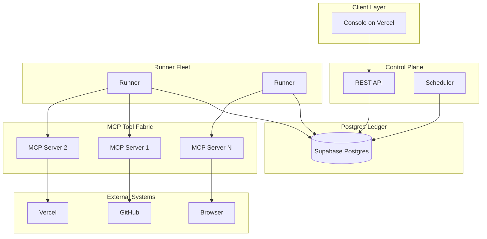
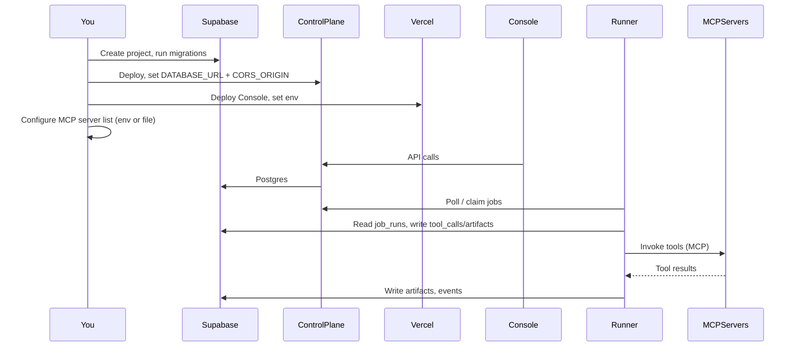

# Put AI Factory on the Web — Deployment Plan (with MCP for Full Automation)

This plan gets the AI Factory live on the web and configures **MCP (Model Context Protocol) connections** so the system can be **fully automated and autonomous**: Runners (and optional agents) invoke tools via MCP servers (GitHub, Vercel, filesystem, browser, etc.) in a governed, auditable way.

---

## Architecture (with MCP)



- **Console** talks to **Control Plane API** and **Supabase Auth**.
- **Control Plane** and **Runners** read/write the **Postgres ledger** (initiatives, runs, job_runs, tool_calls, artifacts).
- **Runners** execute **tool_calls** by calling **MCP servers** (HTTP or stdio). Each MCP server exposes tools (e.g. `github_create_branch`, `vercel_deploy`); the Runner resolves the adapter → MCP server from config and invokes the tool. Results are written back as artifacts and events so the system is **autonomous and auditable**.

---

## What You Need to Create (Summary)

| Component | Where | Purpose |
|-----------|--------|---------|
| **Database + Auth** | Supabase | Ledger + auth; run migrations |
| **Control Plane** | Fly.io / Railway / Render | REST API, scheduler, reaper |
| **Console** | Vercel | Operator UI |
| **MCP server config** | Env or config file | URLs or commands for each MCP server the Runners call |
| **Runners** (optional Phase 1) | Same host as Control Plane or separate | Claim jobs, call MCP tools, write back |
| **Email Marketing Factory** | Vercel (optional) | Second app; proxy from Console |

---

## Phase 1: Supabase (Required)

### 1.1 Create a Supabase project

1. Go to [supabase.com](https://supabase.com) and sign in.
2. **New project**: pick org, name (e.g. `ai-factory-prod`), region, strong DB password (save it).
3. Wait for the project to be ready.

### 1.2 Get credentials

From **Project Settings** → **API**: **Project URL**, **anon public** key, **service_role** key.  
From **Project Settings** → **Database**: **Connection string (URI)** — use **Session** or **Transaction** pooler as `DATABASE_URL`.

### 1.3 Run migrations

**Option A — Supabase CLI**

```bash
cd "/Users/miguellozano/Documents/AI Factory"
supabase login
supabase link --project-ref YOUR_PROJECT_REF
supabase db push
```

**Option B — Manual SQL**  
Run each file in `supabase/migrations/` in order in the SQL Editor.

---

## Phase 2: Control Plane on the Web (Required)

### 2.1 Deploy (Fly.io example)

From repo root or `control-plane/` (see [control-plane/Dockerfile](control-plane/Dockerfile)):

```bash
fly launch --name ai-factory-api --no-deploy
fly secrets set DATABASE_URL="postgresql://..."
fly secrets set CORS_ORIGIN="https://YOUR_VERCEL_CONSOLE_DOMAIN"
fly deploy
```

Save the public URL (e.g. `https://ai-factory-api.fly.dev`) for the Console env.

---

## Phase 3: Console on Vercel (Required)

1. Import repo, set **Root Directory** to `console`.
2. **Environment variables** (Production):
   - `NEXT_PUBLIC_CONTROL_PLANE_API` = Control Plane URL
   - `NEXT_PUBLIC_SUPABASE_URL` = Supabase project URL
   - `NEXT_PUBLIC_SUPABASE_ANON_KEY` = Supabase anon key
   - Optional: `NEXT_PUBLIC_LANGFUSE_URL` for Cost/Usage dashboard link
3. Deploy.

---

## Phase 3b: LLM Gateway (optional; required when executors call LLMs)

Deploy the LLM gateway (LiteLLM Proxy) so all model calls go through one choke point. See [docs/LLM_GATEWAY_AND_OPTIMIZATION.md](LLM_GATEWAY_AND_OPTIMIZATION.md) and `gateway/`.

1. **Deploy gateway** (e.g. Render Web Service using `gateway/Dockerfile`, or use image `ghcr.io/berriai/litellm:main-latest` with config from `gateway/config.yaml`).
2. **Gateway env vars:** `OPENAI_API_KEY`, `ANTHROPIC_API_KEY` (optional); optional `LANGFUSE_SECRET_KEY`, `LANGFUSE_PUBLIC_KEY` for traces.
3. **Runner env:** Set `LLM_GATEWAY_URL` to the gateway base URL (e.g. `https://llm-gateway.onrender.com`).

---

## Phase 4: MCP Connections (Full Automation and Autonomy)

For the factory to be **fully automated and autonomous**, Runners (and optionally the Control Plane or a dedicated gateway) must connect to **MCP servers** that expose tools (e.g. GitHub, Vercel, filesystem, browser). Each tool call is recorded in `tool_calls` and linked to `job_runs` and `artifacts`.

### 4.1 How MCP fits in today

- **Schema:** Adapters, capability_grants, and tool_calls are defined in `schemas/001_core_schema.sql`; the live database uses `supabase/migrations/` (migrations applied via Supabase CLI or SQL Editor). Tool calls are recorded with job_runs and artifacts; producer_plan_node_id links artifacts to plan nodes.
- **Runner:** Runners use handler registry and ExecutorRegistry (`runners/src/`); job context includes agent_role, predecessor_artifacts, workspace_path. For MCP, an adapter can be an **MCP client** that forwards to an MCP server (HTTP or stdio); tool_calls table stores each invocation for audit.
- **Blueprint:** “MCP Tool Fabric” = standardized connectors; execution is via tool_calls with capability_grants and audit in the ledger.

### 4.2 What you need to configure (MCP)

1. **List of MCP servers** the factory will use (e.g. GitHub, Vercel, filesystem, cursor-ide-browser, custom).
2. **Per-server connection details** (so the Runner or MCP gateway can connect):
   - **HTTP MCP servers:** base URL and optional auth (API key header, etc.).
   - **Stdio MCP servers:** command + args (e.g. `npx -y @modelcontextprotocol/server-filesystem /allowed/path`) and optional env.
3. **Where to store this config** (one of):
   - **Env vars:** e.g. `MCP_SERVERS_JSON='[{"name":"github","url":"https://..."}]'` or `MCP_SERVER_GITHUB_URL`, `MCP_SERVER_VERCEL_CMD`, etc.
   - **Config file:** e.g. `mcp-servers.json` or `config/mcp.json` mounted in the Runner/Control Plane container or read from a secret store.
   - **DB table (future):** e.g. `mcp_server_config` with name, type (http|stdio), url_or_cmd, env_json, so it’s manageable from the Console.

### 4.3 Steps for you (MCP)

1. **Choose which MCP servers** you want for Phase 1 (e.g. one filesystem server, one GitHub server). Example: [MCP servers list](https://github.com/modelcontextprotocol/servers).
2. **Decide how they run in production:**
   - **Same host as Runner:** Runner process (or a sidecar) starts stdio MCP servers as child processes; or Runner calls HTTP MCP servers on localhost or internal URL.
   - **Separate services:** Run MCP servers as separate containers/services; Runner calls them via HTTP (internal URL or public URL with auth).
3. **Create the config** (env or file) that the Runner will read, for example:
   - `MCP_SERVERS_JSON` (JSON array of `{ "name": "github", "type": "http", "url": "https://...", "headers": {} }` or `{ "name": "fs", "type": "stdio", "command": "npx", "args": ["-y", "@modelcontextprotocol/server-filesystem", "/workspace"] }`).
   - Or one env per server: `MCP_GITHUB_URL`, `MCP_FILESYSTEM_CMD`, etc.
4. **Secrets:** If an MCP server needs an API key or token, store it in Supabase secrets, or the host’s secret manager, and pass it via env to the Runner (or to the MCP server process). Never commit secrets.
5. **Network:** Ensure the Runner (or Control Plane) can reach the MCP server URLs (same VPC, or allowed egress). If you use stdio, the Runner must be allowed to spawn the MCP server process.

### 4.4 Implementation follow-up (after you finish setup)

Once you have:
- Supabase live and migrated,
- Control Plane deployed and URL known,
- Console deployed with env vars set,
- **MCP server list and connection details** (URLs or stdio commands + env),

then implementation can:
- Add an **MCP client** in the Runner (or a small MCP gateway service) that reads the config and dispatches tool calls to the right MCP server.
- Wire the existing **Adapter** interface to this MCP client (one adapter per MCP server, or one adapter that routes by capability to the right server).
- Optionally add a **Console UI** or API to view/edit MCP server config (if stored in DB) and to test connections.
- Ensure **autonomy**: Runners claim jobs → resolve tool_calls → call MCP tools → write artifacts and events so the system can run without manual steps.

### 4.5 What to send back (MCP)

- Which **MCP servers** you want to use (names and types: http vs stdio).
- For each: **URL** (if http) or **command + args** (if stdio), and whether auth is needed (and how: header, env var name, etc.).
- Where you prefer the config to live: **env vars** (e.g. one JSON env) or **config file** (path and format).

---

## Phase 4b: MCP Implementation Summary

The following MCP infrastructure has been implemented:

- **runners/src/mcp-client.ts** — MCP client that connects to HTTP and stdio MCP servers. Config loaded from `MCP_SERVERS_JSON` env or `config/mcp.json` file. Supports tool calls via JSON-RPC.
- **supabase/migrations/20250303000006_gateway_and_mcp.sql** — `mcp_server_config` table (name, server_type, url_or_cmd, args_json, env_json, auth_header, capabilities, active).
- **Control Plane API** — `GET/POST/PATCH/DELETE /v1/mcp_servers`, `POST /v1/mcp_servers/:id/test` (HTTP ping check).
- **Console** — `/admin/mcp_servers` page to list configured MCP servers.
- **.env.example** — Documents `MCP_SERVERS_JSON` env var format.

To add an MCP server, either:
1. Insert into `mcp_server_config` via Supabase Studio or `POST /v1/mcp_servers`.
2. Set `MCP_SERVERS_JSON` env var for the Runner process.

---

## Phase 5: Email Marketing Factory (Optional)

- Deploy as second Vercel project or same monorepo; set `NEXT_PUBLIC_EMAIL_MARKETING_ORIGIN` in Console env if you want the nav to proxy to it. See [docs/EMAIL_MARKETING_FACTORY_INTEGRATION.md](EMAIL_MARKETING_FACTORY_INTEGRATION.md).

---

## What to Send Back So Implementation Can Continue

After you complete the steps above, reply with:

1. **Supabase:** “Migrations applied” (and whether CLI or manual). Whether you want Auth (Magic Link/Google) wired in the Console now.
2. **Control Plane:** Public URL; confirm it’s the same as `NEXT_PUBLIC_CONTROL_PLANE_API` in Vercel.
3. **Console:** Public URL; whether `NEXT_PUBLIC_EMAIL_MARKETING_ORIGIN` is set.
4. **MCP:**
   - List of MCP servers (name, type: http|stdio, URL or command, auth needs).
   - Preferred config storage: env (e.g. `MCP_SERVERS_JSON`) or config file (path/format).
5. **Optional:** Control Plane host (Fly.io / Railway / Render); if you plan to add AWS later (Runners, S3).

---

## Order of Operations (with MCP)



---

## Do You Need AWS?

Not for Phase 1. You need: **Supabase** (DB + Auth), **Vercel** (Console), **one container host** (Control Plane), and **MCP server config**. AWS is for later (Runners on ECS, S3 artifacts, Secrets Manager) if you want it.

---

## Live deploy quick reference

- **Control Plane on Render:** Repo root includes `render.yaml`. In Render Dashboard: New → Blueprint → connect this repo; add env `DATABASE_URL` (Supabase connection string) and optionally `PORT`. Health check: `GET /v1/health`.
- **Console on Vercel:** Connect the repo; set root directory to `console` (or deploy root with `console` as subpath). Set `NEXT_PUBLIC_CONTROL_PLANE_API` to the Render Control Plane URL. Optionally set `NEXT_PUBLIC_EMAIL_MARKETING_ORIGIN` to the Email Marketing Factory app URL if you proxy it at `/email-marketing`.
- **Branches:** `main` → staging; `prod` → production. GitHub Actions run CI and migrate-and-test on push; Vercel and Render deploy on push (no deploy from Actions).
